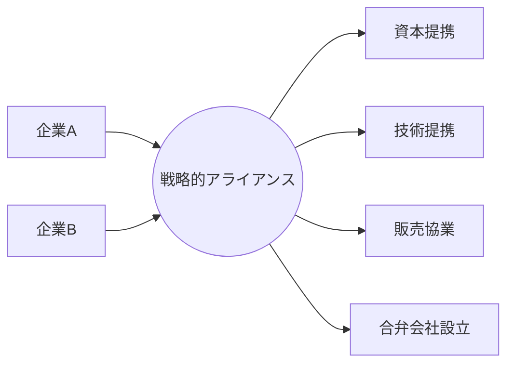

# 戦略的アライアンス - 概要

## 1. 用語と概要

戦略的アライアンスとは、企業が互いの強みを活かし、共同で新たなビジネスチャンスを追求するために結ぶ、長期的な協業関係のことです。単なる業務提携とは異なり、互いに株式を保有したり、経営に深く関与したりするケースも多く、より緊密な関係を築くことが特徴です。競合他社との提携も含まれ、市場支配力を高めたり、リスクを分散したりといった目的で形成されます。  合弁会社設立、技術提携、販売協業など、様々な形態で実施されます。  戦略的アライアンスは、企業単独では達成できない目標を達成するための強力な手段として、近年ますます重要性が増しています。

## 2. 背景と目的

グローバル化の進展や市場の急激な変化により、企業は単独で全ての事業を展開することが難しくなってきています。必要な技術やノウハウ、資金、市場アクセスなどを確保するために、他社との連携が不可欠となっています。戦略的アライアンスは、このような背景の下、企業が自社の競争優位性を強化し、持続的な成長を実現するための重要な戦略となっています。その目的は多岐に渡りますが、大きく分けると以下の通りです。

* **市場拡大:** 新規市場への参入や既存市場でのシェア拡大
* **コスト削減:** 共同調達や生産効率の向上によるコスト削減
* **技術開発:** 互いの技術やノウハウを共有し、革新的な製品・サービスの開発
* **リスク分散:** 事業リスクや市場リスクの分散
* **競争優位性の強化:** 競合他社に対する優位性を確立

## 3. 活用方法（図解・表を含めて）

戦略的アライアンスは、様々な形態で活用できます。

| アライアンスの種類 | 概要 | 例 |
|---|---|---|
| 資本提携 | 株式の相互保有や出資を行う | 企業Aが企業Bの株式を取得し、経営に参画する |
| 技術提携 | 技術やノウハウを共有する | 企業Aと企業Bが共同で新技術を開発する |
| 販売協業 | 互いの製品・サービスを販売する | 企業Aが企業Bの製品を自社の販売網を通じて販売する |
| 合弁会社設立 | 新しい会社を共同で設立する | 企業Aと企業Bが共同で新会社を設立し、新事業を展開する |

**図解：戦略的アライアンスの形態**

## 4. メリット・デメリット

**メリット:**

* 新しい市場への迅速な参入が可能になる。
* 費用やリスクを分担できる。
* 相乗効果によって、より大きな収益を得ることができる。
* 互いの技術やノウハウを共有することで、イノベーションを促進できる。

**デメリット:**

* 相手の企業との意思疎通がうまくいかず、紛争が起こる可能性がある。
* 相手の企業の経営方針に左右される可能性がある。
* 利益配分や経営権をめぐるトラブルが発生する可能性がある。
* 情報漏洩のリスクがある。

## 5. 他手法との違い

戦略的アライアンスは、M&A（合併・買収）やフランチャイズとは大きく異なります。M&Aは企業の合併や買収を通じて完全に一体化を目指すのに対し、戦略的アライアンスは独立性を維持したまま協業関係を築きます。フランチャイズは、ブランドやノウハウの使用許諾契約に基づくもので、戦略的アライアンスよりも関係性が限定的です。

## 6. 企業導入事例（仮想でもよいが現実味のあるもの）

**事例：スマート農業分野における戦略的アライアンス**

農業用ドローン開発企業「AgriDrone社」と、農業用IoTセンサー開発企業「FarmTech社」が戦略的アライアンスを締結。AgriDrone社はFarmTech社のセンサーデータを活用した精密農業ソリューションを提供し、FarmTech社はAgriDrone社のドローンによるデータ収集網を活用することで、農業データの精度向上と顧客基盤の拡大を実現しました。両社は共同で新会社を設立し、より効率的で高収益なスマート農業システムの開発・販売を推進しています。

## 7. よくある誤解

* **短期的な関係で済ませられる:** 戦略的アライアンスは長期的な視点で関係を構築することが重要です。
* **全ての企業と連携できる:** 相互の企業文化や戦略の相性などを考慮し、適切なパートナーを選定する必要があります。
* **リスクが全く無い:** 相手の企業の経営状況や市場環境の変化によって、リスクが発生する可能性があります。

## 8. 成功のコツ

* パートナー企業の選定を慎重に行う。
* 明確な目標設定と役割分担を行う。
* 継続的なコミュニケーションと情報共有を徹底する。
* 信頼関係を構築する。
* 柔軟な対応力を持つ。

## 9. 今後の展望

AIやIoT技術の発展により、データ連携や自動化がより容易になることで、戦略的アライアンスの形態や可能性はさらに広がっていくと予想されます。クロスボーダーなアライアンスも増加し、グローバルなサプライチェーン構築や市場開拓において、戦略的アライアンスはますます重要な役割を果たしていくでしょう。

## 10. 関連リンク

* [経済産業省：中小企業のための戦略的アライアンス](仮のリンク)
* [中小企業基盤整備機構：戦略的アライアンス支援](仮のリンク)

(注：リンクは仮のものであり、実際のリンクは存在しません。)
