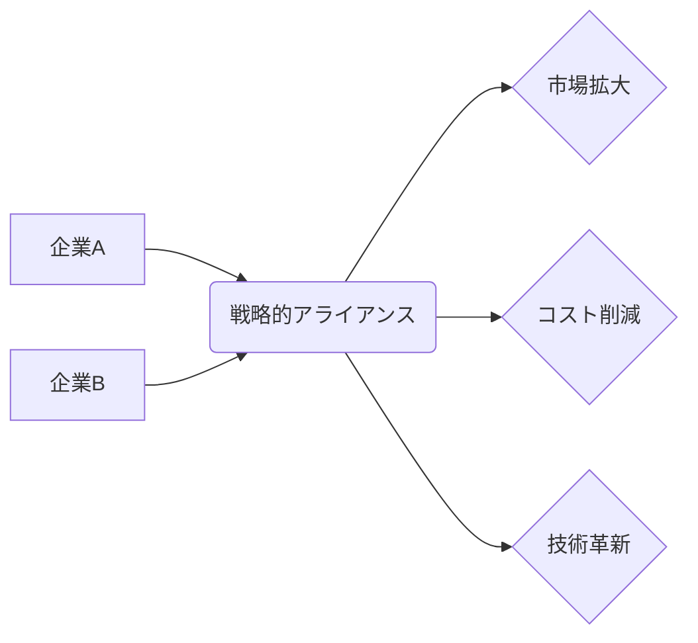

# 戦略的アライアンス - 概要

## 1. 用語と概要

戦略的アライアンスとは、企業が互いの強みを活かし、競争優位性を獲得するために、長期的な関係を構築する協業形態です。単純な取引関係を超え、互いの資源や能力を共有することで、新たな市場への参入や既存市場でのシェア拡大、技術革新の促進などを目指します。合併や買収とは異なり、各企業は独立性を維持したまま協力関係を築きます。アライアンスの種類は、ジョイントベンチャー、ライセンス契約、共同研究開発など多岐に渡ります。成功には、明確な目標設定、互いの信頼関係構築、リスク共有、そして柔軟な対応が不可欠です。

## 2. 背景と目的

グローバル化や技術革新の加速に伴い、単独企業では対応困難な課題が増えています。高度な技術開発には巨額の投資が必要であり、市場参入障壁も高くなっています。このような状況下で、企業は自社だけでは実現できない目標を達成するために、戦略的アライアンスを積極的に活用するようになっています。目的としては、市場拡大、コスト削減、リスク分散、技術獲得、ブランド強化などが挙げられます。特に、新規市場への参入や新たな技術の獲得においては、アライアンスによる迅速な展開が大きなメリットとなります。例えば、既存市場でのシェアが高い企業が、新たな技術を持つスタートアップ企業とアライアンスを組むことで、迅速に新技術を製品に組み込み、市場競争力を高めることができます。

## 3. 活用方法（できれば図解・表を含めて）

戦略的アライアンスの活用方法は、目的や企業の状況によって異なります。

| アライアンスの種類 | 説明 | 具体的な例 | メリット | デメリット |
|---|---|---|---|---|
| ジョイントベンチャー | 新会社を設立し、共同で事業を展開 | ある自動車メーカーと電池メーカーが共同でEVバッテリー生産会社を設立 | リスクとコストの共有、迅速な市場参入 | 意思決定の遅延、企業文化の衝突 |
| ライセンス契約 | 特許やノウハウの利用許諾 | ある製薬会社が、他社の特許技術を利用して新薬を製造・販売 | 技術獲得コストの削減、迅速な製品化 | ロイヤリティの支払、技術漏洩のリスク |
| 共同研究開発 | 共同で研究開発を行い、成果を共有 | あるIT企業と大学が共同でAI技術の研究開発を行う | 研究開発コストの削減、人材の確保 | 情報共有の難しさ、研究成果の知的財産権の帰属問題 |

**図解：戦略的アライアンスのモデル**

## 4. メリット・デメリット

**メリット:**

* **リスク軽減:** 投資や開発リスクを複数企業で分担できる。
* **コスト削減:** 研究開発費、マーケティング費用などを共有することでコスト削減が可能。
* **市場拡大:** 新規市場への参入や既存市場でのシェア拡大が容易になる。
* **技術獲得:** 相手企業の技術やノウハウを習得できる。
* **競争優位性の強化:** 互いの強みを組み合わせることで、競争優位性を高めることができる。

**デメリット:**

* **意思決定の遅延:** 複数企業の合意形成が必要となるため、意思決定が遅れる可能性がある。
* **企業文化の衝突:** 異なる企業文化が衝突し、協力関係がうまくいかない可能性がある。
* **情報漏洩のリスク:** 機密情報の漏洩リスクがある。
* **利益配分の問題:** 利益配分について、企業間で合意できない可能性がある。
* **パートナー企業との依存関係:** パートナー企業との依存関係が高まることで、リスクも増加する。

## 5. 他手法との違い

戦略的アライアンスは、合併・買収、資本提携、フランチャイズなどと比較して、企業の独立性を維持したまま協力関係を築く点が異なります。合併・買収は企業が完全に一体化しますが、アライアンスはそれぞれの企業が独立性を保ちながら、特定の事業において協力関係を構築します。資本提携は株式の相互保有を通じて関係を築きますが、アライアンスは必ずしも株式保有を伴いません。フランチャイズは、ブランドやノウハウの使用権を供与する形態ですが、アライアンスはより広範な協力関係を築きます。

## 6. 企業導入事例（仮想でもよいが現実味のあるもの）

架空の事例として、次のようなケースを考えます。

**事例：スマート農業におけるアライアンス**

農業技術開発企業「アグリテック社」と、農業用ドローン開発企業「スカイファーム社」が、スマート農業システム構築のため戦略的アライアンスを締結しました。アグリテック社は、センシング技術やAIを活用した農業データ分析に強みを持ち、スカイファーム社は、ドローンによる精密農業技術に強みを持っています。両社は、それぞれの技術を統合したスマート農業システムを開発し、農家への提供を開始しました。このアライアンスにより、両社は迅速に市場へ参入し、競争優位性を確立することができました。

## 7. よくある誤解

* **アライアンスは必ず成功する:** アライアンスは、成功する保証はありません。企業間の相性の悪さや、目標設定の不一致などにより失敗するケースもあります。
* **アライアンスは簡単:**  アライアンスを成功させるためには、綿密な計画、パートナー選び、継続的なコミュニケーションが必要です。
* **アライアンスはコストがかからない:**  契約締結や運営にはコストがかかります。

## 8. 成功のコツ

* **明確な目標設定:** アライアンスの目的を明確に定義し、具体的な目標を設定する。
* **適切なパートナー選び:** 相互補完的な関係にある、信頼できるパートナーを選ぶ。
* **契約内容の明確化:** 権利・義務、利益配分などを明確に規定した契約を締結する。
* **継続的なコミュニケーション:** 定期的な情報共有と密なコミュニケーションを維持する。
* **柔軟な対応:** 状況変化に応じて、柔軟に対応する。

## 9. 今後の展望

デジタル化の進展により、データ連携やAIを活用したアライアンスが増加すると予想されます。また、サプライチェーンの最適化やESG経営への対応においても、戦略的アライアンスが重要な役割を果たすことが期待されます。クロスボーダーアライアンスの増加も予想され、国際的な協力関係の構築がますます重要になってきます。

## 10. 関連リンク

* [経済産業省：中小企業庁](https://www.chusho.meti.go.jp/) (参考情報)

