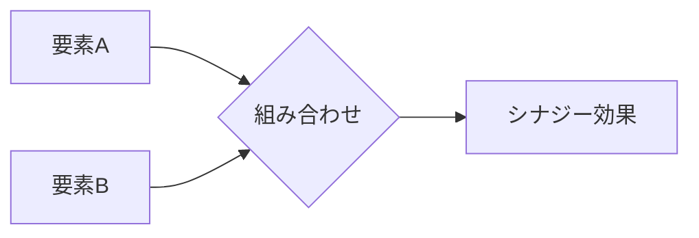

# シナジー効果 - 概要

## 1. 用語と概要

シナジー効果とは、複数の要素を組み合わせることで、個々の要素を単独で作用させた場合の合計を上回る効果を生み出すことを指します。  1+1>2という表現で示されることも多く、企業経営においては、部門間の連携や企業同士の合併など、異なる要素の協調によって生まれる相乗効果を意味します。  単なる足し算ではなく、掛け算や指数関数的な効果を期待するものであり、企業の成長戦略において重要な概念となっています。  その効果は、効率向上、イノベーション創出、市場シェア拡大など、多岐に渡ります。  しかし、シナジー効果は必ずしも自動的に発生するものではなく、適切な戦略と実行が必要不可欠です。  本記事では、シナジー効果の背景、活用方法、メリット・デメリットなどを詳しく解説します。

## 2. 背景と目的

シナジー効果という概念が注目されるようになった背景には、グローバル化や情報化の進展があります。  企業を取り巻く環境が複雑化する中で、単独では対応できない課題も多く存在します。  そのため、異なるスキルやリソースを持つ企業や部門が連携し、互いの強みを補完することで、より大きな成果を上げる必要性が高まっています。  シナジー効果の目的は、単に効率性を上げるだけでなく、新たな価値創造や競争優位性の確立にあります。  既存の枠組みを超えた革新的な製品やサービスを生み出し、市場における競争力を強化することが、シナジー効果追求の究極の目的と言えるでしょう。  特に、M&A（合併・買収）戦略においては、シナジー効果の有無が成功の鍵となります。

## 3. 活用方法（図解・表を含めて）

シナジー効果を最大限に活用するためには、以下の３つの段階を踏むことが重要です。

| 段階 | 内容 | 具体的なアクション |
|---|---|---|
| **1. 潜在的シナジーの特定** | それぞれの要素が持つ強み・弱みを分析し、組み合わせることで生まれる可能性のある効果を洗い出す | SWOT分析、競合分析、市場調査 |
| **2. シナジー創出プラン策定** | 潜在的シナジーを実現するための具体的な計画を立案する | プロジェクトチームの編成、役割分担、スケジュール設定、KPI設定 |
| **3. 実行と評価** | 計画に基づいて実行し、定期的に効果を評価する | 定期的な進捗報告、課題の洗い出し、改善策の実施 |

上記図解は、要素Aと要素Bを組み合わせることでシナジー効果Dを生み出すことを示しています。  単純な合計ではなく、相乗効果が生まれる点が重要です。

## 4. メリット・デメリット

**メリット:**

* **競争優位性の強化:** 新たな製品・サービス開発、コスト削減、市場シェア拡大など、競争力を向上させる。
* **収益性の向上:** 効率化によるコスト削減、売上増加による利益拡大。
* **イノベーション創出:** 異なる視点や知識の融合による新たなアイデアや技術の創出。
* **リスク分散:** 複数の要素に依存することで、リスクを分散できる。

**デメリット:**

* **統合コスト:** 部門間連携や企業合併に伴うコスト（システム統合、人材調整など）。
* **文化摩擦:** 異なる企業文化や価値観の衝突による摩擦。
* **意思決定の遅延:** 多数の関係者の合意形成に時間がかかる可能性。
* **シナジー効果の未達成:** 計画や実行が不十分な場合、期待通りの効果が得られない。

## 5. 他手法との違い

シナジー効果は、単なる効率化やコスト削減とは異なります。  効率化は既存のプロセスを最適化することに焦点を当てますが、シナジー効果は異なる要素の組み合わせによって新たな価値を創造することに焦点を当てています。  また、単純な集約効果とは異なり、要素間の相互作用によって生まれる相乗効果が重要です。

## 6. 企業導入事例（仮想でもよいが現実味のあるもの）

架空のIT企業「Innovate Tech」は、ソフトウェア開発部門とハードウェア開発部門を統合することでシナジー効果を生み出しました。  従来は別々に開発していたソフトウェアとハードウェアを連携させることで、より高度で統合的な製品を提供できるようになり、市場シェアを拡大しました。  具体的には、IoTデバイス向けのソフトウェアとハードウェアを統合開発することで、競合他社にはない独自の製品を開発し、市場で高い評価を得ています。

## 7. よくある誤解

* **必ずしも自動的に発生するわけではない:**  シナジー効果は計画的な取り組みと適切な実行によって初めて実現するものです。
* **規模が大きければ効果が大きいとは限らない:**  適切な組み合わせと連携が重要であり、規模だけが全てではありません。
* **短期的な効果だけを期待しない:**  シナジー効果は長期的な視点で捉えるべきものです。

## 8. 成功のコツ

* **明確な目標設定:**  シナジー効果によって達成したい目標を明確に設定する。
* **適切なパートナー選び:**  互いに補完し合える関係を築けるパートナーを選ぶ。
* **効果的なコミュニケーション:**  関係者間のコミュニケーションを密にする。
* **柔軟な対応:**  状況の変化に応じて柔軟に対応する。
* **継続的な評価と改善:**  効果を定期的に評価し、必要に応じて改善策を講じる。

## 9. 今後の展望

AIやIoT技術の発展により、異なる分野のデータや技術を組み合わせることで、より大きなシナジー効果を生み出すことが期待されています。  今後、企業はこれらの技術を活用し、新たな価値創造に挑戦していくでしょう。  また、サステナビリティへの配慮も重要となり、環境問題解決と経済成長を両立させるシナジー効果の追求が求められています。

## 10. 関連リンク

* [Wikipedia: シナジー効果](https://ja.wikipedia.org/wiki/%E3%82%B7%E3%83%8A%E3%82%B8%E3%83%BC%E5%8A%B9%E6%9E%9C) (仮リンク)

