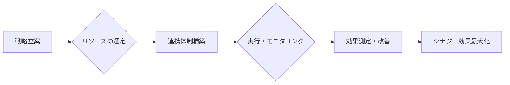

# シナジー効果 - 概要

## 1. 用語と概要

シナジー効果とは、複数の要素を組み合わせることで、それぞれの要素単独の効果の合計を上回る相乗的な効果を生み出すことを指します。1+1＞2の関係性を持ち、ビジネスにおいては、異なる部署や企業、技術、製品などを組み合わせることで、新たな価値創造や効率向上を期待できる重要な概念です。単なる足し算ではなく、掛け算的な効果を狙う戦略であり、企業成長に大きく貢献する可能性を秘めています。  効果の大きさは、組み合わせる要素間の関連性や、連携の密接さに大きく依存します。  適切なシナジー効果を生み出すためには、綿密な計画と実行、そして継続的なモニタリングが不可欠です。

## 2. 背景と目的

現代のビジネス環境は、ますます複雑化し、競争が激化しています。単一の事業や技術だけで成功を収めることは難しくなっており、複数のリソースを効果的に統合し、相乗効果を生み出すことが企業の生き残りと成長に不可欠となっています。シナジー効果を追求する背景には、限られた資源を最大限に活用し、競争優位性を確立したいという強い意志があります。  目的は、単なる効率化だけでなく、革新的な製品・サービスの開発、新規市場への参入、顧客満足度の向上など、多岐に渡ります。  企業は、シナジー効果の追求を通じて、持続可能な成長を実現しようとしています。

## 3. 活用方法（できれば図解・表を含めて）

シナジー効果を最大限に活用するためには、戦略的な計画と実行が必要です。以下に、具体的な活用方法を示します。

**図1：シナジー効果を生み出すためのプロセス**

**表1：シナジー効果の活用例**

| 組み合わせる要素 | 期待されるシナジー効果 | 例 |
|---|---|---|
| マーケティング部門と営業部門 | 顧客獲得効率の向上、顧客満足度の向上 | マーケティングデータに基づいた営業戦略の立案、顧客ニーズに合わせた製品開発 |
| 製造部門と開発部門 | 製品開発期間の短縮、製品品質の向上 | 開発段階からの製造工程の検討、製造技術のフィードバックによる製品改善 |
| 自社製品と他社製品 | 新規市場への参入、顧客層の拡大 | 互換性のある製品の連携、共同マーケティング |

## 4. メリット・デメリット

**メリット:**

* **競争優位性の強化:**  他社にはない独自の価値を提供することで、競争力を高めることができます。
* **収益性の向上:**  効率向上や新規事業創出により、収益を増加させることができます。
* **イノベーション創出:**  異なる分野の知見や技術を組み合わせることで、革新的な製品やサービスを生み出すことができます。
* **リスク分散:**  複数の事業を展開することで、リスクを分散し、事業の安定性を高めることができます。

**デメリット:**

* **連携コストの増加:** 部署間の調整や情報共有にコストがかかる可能性があります。
* **意思決定の遅れ:** 複数の関係者との調整が必要なため、意思決定に時間がかかる可能性があります。
* **文化摩擦:** 異なる部門や企業の文化が衝突し、連携がうまくいかない可能性があります。
* **効果測定の困難さ:** シナジー効果の大きさを正確に測定することが難しい場合があります。

## 5. 他手法との違い

シナジー効果は、単なるコスト削減や効率化とは異なる概念です。コスト削減は既存業務の改善を目的とする一方、シナジー効果は、新たな価値創造を目的として、複数の要素を組み合わせることで1+1＞2の効果を狙います。  また、単純な相乗効果とは異なり、要素間の複雑な相互作用や連携によって生まれる、より高度な効果を指します。

## 6. 企業導入事例（仮想でもよいが現実味のあるもの）

架空の企業「GreenTech社」は、環境関連事業とIT事業を展開しています。環境センサーの開発・製造を行う環境事業部門と、IoTプラットフォームを提供するIT事業部門が連携することで、リアルタイムな環境データ収集・分析による精密農業ソリューションを提供開始しました。環境事業部門のセンサー技術とIT事業部門のプラットフォーム技術の融合により、競合他社にはない高度なソリューションを提供できるようになり、市場シェア拡大に成功しました。

## 7. よくある誤解

* **シナジー効果は必ず発生する：** シナジー効果は、適切な計画と実行がなされた場合にのみ発揮されます。
* **シナジー効果は簡単に実現する：** 部署間の調整や文化の違いなど、様々な課題を克服する必要があります。
* **シナジー効果は定量的に簡単に計測できる：**  効果の測定には高度な分析が必要となる場合もあります。

## 8. 成功のコツ

* **明確な目標設定:**  具体的な目標を設定し、関係者全員で共有することが重要です。
* **効果的なコミュニケーション:**  関係者間の円滑なコミュニケーションを促進する必要があります。
* **柔軟な対応:**  予期せぬ問題が発生した場合でも、柔軟に対応できる体制を整える必要があります。
* **継続的なモニタリングと改善:**  効果を継続的にモニタリングし、必要に応じて改善策を講じる必要があります。

## 9. 今後の展望

AIやIoT技術の発展により、より複雑で高度なシナジー効果の創出が可能になります。  データ分析技術を活用することで、シナジー効果の測定や予測精度も向上するでしょう。  今後、企業は、これらの技術を活用し、新たな価値創造に挑戦していくことが求められます。

## 10. 関連リンク

* [Wikipedia: シナジー効果](https://ja.wikipedia.org/wiki/%E3%82%B7%E3%83%8A%E3%82%B8%E3%83%BC%E5%8A%B9%E6%9E%9C) (参考として)

