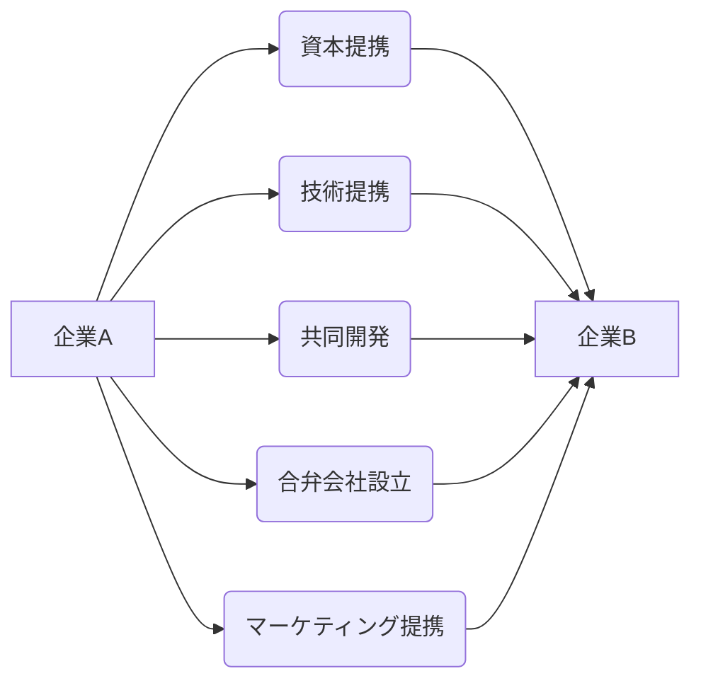

# 戦略的アライアンス - 概要

## 1. 用語と概要

戦略的アライアンスとは、2社以上の企業が、それぞれの強みや資源を共有し、共通の目標達成に向けて長期的に協力関係を築くことを指します。単なる取引関係を超え、互恵的な関係を構築することで、競争優位性を獲得したり、新たな市場を開拓したりすることを目的としています。合弁会社設立や資本提携、技術提携など、様々な形態をとることが可能です。企業規模や業界を問わず、多くの企業が戦略的アライアンスをビジネス戦略の中核に据えています。市場環境の変化が激しく、単独では対応困難な課題が増える中、戦略的アライアンスは、リスクを分散し、シナジー効果を生み出す有効な手段となっています。

## 2. 背景と目的

グローバル化の進展や技術革新の加速により、市場競争は激化の一途を辿っています。企業は、単独では対応できないような複雑な課題に直面しており、その解決には、複数の企業が協力して取り組むことが不可欠になっています。そこで、戦略的アライアンスが注目されています。その目的は、大きく分けて以下の3つに分類できます。

* **市場シェアの拡大**: 既存市場での競争優位性を高め、市場シェアを拡大する。
* **新規市場への参入**: 新しい市場や製品分野に迅速かつ効率的に参入する。
* **コスト削減・効率化**: 研究開発、生産、販売などのコストを削減し、効率性を向上させる。

特に、高度な技術や専門知識が必要な分野では、戦略的アライアンスを通じて、効率的な研究開発体制を構築することが重要になります。また、異なる地域や文化圏に展開する企業同士のアライアンスは、グローバルな市場開拓に繋がるでしょう。

## 3. 活用方法（図解・表を含めて）

戦略的アライアンスは、様々な形態で活用されます。

| アライアンス形態 | 説明 | 例 |
|---|---|---|
| 資本提携 | 株式を相互に保有することで、資本関係を構築する。 | 企業Aが企業Bの株式を10%取得する |
| 技術提携 | 特許やノウハウなどの技術を共有する。 | 企業Aが保有する特許技術を企業Bが使用し、その対価としてロイヤルティを支払う |
| 共同開発 | 新しい製品やサービスを共同で開発する。 | 企業Aと企業Bが共同で次世代自動車の開発を行う |
| 合弁会社設立 | 新しい会社を共同で設立する。 | 企業Aと企業Bが50%ずつ出資して、合弁会社を設立する |
| マーケティング提携 | 共同でマーケティング活動を行う。 | 企業Aと企業Bが共同で販促キャンペーンを実施する |

**図：戦略的アライアンスの形態**

## 4. メリット・デメリット

**メリット**

* **リスクの分散**: 複数企業でリスクを分担できるため、単独での事業展開よりもリスクが軽減される。
* **シナジー効果**: 各社の強みを組み合わせることで、相乗効果を生み出せる。
* **スピードアップ**: 共同で取り組むことで、開発や市場参入のスピードを速めることができる。
* **コスト削減**: 資源や設備などを共有することで、コストを削減できる。
* **競争優位性の向上**: 共同で競争優位性を築き、市場での地位を強化できる。

**デメリット**

* **意思決定の遅延**: 複数企業の合意が必要なため、意思決定に時間がかかる可能性がある。
* **情報の漏洩**: 重要な情報が漏洩するリスクがある。
* **パートナー企業との摩擦**: パートナー企業との間で意見の相違や利害の衝突が生じる可能性がある。
* **依存性の高まり**: パートナー企業への依存度が高まり、自社の独立性が低下する可能性がある。

## 5. 他手法との違い

戦略的アライアンスは、買収や合併とは異なり、企業が独立性を維持したまま協力関係を築く点が異なります。買収や合併は、企業の統合を目的とする一方、戦略的アライアンスは、それぞれの企業が独立性を保ちながら、互いに利益を享受することを目的としています。また、ライセンス契約とは、技術やノウハウの使用権を許諾するもので、アライアンスよりも範囲が限定的です。

## 6. 企業導入事例（仮想でもよいが現実味のあるもの）

架空の事例として、次のようなケースが考えられます。

**事例：スマート農業分野における戦略的アライアンス**

農業用ドローン開発企業である「AgriDrone社」と農業IoTシステム開発企業である「FarmTech社」は、スマート農業分野における市場拡大を目指し、戦略的アライアンスを締結しました。AgriDrone社はドローンによる農薬散布や生育状況のモニタリング技術を、FarmTech社はIoTセンサーによるデータ収集・分析技術を提供します。両社は共同で、ドローンとIoTシステムを統合したスマート農業ソリューションを開発し、農業生産性の向上に貢献します。このアライアンスにより、両社は単独では実現困難な市場開拓を迅速に進めることができます。

## 7. よくある誤解

* **単なる取引関係と混同**:  戦略的アライアンスは、短期的な取引関係ではなく、長期的な協力関係を意味します。
* **完全な統合と混同**:  戦略的アライアンスは、企業の完全な統合を意味するものではありません。各企業は独立性を維持したまま協力します。
* **リスクフリーであると誤解**:  戦略的アライアンスにもリスクは存在します。パートナー企業との間で摩擦が生じたり、情報漏洩が発生する可能性もあります。

## 8. 成功のコツ

戦略的アライアンスを成功させるためには、以下の点が重要です。

* **明確な目標設定**: アライアンスの目的を明確に設定し、各社の役割を明確にする。
* **互恵的な関係構築**: パートナー企業との間で、互恵的な関係を構築することが重要です。
* **情報共有**: 重要な情報を積極的に共有し、信頼関係を築く。
* **リスク管理**:  リスクを事前に把握し、適切な対策を講じる。
* **柔軟な対応**:  市場環境の変化に合わせて、柔軟に対応する。

## 9. 今後の展望

技術革新やグローバル化の進展に伴い、戦略的アライアンスの重要性はますます高まると考えられます。特に、AIやIoT、ブロックチェーンなどの新技術を活用したアライアンスは、新たなビジネスモデルを生み出す可能性を秘めています。今後、より複雑で多様なアライアンス形態が登場し、企業間の連携がより緊密になることが予想されます。

## 10. 関連リンク

* [経済産業省：戦略的アライアンスに関する情報](仮のURL)
* [日本政策金融公庫：戦略的アライアンスに関する情報](仮のURL)

**(注：上記関連リンクは架空のURLです。実際のリンクはご自身で検索ください。)**
