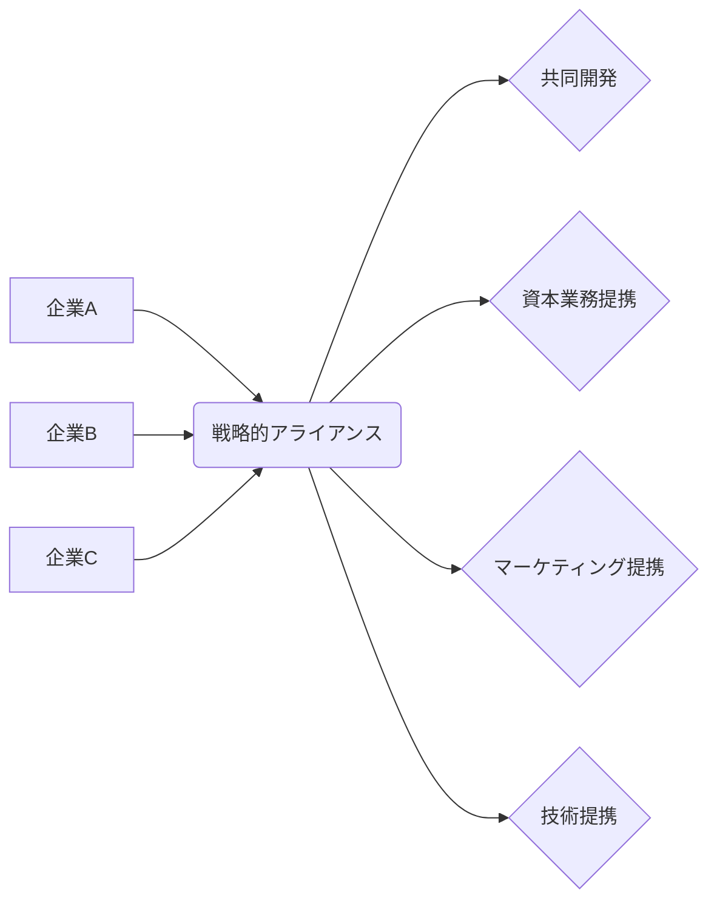

# 戦略的アライアンス - 概要

## 2. 背景と目的

現代のビジネス環境は、ますます複雑化し、競争が激化しています。単独企業では対応できない課題も多く、技術革新のスピードも速いため、迅速な対応が求められます。このような状況下で、企業は自社の資源や能力だけでは解決できない問題を克服し、競争優位性を築くために、戦略的アライアンスを構築するようになりました。

戦略的アライアンスの目的は、短期的な利益追求だけでなく、長期的な成長と持続可能な競争力の獲得にあります。具体的には、新たな市場への参入、技術開発の加速、コスト削減、リスク軽減、ブランドイメージの向上などを目指します。パートナー企業との相乗効果によって、単独では達成できないレベルの成果を創出することが期待されています。  アライアンスのパートナー選びは、企業の将来を左右する重要な意思決定であり、慎重な検討が必要です。互いの強みと弱みを正確に把握し、戦略的な整合性を確認した上で、長期的な関係構築を目指すべきです。短期的な利益だけに囚われず、互いに信頼関係を築き、共通の目標に向かって努力していく姿勢が重要です。

## 3. 活用方法（図解・表を含めて）

戦略的アライアンスは、様々な形態で活用できます。主な形態と、それぞれのメリット・デメリットを以下に示します。

| アライアンス形態 | 概要 | メリット | デメリット |
|---|---|---|---|
| 共同開発 | 複数の企業が共同で製品やサービスを開発する | リスク分担、開発期間短縮、コスト削減 | 意思決定の遅延、情報漏洩のリスク |
| 資本業務提携 | 資本を出し合って共同で事業を行う | 資金調達、経営資源の共有、シナジー効果 | 経営権の希釈、経営方針の不一致 |
| マーケティング提携 | 共同でマーケティング活動を行う | 市場浸透率向上、ブランド認知度向上、コスト削減 | 利益配分の問題、パートナー企業との関係維持 |
| 技術提携 | 特定の技術を相互に提供・活用する | 技術開発の加速、競争優位性の向上 | 技術流出のリスク、技術依存 |

**(図解)**

## 4. メリット・デメリット

**メリット:**

* **リスク軽減:**  リスクを複数企業で分担できるため、単独で事業を行うよりもリスクが低減します。
* **コスト削減:**  資源や設備を共有することで、コスト削減効果が期待できます。
* **市場拡大:**  新たな市場への参入を容易にします。
* **技術革新の加速:**  異なる企業の技術やノウハウを融合することで、技術開発を加速できます。
* **競争優位性の向上:**  相乗効果により、競争優位性を高めることができます。

**デメリット:**

* **意思決定の遅延:**  複数の企業が関与するため、意思決定に時間がかかる場合があります。
* **パートナー企業との摩擦:**  企業文化や経営理念の違いから、摩擦が生じる可能性があります。
* **情報漏洩のリスク:**  機密情報の漏洩リスクがあります。
* **利益配分の問題:**  利益配分に関して、パートナー企業間で紛争が生じる可能性があります。
* **依存関係の発生:**  一方のパートナー企業に依存しすぎることで、事業リスクが高まる可能性があります。

## 5. 他手法との違い

戦略的アライアンスは、M&A（合併・買収）、ジョイントベンチャー、ライセンス契約など、他の企業連携手法と比較して、より柔軟性があり、比較的容易に開始・終了できる点が特徴です。M&Aは企業の統合を伴うため、大きなリスクとコストを伴いますが、戦略的アライアンスは、資本関係を構築しない場合も多く、リスクを軽減できます。ジョイントベンチャーは、新たな会社を設立する必要があるため、初期投資や手続きが複雑になりますが、戦略的アライアンスは、既存の組織体制を維持したまま連携できます。ライセンス契約は、特定の技術やブランドの使用権を許諾するもので、戦略的アライアンスよりも範囲が限定的です。

## 6. 企業導入事例（仮想でもよいが現実味のあるもの）

架空の例として、次のような事例が考えられます。

**事例：スマートシティ開発における戦略的アライアンス**

スマートシティ開発を推進する架空の企業「スマートシティ・イノベーションズ株式会社」は、以下の3社との戦略的アライアンスを締結しました。

* **A社（通信インフラ企業）:**  高度な通信インフラを提供
* **B社（AI開発企業）:**  AIを活用した都市管理システムを提供
* **C社（エネルギー企業）:**  再生可能エネルギーを活用した電力供給システムを提供

各社の強みを活かすことで、効率的で持続可能なスマートシティを実現することができました。

## 7. よくある誤解

* **アライアンスは必ず成功するわけではない:** パートナー選びや契約内容の不備などによって、失敗する可能性もあります。
* **アライアンスはコスト削減だけではない:**  技術開発や市場拡大など、様々な目的で活用されます。
* **アライアンスは永続的な関係ではない:**  状況の変化に応じて、終了することもあります。

## 8. 成功のコツ

* **互いの強みと弱みを正確に把握する:** 相互補完的な関係を築くことが重要です。
* **明確な目標を設定する:**  アライアンスの目的を明確に共有する必要があります。
* **信頼関係を構築する:**  長期的な関係を築くためには、信頼関係が不可欠です。
* **柔軟な対応力を持つ:**  変化に柔軟に対応できる体制が必要です。
* **適切なガバナンス体制を構築する:**  意思決定プロセスや情報共有の仕組みを整備する必要があります。

## 9. 今後の展望

デジタル技術の進化やグローバル化の進展に伴い、戦略的アライアンスはますます重要性を増していくと考えられます。特に、サプライチェーンの最適化やESG経営の推進において、戦略的アライアンスは重要な役割を果たすでしょう。 今後は、より複雑で多様なアライアンス形態が登場し、企業間の連携が更に緊密化していくことが予想されます。

## 10. 関連リンク

* [経済産業省：戦略的アライアンスに関する情報](仮のリンク)
* [中小企業庁：中小企業における戦略的アライアンス](仮のリンク)

**(注記: 上記のリンクは仮のもので、実際のリンクは存在しません。)**
