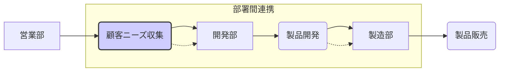

# シナジー効果 - 概要

## 1. 用語と概要

シナジー効果とは、複数の要素を組み合わせることで、それぞれの要素単体では期待できない、より大きな成果や価値を生み出す効果のことです。1+1>2という表現がよく用いられますが、単に足し算以上の相乗効果を意味しており、企業活動においては、部署間の連携強化、企業合併、業務プロセス改善など、様々な場面で活用されます。効果の大きさは、要素間の相乗関係の強さに依存します。  完璧なシナジー効果は、各要素が互いに補完し合い、新たな価値創造に繋がる状態を指します。要素間の関連性が低い場合は、期待した効果を得られない可能性があります。そのため、シナジー効果を狙う際には、要素間の適合性や連携の質を綿密に検討する必要があります。

## 2. 背景と目的

シナジー効果の概念は、古くから存在しますが、現代においては、グローバル化やデジタル化の進展によって、企業活動の複雑化、競争激化が加速しており、より効率的で効果的な経営戦略が求められています。限られた資源を最大限に活用し、競争優位性を確立するために、シナジー効果の追求は不可欠となっています。企業は、それぞれの部署や事業部門が個々に活動するのではなく、相互に連携し、互いの強みを活かすことで、全体最適を目指します。その目的は、収益の向上、コスト削減、市場シェアの拡大、イノベーション創出など多岐に渡ります。単独では達成困難な目標を、シナジー効果によって実現可能にすることが、多くの企業にとって重要な戦略となっています。

## 3. 活用方法（図解・表を含めて）

シナジー効果を最大限に活用するには、適切な計画と実行が必要です。以下に、シナジー効果を生み出すための代表的な活用方法を示します。

| 活用方法 | 説明 | 例 |
|---|---|---|
| 部署間連携 | 異なる部署間の協力により、業務効率向上や新たな価値創造 | 営業部と開発部の連携による顧客ニーズに合わせた製品開発 |
| 企業合併・買収 | 企業同士の統合により、市場シェア拡大やコスト削減 | 自動車メーカーと部品メーカーの合併によるコスト削減と製品開発の効率化 |
| 業務プロセス改善 | 複数の業務プロセスを最適化することで、全体的な効率向上 | 生産工程の改善によるリードタイム短縮と不良率の低減 |
| 共同開発 | 複数の企業が協力して製品開発を行うことで、リスク分散や開発期間短縮 | ソフトウェア開発における複数企業による共同開発 |

**図解：部署間連携によるシナジー効果**

この図は、営業部が収集した顧客ニーズを開発部にフィードバックし、製品開発に反映することで、顧客満足度向上というシナジー効果を生み出している様子を表しています。

## 4. メリット・デメリット

**メリット:**

* **収益向上:** 効率的な業務遂行によるコスト削減や、新たな市場開拓による売上増加。
* **競争優位性:** 独自の強みを組み合わせた差別化戦略による市場における優位性確保。
* **イノベーション創出:** 異なる視点や専門知識の融合による革新的な製品・サービス開発。
* **リスク低減:** 複数の要素による分散効果で、単一要素に依存するリスクを軽減。

**デメリット:**

* **調整コスト:** 部署間や企業間の調整に多くの時間と労力を要する場合がある。
* **意思疎通の困難:** 異なる文化や価値観を持つ組織間の連携は難しい場合がある。
* **リスク増加:** 失敗した場合、単独で取り組むよりも大きな損失を被る可能性がある。
* **情報共有の課題:** 情報の非公開や隠蔽によって、シナジー効果が阻害される可能性がある。

## 5. 他手法との違い

シナジー効果は、単なる集計的な効果とは異なります。単純な足し算ではなく、掛け算や指数関数的な効果を生み出すことを目指します。例えば、複数の製品を単に組み合わせるだけではシナジー効果とは言えず、それらの製品が互いに補完し合い、新たな価値を生み出す場合に初めてシナジー効果が実現します。  コスト削減などの効率化手法とは、目的が異なります。効率化は、既存の業務を最適化することに焦点を当てますが、シナジー効果は、新たな価値創造を目指します。

## 6. 企業導入事例（仮想でもよいが現実味のあるもの）

**仮想事例：スマート農業におけるシナジー効果**

A社（農業用ドローン開発会社）とB社（農業IoTシステム開発会社）が合併しました。A社のドローン技術とB社のIoTシステムを統合することで、農薬散布の自動化、生育状況のリアルタイムモニタリング、収穫時期の最適化などを実現し、生産性向上とコスト削減に成功しました。  従来は個々の技術では実現できなかった精密農業を実現し、大幅な収益増加と市場シェア拡大を達成しました。

## 7. よくある誤解

* **必ずしも全ての組み合わせで効果が出るわけではない:**  要素間の親和性や連携の質が重要です。
* **短期的に効果が出るとは限らない:**  効果を実感するには、時間と努力が必要な場合があります。
* **シナジー効果だけで成功するわけではない:**  他の経営戦略との連携も重要です。

## 8. 成功のコツ

* **明確な目標設定:** どのようなシナジー効果を目指しているのかを明確に定義する。
* **適切なパートナー選び:** 相互補完的な関係にあるパートナーを選択する。
* **密なコミュニケーション:** 定期的な情報共有と迅速な意思決定を行う。
* **柔軟な対応:** 状況に応じて計画を修正できる柔軟性を持つ。
* **効果測定の仕組み:** シナジー効果を定量的に測定し、改善につなげる。

## 9. 今後の展望

AIやIoT技術の進化により、シナジー効果の創出はますます容易になると予想されます。データ分析による最適な組み合わせの発見や、自動化による効率化が進むことで、より大きなシナジー効果が期待できます。  しかし、技術の進化に伴い、倫理的な課題やセキュリティ対策も重要になってきます。

## 10. 関連リンク

* [Wikipedia: シナジー効果](https://ja.wikipedia.org/wiki/%E3%82%B7%E3%83%8A%E3%82%B8%E3%83%BC%E5%8A%B9%E6%9E%9C) (例として)

