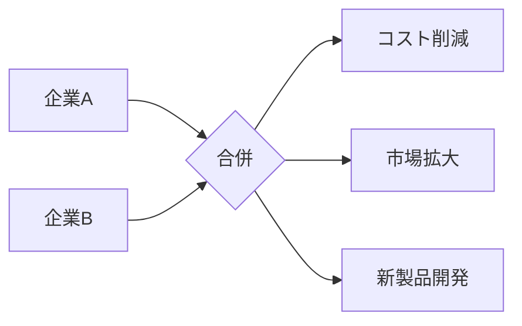

# シナジー効果 - 概要

## 1. 用語と概要

シナジー効果とは、複数の要素を組み合わせることで、それぞれの要素単独の効果の合計を上回る相乗的な効果を生み出すことを指します。  単なる足し算ではなく、掛け算、もしくはそれ以上の効果を生み出すことを意味し、ビジネスにおいては、企業合併、事業提携、部門連携など、異なる資源や能力を統合することで、新たな価値創造を目指す際に重要な概念となります。  シナジー効果は、単に効率性を上げるだけでなく、革新的な製品やサービスの開発、市場における競争優位性の獲得、企業価値の向上など、多様なポジティブなアウトカムに繋がる可能性を秘めています。  その効果は、それぞれの要素が持つ特性や、組み合わせ方によって大きく変動するため、効果的なシナジー創出のための戦略立案が不可欠です。

## 2. 背景と目的

シナジー効果の概念は、古くから存在しますが、特に近年、グローバル化やデジタル化の進展に伴い、企業は単独では対応できない複雑な課題に直面するようになりました。  市場競争の激化、技術革新の加速、顧客ニーズの多様化など、これらの課題を克服するためには、複数の企業や部門が連携し、それぞれの強みを活かしながら、相乗効果を生み出すことが重要となっています。  シナジー効果を目的とした企業活動の背景には、コスト削減、収益向上、市場シェア拡大、新規事業創出、企業リスク軽減といった具体的な目標が存在します。  企業は、これらの目標達成のために、シナジー効果を戦略的に活用し、持続的な成長を目指しています。

## 3. 活用方法（図解・表を含めて）

シナジー効果は、様々な場面で活用できます。例えば、企業合併によるシナジー効果は、以下のように分類されます。

| シナジー効果の種類 | 説明 | 例 |
|---|---|---|
| 規模の経済効果 | 生産規模の拡大によるコスト削減 | 購買力向上による原材料コスト削減 |
| 範囲の経済効果 | 関連事業の統合による効率向上 | 販売網の共有による販売コスト削減 |
| 技術的シナジー効果 | 技術・ノウハウの共有による開発効率向上 | 新製品開発のスピードアップ |
| 財務的シナジー効果 | 資金調達コストの削減、資本効率の向上 | 借入金利回りの改善 |

 

**図解：企業合併によるシナジー効果**

上記の図は、企業Aと企業Bが合併することで、コスト削減、市場拡大、新製品開発といったシナジー効果が生まれる様子を表しています。

## 4. メリット・デメリット

**メリット:**

* **競争優位性の向上:** 統合された資源と能力により、競合他社との差別化を図ることが可能になります。
* **収益性の向上:** コスト削減、効率向上、売上増加などを通じて、収益性を高めることができます。
* **リスク軽減:** 多角化によるリスク分散や、事業ポートフォリオの最適化が期待できます。
* **イノベーション促進:** 異なる視点や専門知識の融合により、新たなアイデアや技術を生み出すことができます。
* **市場拡大:** 新規顧客層へのリーチや、新たな市場への進出が容易になります。

**デメリット:**

* **統合コスト:** 企業合併や事業提携には、多大な費用と時間がかかります。
* **文化摩擦:** 異なる企業文化の衝突により、統合プロセスが困難になる可能性があります。
* **人事問題:** 従業員の配置転換や解雇といった問題が発生する可能性があります。
* **リスク増大:** 統合失敗による経営危機や、事業の失敗リスクも存在します。
* **予期せぬ問題:** 計画外の課題や、シナジー効果が想定通りに発揮されない可能性があります。

## 5. 他手法との違い

シナジー効果は、単なるコスト削減や効率向上とは異なります。  コスト削減は、既存の業務プロセスを改善することで費用を削減することを目的とする一方、シナジー効果は、複数の要素を組み合わせることで、単なる合計を上回る新たな価値を生み出すことを目指します。  また、効率向上は、生産性や作業効率を高めることを目的としますが、シナジー効果は、効率向上を包含しつつ、新たなビジネスチャンスやイノベーション創出といったより広範な効果を目指します。

## 6. 企業導入事例（仮想でもよいが現実味のあるもの）

架空の事例として、食品メーカーA社と飲料メーカーB社の合併を考えてみましょう。A社は高いブランド力と食品開発力、B社は広範な販売網と飲料製造技術を持っています。合併により、A社の食品とB社の飲料をセットで販売できるようになり、売上増加が見込めます。また、両社の製造技術を融合することで、新たな健康志向飲料の開発にも成功し、市場を拡大しました。さらに、販売網の共有によるコスト削減も実現し、大きなシナジー効果を生み出しました。

## 7. よくある誤解

* **必ずしもプラスの効果が生まれるわけではない:** シナジー効果は、適切な戦略と実行が不可欠です。計画不足や連携不足では、効果が期待できないばかりか、逆にマイナス効果が生じる可能性もあります。
* **短期的にはコストが増加する可能性がある:** 統合プロセスには、初期投資や調整費用が必要となるため、短期的にはコストが増加する場合があります。
* **全てがシナジー効果ではない:** 効率化やコスト削減はシナジー効果の一部ですが、それだけではシナジー効果とは言えません。新しい価値創造が重要です。

## 8. 成功のコツ

* **明確な目標設定:**  どのようなシナジー効果を目指しているのかを明確に定義する必要があります。
* **綿密な計画立案:**  統合プロセスを綿密に計画し、リスクを事前に洗い出す必要があります。
* **効果的なコミュニケーション:**  関係各社・部門間のコミュニケーションを密にする必要があります。
* **柔軟な対応:**  予期せぬ問題が発生した場合でも、柔軟に対応できる体制が必要です。
* **継続的な改善:**  シナジー効果の測定と分析を行い、継続的に改善していく必要があります。

## 9. 今後の展望

AIやIoTなどの技術革新により、企業間の連携がさらに容易になり、新たなシナジー効果創出の可能性が広がっています。  データ分析技術を活用することで、シナジー効果をより正確に予測・評価できるようになり、より効率的な戦略立案が可能になります。  さらに、オープンイノベーションの促進により、企業内外の連携が深まり、より大きなシナジー効果が期待されます。

## 10. 関連リンク

* [経済産業省：企業連携](仮のURL)
* [中小企業庁：事業承継](仮のURL)

**(注：上記のURLは架空のものです。)**
