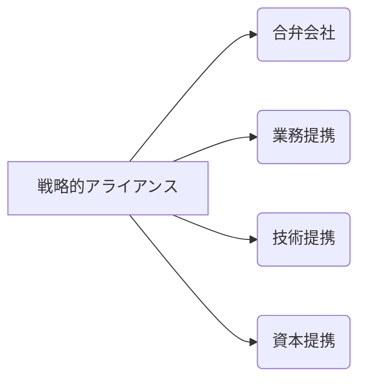

# 戦略的アライアンス - 概要

## 1. 用語と概要

戦略的アライアンスとは、企業が互いの強みを活かし、共同で新たな市場を開拓したり、既存市場での競争力を強化したりするために結ぶ、長期的な協力関係のことです。単なる取引関係を超え、相互に資本や技術、人材などを共有し、戦略目標を達成するために密接に連携することを指します。  合弁会社設立、業務提携、技術提携など、様々な形態が存在し、それぞれの企業の状況や目標に応じて最適な形態が選択されます。  近年では、グローバル化やデジタル化の加速により、単独企業では対応困難な課題が増えているため、戦略的アライアンスの重要性はますます高まっています。 特に、急成長市場への参入や、高度な技術開発、サプライチェーンの強化において効果を発揮します。

## 2. 背景と目的

戦略的アライアンスの背景には、企業を取り巻く環境変化が大きく影響しています。グローバル競争の激化、技術革新の加速、市場の多様化など、単独企業では対応が困難な課題が山積しているのが現状です。  従来の垂直統合型のビジネスモデルでは、巨額な投資や長期間の開発期間が必要となり、市場の変化に対応しきれないリスクがあります。そこで、複数の企業がそれぞれの強みを活かし、リスクを共有しながら連携することで、より効率的かつ効果的に事業を推進できる戦略的アライアンスが注目されています。  目的としては、市場シェア拡大、新規事業開発、コスト削減、技術革新、リスク軽減などが挙げられます。  特に、異業種間のアライアンスは、既存の枠にとらわれないイノベーションを生み出す可能性を秘めています。

## 3. 活用方法（図解・表を含めて）

戦略的アライアンスには様々な形態があります。以下に代表的なものを示します。

| アライアンス形態 | 概要 | 具体的な例 |
|---|---|---|
| **合弁会社** | 2社以上が出資して設立する新しい会社 | トヨタとマツダの合弁会社によるEV開発 |
| **業務提携** | 特定の業務において協力関係を結ぶ | マーケティング業務における共同キャンペーン実施 |
| **技術提携** | 技術や特許の相互利用を行う | 半導体メーカー間の技術ライセンス契約 |
| **資本提携** | 資本を出し合って相互に株式を保有する | 企業Aが企業Bの株式の一部を取得し、経営に参画 |

**図解：戦略的アライアンスの類型**

## 4. メリット・デメリット

**メリット:**

* **リスクの分散:** 複数企業でリスクを共有できるため、単独企業よりもリスクが低減されます。
* **コスト削減:** 資源や設備を共有することで、コスト削減効果が期待できます。
* **技術・ノウハウの獲得:** 他の企業から技術やノウハウを学ぶことができます。
* **市場拡大:** 新しい市場への参入や既存市場でのシェア拡大が容易になります。
* **迅速な事業展開:** 複数企業の連携により、事業展開のスピードが向上します。

**デメリット:**

* **意思決定の遅れ:** 複数企業の合意形成が必要なため、意思決定に時間がかかる場合があります。
* **情報の漏洩リスク:** 重要な情報の漏洩リスクがあります。
* **企業文化の相違:** 企業文化の違いから、摩擦が生じる可能性があります。
* **パートナー選定の困難さ:** 信頼できる適切なパートナーを見つけることが困難な場合があります。
* **利益配分に関する紛争:** 利益配分に関して、紛争が起こる可能性があります。

## 5. 他手法との違い

戦略的アライアンスは、M&A（合併・買収）やフランチャイズとは異なる手法です。M&Aは企業の完全な統合を目的とするのに対し、戦略的アライアンスはあくまで協力関係を維持したまま、それぞれの独立性を保ちながら連携します。フランチャイズは、ブランドやノウハウを提供する側と、それを活用する側の関係であり、戦略的アライアンスのような相互協力関係とは異なります。

## 6. 企業導入事例（仮想でもよいが現実味のあるもの）

架空の事例として、食品メーカーA社と物流企業B社の戦略的アライアンスを考えます。A社は高品質な食品を製造していますが、物流網が不足していました。B社は全国規模の物流網を持っていますが、食品輸送のノウハウが不足していました。両社は業務提携し、A社はB社に食品輸送を委託し、B社はA社の物流ノウハウを学ぶことで、相互にメリットを得るシナリオです。  これによりA社は安定した物流体制を構築し、B社は新たな顧客基盤を獲得することができるようになります。

## 7. よくある誤解

* **「何でも共同でやる」という誤解:**  戦略的アライアンスは、全ての業務を共同で行う必要はありません。それぞれの企業の強みを活かし、得意な業務を分担することが重要です。
* **「簡単に成功する」という誤解:**  戦略的アライアンスは、綿密な計画と、パートナー企業との信頼関係構築が不可欠です。安易な取り組みでは、失敗する可能性があります。
* **「一度組めば永久に続く」という誤解:**  市場環境の変化などにより、アライアンス関係を解消する可能性もあります。継続的な見直しが必要です。

## 8. 成功のコツ

戦略的アライアンスを成功させるためには、以下の点が重要です。

* **明確な目標設定:** アライアンスの目的を明確に設定し、双方で共有することが重要です。
* **信頼関係の構築:** パートナー企業との信頼関係を構築することが成功の鍵となります。
* **適切なパートナー選定:** 自社の戦略と相性の良いパートナー企業を選択することが重要です。
* **柔軟な対応:** 市場環境の変化に対応できるよう、柔軟な対応が必要です。
* **継続的なコミュニケーション:** 定期的なコミュニケーションを取り、情報共有を徹底することが重要です。

## 9. 今後の展望

今後、デジタル化の進展により、データ連携やAI活用による新たな戦略的アライアンスの形態が登場する可能性があります。  また、サステナビリティへの関心の高まりから、ESG経営を重視したアライアンスも増加していくと考えられます。  さらに、異業種間の連携によるイノベーション創出が加速し、戦略的アライアンスの重要性はますます高まると予想されます。

## 10. 関連リンク

* [経済産業省：戦略的アライアンスに関する資料](仮のURL)
* [中小企業庁：戦略的アライアンス支援策](仮のURL)

**(注：上記のURLは架空のものです。)**
