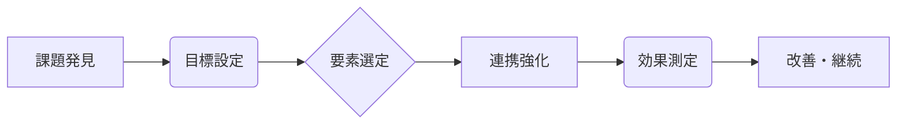

# シナジー効果 - 概要

## 1. 用語と概要

シナジー効果とは、複数の要素を組み合わせることで、それぞれの要素単体では期待できない、より大きな成果や価値を生み出す効果のことです。1+1>2の関係性を表し、企業経営においては、複数の部署や事業部門の連携、企業合併、業務プロセス改善など、様々な場面で重要な概念となります。単なる足し算ではなく、相乗的な効果を生み出す点が特徴です。  効果の大きさは、組み合わせる要素の特性や連携の質に大きく依存します。  うまくシナジー効果を生み出せれば、効率化、売上向上、競争優位性の獲得など、企業にとって大きなメリットとなりますが、逆に効果が期待できない場合、資源の無駄遣いになりかねません。そのため、シナジー効果を計画的に創出・活用する戦略が求められます。

## 2. 背景と目的

シナジー効果の概念は、古代ギリシャの哲学者アリストテレスの時代から存在していましたが、現代的なビジネス用語としては20世紀後半から注目されるようになりました。グローバル化や市場競争の激化に伴い、企業は単独での活動では限界を感じ、複数の企業との連携や事業統合によるシナジー効果の追求が不可欠になってきたからです。目的は、企業価値の向上、競争力の強化、効率性の向上に尽きます。  具体的には、売上増加、コスト削減、市場シェア拡大、新規事業創出など、様々なビジネス目標の達成に貢献します。  近年では、デジタルトランスフォーメーション(DX)推進においても、異なるシステムや技術の連携によるシナジー効果が重要な役割を果たしています。

## 3. 活用方法（図解・表を含めて）

シナジー効果を最大限に活用するには、適切な計画と実行が不可欠です。

**図1：シナジー効果の創出プロセス**

**表1：シナジー効果を生むための要素組み合わせ例**

| 要素A | 要素B | 期待されるシナジー効果 |
|---|---|---|
| 新技術開発 | マーケティング強化 | 新製品の早期市場浸透、売上増加 |
| 業務プロセス改善 | ITシステム導入 | 業務効率化、コスト削減 |
| 企業合併 | ブランド力向上 | 市場シェア拡大、競争優位性獲得 |
| 人材育成 | 組織改革 | 従業員エンゲージメント向上、生産性向上 |

## 4. メリット・デメリット

**メリット:**

* **収益増加:** 新製品開発、市場拡大などにより売上高が増加します。
* **コスト削減:** 業務効率化、重複排除によりコストを削減できます。
* **競争優位性向上:** 独自の強みを組み合わせることで競合他社との差別化を図れます。
* **リスク分散:** 多角化経営により、特定事業のリスクを軽減できます。
* **イノベーション創出:** 異なる分野の知見を融合することで、新たな価値を生み出せます。

**デメリット:**

* **連携の困難さ:** 部署間の利害調整やコミュニケーション不足による摩擦が生じる可能性があります。
* **統合コスト:** システム統合、人事異動など、統合に多大なコストがかかる場合があります。
* **文化摩擦:** 企業文化の違いによる衝突や統合後の混乱が生じる可能性があります。
* **リスク増加:** 失敗した場合、大きな損失を被る可能性があります。
* **効果測定の難しさ:** シナジー効果の大きさを正確に測定することが難しい場合があります。

## 5. 他手法との違い

シナジー効果は、単なる協力関係や業務委託とは異なります。協力関係は個々の成果の合計に留まることが多いですが、シナジー効果は、要素間の相互作用によって、合計をはるかに超える成果を生み出します。業務委託は特定の業務を外部に委託するもので、必ずしもシナジー効果が生まれるとは限りません。

## 6. 企業導入事例（仮想でもよいが現実味のあるもの）

架空の企業「A社」は、食品製造事業と物流事業を展開していました。それぞれ単独では収益は安定していましたが、成長に限界を感じていました。そこで、両事業を統合し、自社工場から直接消費者へ商品を届ける「D2Cモデル」を導入しました。その結果、物流コストの削減、新鮮な商品の提供による顧客満足度向上、ブランドイメージの向上を実現し、大幅な売上増加につながりました。これは、食品製造と物流の連携によるシナジー効果の好例です。

## 7. よくある誤解

* **必ずしもプラスの効果が生まれるわけではない:** シナジー効果は、適切な計画と実行によってはじめて生まれるものです。
* **簡単に実現できるわけではない:** 部署間の調整や文化の違い、システム統合などの課題を乗り越える必要があります。
* **目に見える成果がすぐに現れるとは限らない:** 中長期的な視点で効果を評価する必要があります。

## 8. 成功のコツ

* **明確な目標設定:** 具体的な目標を設定し、シナジー効果を測定可能な指標に落とし込む。
* **適切なパートナー選定:** 相互補完的な関係にあるパートナーを選択する。
* **効果的なコミュニケーション:** 部署間、企業間での情報共有と連携を強化する。
* **柔軟な対応:** 状況に応じて計画を修正し、課題解決に迅速に対応する。
* **継続的な改善:** 定期的に効果を評価し、改善策を講じる。

## 9. 今後の展望

AIやIoTなどの技術革新によって、異なるシステムやデータの連携によるシナジー効果がますます重要になります。  企業は、これらの技術を活用し、新たな価値創造に挑戦していく必要があります。  また、サステナビリティへの取り組みにおいても、企業間の連携によるシナジー効果が期待されます。

## 10. 関連リンク

* [経済産業省：デジタルトランスフォーメーション](https://www.meti.go.jp/policy/digital_economy/index.html) (例として)

