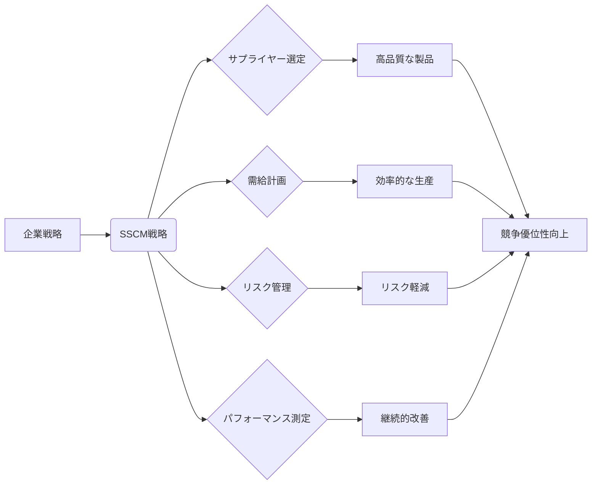

# 戦略的サプライチェーンマネジメント - 概要

## 1. 用語と概要

戦略的サプライチェーンマネジメント (Strategic Supply Chain Management: SSCM) とは、企業の長期的な競争優位性を確立するために、サプライチェーン全体を戦略的に計画・管理するアプローチです。単なる効率性向上だけでなく、市場の変化への迅速な対応、リスク管理、顧客価値の最大化といった、より包括的な視点を取り入れています。従来の、個々のプロセス最適化に焦点を当てたサプライチェーンマネジメントとは異なり、SSCMは企業全体の戦略と密接に連携し、持続可能な成長を目指します。これは、原材料の調達から製品の販売・アフターサービスまで、バリューチェーン全体を統合的に捉え、最適化しようとするものです。

## 2. 背景と目的

グローバル化と市場のダイナミズムの高まりにより、企業は複雑かつ不確実性の高いサプライチェーン環境に直面しています。従来型のサプライチェーン管理では、これらの変化への対応が困難になりつつあります。SSCMは、こうした背景から生まれた概念であり、その主な目的は、以下の通りです。

* **競争優位性の強化**: 迅速な市場対応、コスト削減、製品品質向上による競争力の強化
* **リスク軽減**: 供給網の脆弱性や自然災害、政治的リスクなどに対するリスク管理体制の構築
* **顧客満足度向上**: 高品質な製品・サービスの提供、迅速な納品、カスタマイズ対応による顧客満足度の向上
* **持続可能性の追求**: 環境配慮、社会貢献、倫理的な調達などを重視したサプライチェーンの構築
* **収益性の向上**: コスト削減、効率化、需要予測の精度向上による収益性の向上

## 3. 活用方法（図解・表を含めて）

SSCMの活用方法は、企業規模や業種によって異なりますが、一般的には以下のステップに従います。

| ステップ | 内容 | 具体的な取り組み例 |
|---|---|---|
| **1. 戦略策定** | 企業全体の戦略とサプライチェーン戦略の整合性確保 | 市場分析、競合分析、SWOT分析 |
| **2. サプライヤー選定** | 信頼性が高く、コスト競争力のあるサプライヤーを選定 | サプライヤー評価、スコアリングシステム導入 |
| **3. 需給計画** | 需要予測、在庫管理、生産計画の最適化 | 需要予測モデルの構築、在庫最適化システム導入 |
| **4. リスク管理** | サプライチェーンにおけるリスクを特定し、対策を講じる | リスクアセスメント、BCP策定 |
| **5. パフォーマンス測定** | KPIを設定し、サプライチェーンのパフォーマンスを測定・評価 | KPIダッシュボードの構築、定期的なレビュー |

**(図解)**

## 4. メリット・デメリット

**メリット:**

* コスト削減、効率向上による収益性の向上
* リスク軽減による事業継続性の向上
* 顧客満足度向上によるブランドイメージ向上
* 新製品開発や市場変化への迅速な対応

**デメリット:**

* 導入コスト、システム構築コストが高い
* 関係者間の連携強化、情報共有体制の構築が困難
* サプライヤーとの協調関係の構築に時間と労力がかかる
* パフォーマンス測定指標の選定が難しい

## 5. 他手法との違い

従来のサプライチェーンマネジメントは、主に個々のプロセスの効率化に焦点を当てていました。一方、SSCMは、企業全体の戦略と整合性をとり、長期的な視点でサプライチェーン全体を最適化しようとする点が異なります。例えば、在庫管理において、従来型では在庫削減を最優先するのに対し、SSCMでは、リスク管理や顧客サービスレベルなども考慮して最適な在庫レベルを決定します。

## 6. 企業導入事例（仮想でもよいが現実味のあるもの）

**株式会社アーステック（仮想企業）**は、自動車部品メーカーです。グローバルなサプライチェーンを持つ同社は、SSCMを導入することで、サプライヤーとの連携強化、リスク管理体制の構築、需給計画の最適化を実現しました。その結果、生産リードタイムを15%短縮、在庫レベルを10%削減、顧客満足度を5%向上させることに成功しました。具体的な取り組みとしては、サプライヤーとの情報共有プラットフォームを構築、リスクアセスメントツールを導入、需要予測モデルを高度化しました。

## 7. よくある誤解

* **SSCMはITシステム導入だけで実現できる:** SSCMは、ITシステムも重要な要素ですが、人材育成、組織体制、サプライヤーとの協調関係など、多様な要素が複雑に絡み合っています。
* **SSCMはコスト削減だけが目的である:** コスト削減も重要な要素ですが、顧客満足度向上、リスク軽減、持続可能性など、より広い範囲での価値創造を目指します。
* **SSCMは一度導入すれば終わりである:** SSCMは、市場環境の変化に合わせて、継続的に改善・進化させていく必要があります。

## 8. 成功のコツ

SSCMを成功させるためには、以下の点が重要です。

* **トップマネジメントのコミットメント**: 企業全体の戦略との整合性を図り、必要な資源を投入する
* **関係者間の連携強化**: サプライヤー、顧客、内部部門など、関係者間の緊密な連携を構築する
* **情報共有体制の構築**: 透明性が高く、リアルタイムな情報共有を実現する
* **人材育成**: SSCMに関する知識・スキルを備えた人材を育成する
* **KPIの設定とモニタリング**: パフォーマンスを測定し、継続的な改善を行う

## 9. 今後の展望

今後、SSCMは、デジタルトランスフォーメーション(DX)、AI、IoTなどの技術を活用することで、さらに高度化していくと予想されます。予測精度の向上、リアルタイムなサプライチェーンの可視化、自動化・省人化による効率性向上などが期待されます。また、サステナビリティへの配慮もますます重要になり、環境負荷低減、倫理的な調達などを重視したサプライチェーンの構築が求められるでしょう。

## 10. 関連リンク

* [サプライチェーンマネジメント協会](https://www.scm.or.jp/)  (仮想リンク)
* [世界サプライチェーン協議会](https://www.iscouncil.org/) (仮想リンク)

