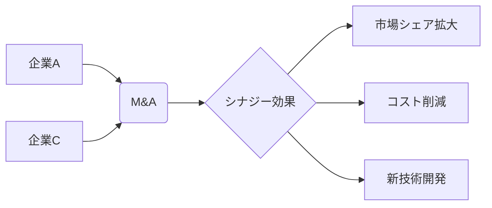

# シナジー効果 - 概要

## 1. 用語と概要

シナジー効果とは、複数の要素を組み合わせることで、個々の要素の単純な合計以上の効果を生み出す現象を指します。1+1＞2といった表現で表されることが多く、ビジネスの文脈では、異なる部署や企業、技術、製品などを連携させることで、全体としてより大きな価値を生み出すことを意味します。単に相乗効果と訳されることもありますが、より積極的で、戦略的な連携による成果を強調するニュアンスを含んでいます。  シナジー効果を生み出すためには、各要素間の適切な連携と、全体の目標を共有することが不可欠です。要素間の相関関係を深く理解し、相互作用を最大限に引き出すための綿密な計画と実行が必要です。  単なる足し算ではなく、掛け算、あるいは指数関数的な効果を狙う点が、シナジー効果の重要なポイントです。

## 2. 背景と目的

企業を取り巻く環境はますます複雑化・高度化しており、単一の部門や技術だけで競争優位性を維持することは困難になっています。そのため、企業は複数のリソースを効果的に組み合わせ、新たな価値を創造する必要性に迫られています。シナジー効果の追求は、このような背景から生まれた経営戦略上の重要な目標となっています。  その目的は、企業全体の競争力強化、収益向上、イノベーション促進、市場シェア拡大など多岐に渡ります。  具体的には、既存事業の活性化、新規事業の創出、コスト削減、リスク軽減など、様々な経営課題の解決に貢献します。  シナジー効果を最大化することで、企業は持続的な成長を実現し、株主価値の向上を目指せます。

## 3. 活用方法（図解・表を含めて）

シナジー効果の活用方法は多様であり、企業規模や業種、戦略によって最適な手法は異なります。  ここでは、代表的な活用例を図解と表で示します。

**図1：シナジー効果の例（M&A）**

**表1：シナジー効果を生み出すための要素**

| 要素 | 説明 | 例 |
|---|---|---|
| 互換性 | 各要素が互いに連携しやすく、統合が容易であること | 製品間の互換性、システム間のAPI連携 |
| 相乗効果 | 各要素を組み合わせることで、1+1＞2の効果が生まれること | 異なる専門知識の融合によるイノベーション |
| 共通の目標 | 全体の目標を明確に共有し、各要素が連携して取り組むこと | 市場シェア拡大、収益向上 |
| コミュニケーション | 部署間、企業間での円滑な情報共有と意思疎通 | 定期的な会議、情報共有システム |
| リスク管理 | 潜在的なリスクを事前に特定し、適切な対策を講じること | 統合後の組織運営、技術的リスク |

## 4. メリット・デメリット

**メリット:**

* 収益性の向上：コスト削減や売上増加による収益増加
* 競争力の強化：市場での優位性獲得
* イノベーション促進：新しい製品・サービスの開発
* リスク軽減：複数の事業によるリスク分散
* 企業価値の向上：株価上昇など

**デメリット:**

* 統合コスト：システム統合や人員配置変更に伴うコスト
* 文化摩擦：企業文化の差異による摩擦
* 統合リスク：統合プロセスにおける失敗リスク
* 意思決定の遅延：複数の関係者の合意形成に時間がかかる
* 情報漏洩リスク：情報共有におけるセキュリティリスク

## 5. 他手法との違い

シナジー効果は、単なるコスト削減や効率化とは異なります。コスト削減や効率化は、同じ作業をより安く、より早く行うことを目指しますが、シナジー効果は、異なる要素を組み合わせることで、全く新しい価値を創造することを目指します。  また、単なるコラボレーションとも異なります。コラボレーションは、複数の企業や個人が協力して作業を行うことを意味しますが、シナジー効果は、コラボレーションによって生み出される相乗効果を最大化することを目指します。

## 6. 企業導入事例（仮想でもよいが現実味のあるもの）

架空の事例として、食品メーカーA社と物流会社B社のM&Aを考えます。A社は高い品質の食品を製造していますが、物流網が弱く、販売エリアが限定されていました。B社は広範囲にわたる物流網を持っていますが、独自の食品ブランドがありません。両社が合併することで、A社の高品質な食品をB社の物流網を通じて全国に販売できるようになり、売上を大幅に増加させるシナジー効果が期待できます。さらに、共同で新しい食品開発を行うことで、新たな収益源の創出も期待できます。

## 7. よくある誤解

シナジー効果は、必ずしも容易に実現できるものではありません。多くの場合、綿密な計画と実行が必要です。 よくある誤解として、「単に企業を合併すればシナジー効果が生まれる」という考えがあります。  合併後、企業文化の衝突や、統合作業の失敗によって、逆にシナジー効果どころか損失を被るケースもあります。 また、シナジー効果を過剰に期待し、現実的な目標設定ができていないケースも見られます。

## 8. 成功のコツ

シナジー効果を実現するためには、以下の点が重要です。

* 明確な目標設定：シナジー効果によって達成したい目標を明確に設定する
* 関係者の協調：関係各部署、企業間の連携と協調を促進する
* 情報共有：必要な情報をタイムリーに共有する
* リスク管理：潜在的なリスクを事前に特定し、対策を講じる
* 定期的な評価：効果を定期的に評価し、必要に応じて改善策を講じる

## 9. 今後の展望

今後、AIやIoT技術の発展により、より高度なシナジー効果の実現が期待されます。  例えば、AIを活用したデータ分析により、顧客ニーズを正確に把握し、最適な製品・サービスを提供することで、より大きなシナジー効果を生み出すことができます。  また、IoT技術を活用することで、リアルタイムでデータを収集・分析し、迅速な意思決定を行うことが可能になります。

## 10. 関連リンク

* [経済産業省：中小企業における経営革新](仮のリンク)
* [日本生産性本部：経営効率化](仮のリンク)

(注：上記リンクは架空のものです。)
