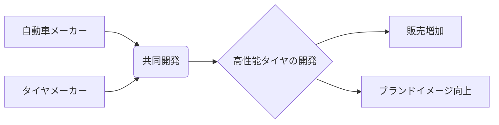

# シナジー効果 - 概要

## 1. 用語と概要

シナジー効果とは、複数の要素を組み合わせることで、それぞれの要素単独の効果の合計を上回る相乗的な効果が生まれることを指します。1+1>2という表現で表されることが多く、ビジネスにおいては、部門、企業、製品、サービスなどを組み合わせることで、新たな価値創造や効率化を実現することを意味します。単なる合計以上の効果を生み出すため、計画的な戦略と実行が不可欠です。  シナジー効果の最大化は、企業にとって大きな競争優位性につながります。

## 2. 背景と目的

シナジー効果を追求する背景には、現代ビジネスにおける複雑化と競争激化があります。単独の事業では限界があり、新たな価値創造やコスト削減には、複数の要素を効果的に統合することが必要不可欠となっています。  企業合併や提携、製品・サービスの組み合わせなどが代表的な例です。目的は、単独では達成できない目標を達成し、企業価値を最大化することです。具体的には、収益の向上、コストの削減、市場シェアの拡大、顧客満足度の向上などが挙げられます。  戦略的なシナジー効果の追求は、企業の持続的な成長にとって重要な鍵となります。

## 3. 活用方法（図解・表を含めて）

シナジー効果を最大限に活用するためには、綿密な計画と実行が必要です。以下に、活用方法の例を図解と表を用いて示します。

**図解：シナジー効果の例（自動車メーカーとタイヤメーカーの提携）**

**表：シナジー効果の活用例**

| 組み合わせ例 | シナジー効果 | 具体的な効果 |
|---|---|---|
| マーケティング部門と販売部門 | 情報共有による効率的な顧客対応 | 顧客満足度向上、販売増加 |
| 製品Aと製品Bの組み合わせ | 互換性による付加価値向上 | 新製品開発、販売価格の向上 |
| 企業Aと企業Bの合併 | 資源・技術の統合 | コスト削減、市場シェア拡大 |

## 4. メリット・デメリット

**メリット:**

* **収益増加:** 新規市場開拓、顧客基盤拡大などによる売上増加。
* **コスト削減:** 資源共有、業務効率化によるコスト削減。
* **競争優位性の確立:** 他社には真似できない独自の価値創造。
* **イノベーション促進:** 異なる分野の知見融合による新たな技術開発。
* **リスク分散:** 多角化による事業リスクの軽減。

**デメリット:**

* **統合コスト:** システム統合、組織再編などによる初期投資。
* **文化摩擦:** 異なる企業文化の衝突による調整コスト。
* **意思決定の遅延:** 複数の関係者の合意形成に時間がかかる。
* **シナジー効果の未達成:** 期待通りの効果が得られないリスク。
* **情報漏洩リスク:** 統合に伴う情報管理の難しさ。

## 5. 他手法との違い

シナジー効果は、単なる「相乗効果」や「相関関係」とは異なります。「相乗効果」は、複数の要素が互いに影響し合って効果を生むことを広く指しますが、シナジー効果は、その効果が単なる合計を上回ることを明確に示しています。また、「相関関係」は、複数の要素間に関連性があることを示すもので、必ずしも効果の増大を意味しません。シナジー効果は、計画的な統合によって、意図的に大きな効果を生み出すことを目的としています。

## 6. 企業導入事例（仮想でもよいが現実味のあるもの）

架空の事例として、食品メーカー「A社」と飲料メーカー「B社」の提携を挙げます。A社は健康志向の食品を製造、B社は機能性飲料を製造しています。両社は提携することで、A社の食品とB社の飲料を組み合わせた健康セットを開発・販売。それぞれの顧客層に新たな商品を提案することで、両社の売上向上を実現しました。  さらに、共同でのマーケティング戦略により、ブランド認知度も向上し、シナジー効果を大きく生み出しました。

## 7. よくある誤解

* **全ての場合でシナジー効果が生まれるわけではない:** 適切な計画と実行がなければ、期待通りの効果は得られません。
* **シナジー効果は魔法ではない:** 努力と時間が必要であり、リスクも存在します。
* **シナジー効果はすぐに生まれるわけではない:**  効果が現れるまでには時間がかかる場合があります。

## 8. 成功のコツ

* **明確な目標設定:** 具体的な目標を設定し、指標を明確にする。
* **綿密な計画:** 統合プロセス、リスク管理などを詳細に計画する。
* **関係者間の連携:** 部署、企業間で密接な連携を図る。
* **柔軟な対応:** 状況の変化に対応できる柔軟性を持つ。
* **効果測定:** 定期的に効果を測定し、改善策を講じる。

## 9. 今後の展望

AIやIoT技術の活用により、シナジー効果の創出と最適化がさらに加速すると予想されます。データ分析による効率的な意思決定や、リアルタイムでの状況把握が可能になり、より精緻なシナジー効果の追求が可能になります。  また、サプライチェーン全体でのシナジー効果の活用も重要となり、企業間の連携がさらに深化していくと考えられます。

## 10. 関連リンク

* [経済産業省：産業競争力強化](仮のリンク)
* [中小企業庁：経営革新](仮のリンク)

**(注記：リンクは仮のものであり、実際のリンクは存在しません。)**
