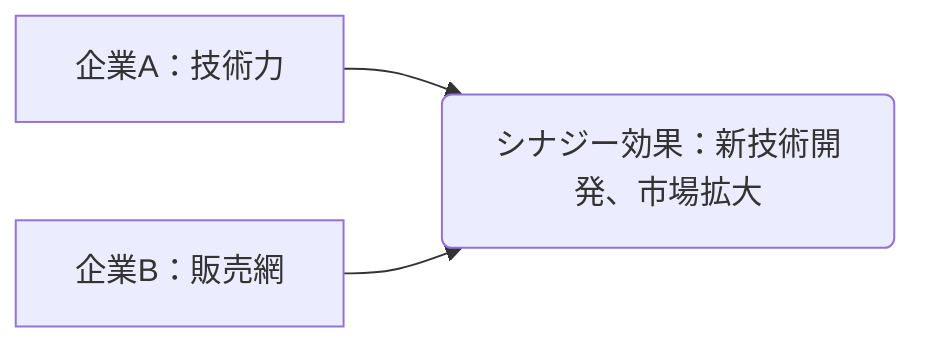

# シナジー効果 - 概要

## 1. 用語と概要

「シナジー効果」とは、複数の要素を組み合わせることで、それぞれの要素単独の効果を合計した以上の効果を生み出すことを指します。1+1>2の関係性を表す言葉として広くビジネスシーンで使用され、特に複数の企業が合併したり、事業提携を行う際に期待される効果として頻繁に用いられます。単なる相乗効果ではなく、各要素間の相互作用によって生まれる、真に新しい価値創造を意味する点が重要です。単なる合計以上の効果ではなく、革新的な成果や新たな可能性の創出を伴う点が、シナジー効果の本質です。この効果を最大限に引き出すためには、各要素の特性を深く理解し、最適な組み合わせと連携戦略を構築することが不可欠です。

## 2. 背景と目的

シナジー効果という概念が注目されるようになった背景には、グローバル化や市場の複雑化があります。単独企業では対応が困難な課題に対処するため、企業同士の連携や合併が盛んに行われるようになり、その際に期待される効果としてシナジー効果が強調されるようになりました。  企業合併やM&Aにおいては、単に売上高や従業員数を増やすだけでなく、それ以上の価値創造を目指し、シナジー効果の獲得が重要な経営目標となります。目的は、コスト削減、市場シェア拡大、技術革新、ブランド力の向上など、多岐にわたります。これらの目的達成のためには、綿密な計画と実行、そして継続的なモニタリングが不可欠です。  特に、異なる強みを持つ企業が連携することで、相乗効果を超えた、真に新しい価値を生み出す可能性が高まります。

## 3. 活用方法（図解・表を含めて）

シナジー効果は、様々なビジネスシーンで活用できます。例えば、以下のようなケースが考えられます。

| 活用事例 | 説明 | 期待されるシナジー効果 |
|---|---|---|
| 企業合併 | A社とB社が合併し、経営資源を統合 | コスト削減、市場シェア拡大、新製品開発 |
| 事業提携 | A社とB社が共同で新事業を展開 | 顧客基盤の拡大、技術力の向上、リスク分散 |
| 部署間の連携 | 営業部と開発部が連携して新製品を開発 | 新製品の市場適合性向上、開発期間短縮 |

**図解：企業合併によるシナジー効果**

上記図解は、技術力に優れた企業Aと、広範な販売網を持つ企業Bが合併することで、新たな技術開発と市場拡大というシナジー効果を生み出すことを示しています。

## 4. メリット・デメリット

**メリット:**

* **収益性の向上:** コスト削減、効率化、売上増加などを通じて、収益性を大幅に向上させることができます。
* **競争力の強化:** 市場シェア拡大、新製品・サービス開発などにより、競争力を強化できます。
* **リスクの軽減:** 多様な事業展開や技術獲得により、リスクを分散することができます。
* **イノベーションの促進:** 異なる専門知識や技術の融合により、革新的な製品やサービスを生み出すことができます。

**デメリット:**

* **文化摩擦:** 企業文化や経営スタイルの違いにより、統合に時間がかかったり、摩擦が生じることがあります。
* **統合コスト:** システム統合や人員整理など、統合に伴うコストが発生します。
* **リスク増加:** 計画が失敗した場合、大きな損失を被る可能性があります。
* **シナジー効果の不発:** 期待した効果が得られない可能性もあります。

## 5. 他手法との違い

シナジー効果は、単なる相乗効果とは異なります。相乗効果は、複数の要素を組み合わせることで、それぞれの要素の単純な合計以上の効果を生み出すことを意味しますが、シナジー効果は、それ以上の、全く新しい価値創造を伴う点が異なります。例えば、２つの企業の単なる売上高の合計を超えるのが相乗効果だとしたら、シナジー効果は、両社の統合によって全く新しい市場を開拓し、売上高を飛躍的に向上させるような効果です。また、単なるコスト削減や効率化だけでなく、イノベーション創出などの質的な向上も伴う点が大きな違いです。

## 6. 企業導入事例（仮想でもよいが現実味のあるもの）

架空の事例として、食品メーカー「A社」とIT企業「B社」の提携を考えてみましょう。A社は高い品質の食品を生産する一方で、オンライン販売のノウハウが不足していました。B社はECサイト構築やマーケティングに強みを持っていましたが、食品業界への進出を模索していました。両社が提携することで、A社はB社の技術を用いてオンライン販売を強化し、新たな顧客層を開拓。B社は食品という新しい市場に参入し、自社の技術力を活かす新たなビジネスモデルを確立することができました。これは、それぞれの企業単独では実現できなかったシナジー効果の好例です。

## 7. よくある誤解

* **必ず成功するわけではない:** シナジー効果は、計画や実行が適切でなければ、期待通りの成果が得られない可能性があります。
* **短期的な成果のみを重視しない:** シナジー効果は、長期的な視点で捉える必要があります。
* **魔法の公式ではない:** シナジー効果を得るためには、綿密な計画と実行が必要です。

## 8. 成功のコツ

シナジー効果を成功させるためには、以下の点を考慮することが重要です。

* **明確な目標設定:** 具体的な目標を設定し、それを共有することが重要です。
* **綿密な計画:** 統合プロセス、役割分担、リスク管理などを綿密に計画する必要があります。
* **効果的なコミュニケーション:** 企業間、部門間での効果的なコミュニケーションを促進する必要があります。
* **柔軟な対応:** 計画通りに進まない場合にも対応できる柔軟性が必要です。
* **継続的なモニタリング:** 定期的に成果を評価し、必要に応じて修正を行う必要があります。

## 9. 今後の展望

今後、AIやIoTなどの技術革新により、シナジー効果を生み出す機会はますます増えると予想されます。異なる業界や分野の企業が連携することで、より革新的な製品やサービスが開発される可能性が高まります。  また、データ分析技術の進歩により、シナジー効果の測定や予測が容易になり、より効率的な戦略立案が可能になると期待されます。

## 10. 関連リンク

* [Wikipedia - シナジー効果](https://ja.wikipedia.org/wiki/%E3%82%B7%E3%83%8A%E3%82%B8%E3%83%BC%E5%8A%B9%E6%9E%9C) (仮のリンク)
* [M&Aに関する記事](https://www.example.com/ma) (仮のリンク)

