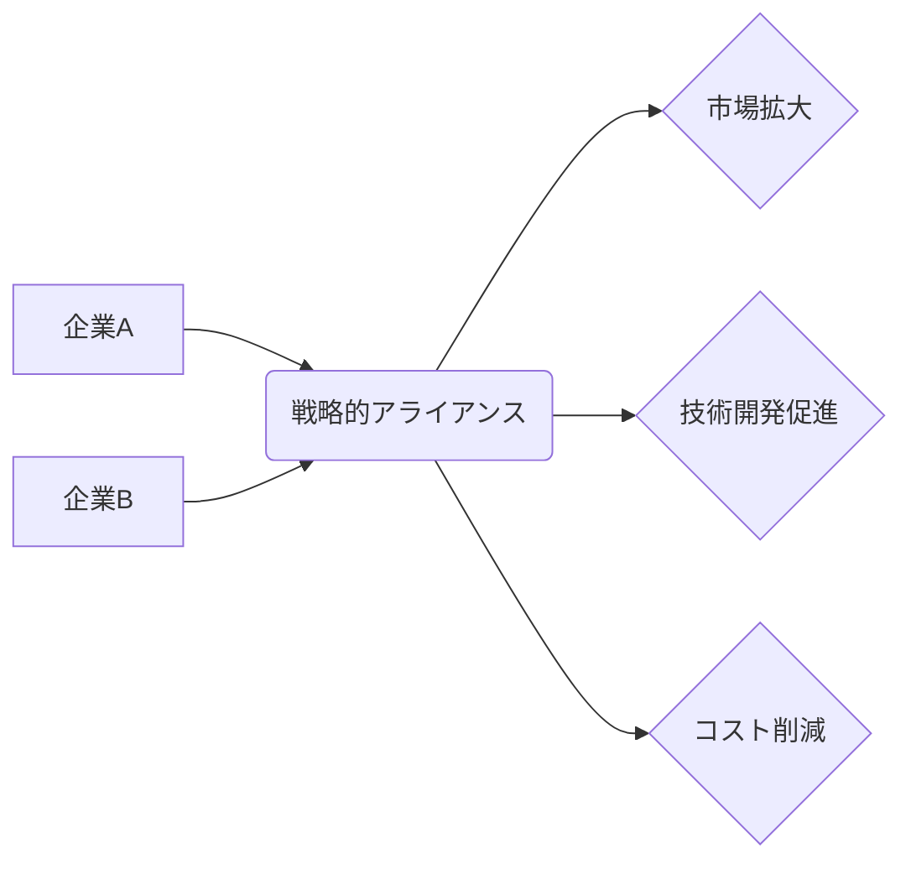

# 戦略的アライアンス - 概要

## 2. 背景と目的

グローバル化が加速し、市場競争が激化する現代において、企業単独で全ての事業領域をカバーすることは困難になりつつあります。技術革新のスピードも速く、自社だけで全ての技術を保有・開発することも現実的ではありません。そのため、自社の強みと他社の強みを結びつけ、相乗効果を生み出す戦略的アライアンスが注目されています。その目的は多岐に渡りますが、大きく分けて以下の3点が挙げられます。

* **市場拡大:** 新規市場への参入や既存市場でのシェア拡大を図るために、新たな顧客基盤や販売チャネルを獲得します。例えば、国内市場で強い企業と海外市場に強い企業が連携することで、両社共にグローバル展開を加速させることができます。
* **技術開発の促進:** 自社だけでは開発が困難な技術を、アライアンスパートナーから取得・共同開発することで、技術開発のスピードと効率性を向上させます。特に、高度な専門知識や多大な投資が必要な分野では、アライアンスによる技術獲得は非常に有効です。
* **コスト削減:** 共同購買や資源共有、生産設備の共同利用などを通して、コスト削減を実現します。特に、研究開発や製造といったコストのかかる分野では、アライアンスによるコスト削減効果は大きくなります。

戦略的アライアンスは、単なる提携ではなく、長期的な視点に立った戦略的なパートナーシップを構築することが重要です。そのため、互いの企業文化や経営理念、リスク許容度などを十分に理解した上で、契約内容を慎重に検討する必要があります。

## 3. 活用方法（図解・表を含めて）

戦略的アライアンスは、様々な形態をとることができます。

| アライアンス形態 | 概要 | 例 |
|---|---|---|
| 資本業務提携 | 株式の相互保有や資本参加を通じて、経営的な連携を図る。 | 企業Aが企業Bの株式の一部を取得し、経営に参画する。 |
| 技術提携 | 特許やノウハウなどの技術を相互に提供し合う。 | 企業Aが保有する特許技術を企業Bにライセンス供与する。 |
| 販売提携 | 互いの製品やサービスを販売し合う。 | 企業Aが企業Bの製品を自社の販売チャネルを通じて販売する。 |
| 共同開発 | 新製品や新サービスを共同で開発する。 | 企業Aと企業Bが共同で次世代自動車の開発を行う。 |

## 4. メリット・デメリット

**メリット:**

* **リスク分散:** 複数企業でリスクを共有することで、単独で事業を行うよりもリスクを軽減できます。
* **迅速な市場対応:** アライアンスを通じて、迅速に市場の変化に対応できます。
* **競争優位性の向上:** 相乗効果により、競争優位性を高めることができます。
* **資源の有効活用:** 資源を効率的に活用し、コスト削減を実現できます。

**デメリット:**

* **意思決定の遅れ:** 複数企業の合意が必要となるため、意思決定に時間がかかる場合があります。
* **情報漏洩のリスク:** パートナー企業への情報漏洩リスクがあります。
* **文化の違いによる摩擦:** 企業文化の違いによる摩擦が生じる可能性があります。
* **パートナー選びの失敗:** 不適切なパートナーを選んでしまうと、かえって損失を招く可能性があります。

## 5. 他手法との違い

戦略的アライアンスは、買収や合併とは大きく異なります。買収や合併は、一方の企業が他方の企業を完全に支配下に置くことを目的としますが、戦略的アライアンスは、互いに独立性を保ちながら協力関係を築くことを目的としています。また、単なる業務提携とは異なり、より長期的な視点に立った戦略的なパートナーシップを構築することを重視します。

## 6. 企業導入事例（仮想でもよいが現実味のあるもの）

架空の事例として、環境問題に配慮したスマート農業に取り組む企業A社と、AI技術を専門とする企業B社が戦略的アライアンスを組んだ例を挙げましょう。企業A社は、持続可能な農業技術を開発していますが、データ分析による精密農業への展開が課題でした。企業B社は、AIを活用した農業データ解析技術を有していますが、農業分野への展開が遅れていました。両社は共同で、AIを活用した精密農業システムを開発し、販売することで、市場シェアを拡大し、共に利益を享受できるようになりました。

## 7. よくある誤解

* **単なる業務提携と混同:** 戦略的アライアンスは、長期的な視点で戦略的に構築されるパートナーシップであり、短期的な業務提携とは異なる。
* **必ず成功すると思いがち:**  パートナー選びの失敗や、互いの企業文化の不一致など、失敗するリスクも存在する。
* **契約だけで成功すると思いがち:** 契約だけでなく、継続的なコミュニケーションと信頼関係の構築が不可欠。

## 8. 成功のコツ

* **相補的な関係:** 相互に補完し合える関係を構築する。
* **明確な目標設定:** アライアンスの目的を明確に設定し、具体的な目標を共有する。
* **綿密な計画策定:** リスク管理を含めた綿密な計画を策定する。
* **信頼関係の構築:** パートナー企業との信頼関係を築く。
* **柔軟な対応:** 環境の変化に合わせて柔軟に対応する。

## 9. 今後の展望

技術革新の加速やグローバル化の進展に伴い、戦略的アライアンスの重要性はますます高まると予想されます。特に、サプライチェーンの多様化やESG投資の増加など、企業を取り巻く環境が大きく変化する中、戦略的アライアンスはリスク軽減と持続的な成長を実現するための重要な手段となるでしょう。オープンイノベーションの推進や、デジタル技術を活用したアライアンスの高度化も進むと考えられます。

## 10. 関連リンク

* [経済産業省：戦略的アライアンスに関する情報](仮のリンク)
* [複数のビジネスコンサルティングファームのウェブサイト](仮のリンク)

