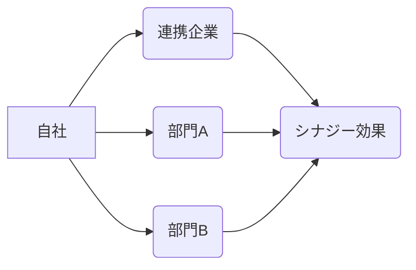

# シナジー効果 - 概要

## 1. 用語と概要

シナジー効果とは、複数の要素を組み合わせることで、それぞれの要素単独の効果の合計を上回る相乗的な効果を生み出すことを指します。1+1>2という関係をイメージすると分かりやすいでしょう。ビジネスにおいては、企業合併、部門連携、製品・サービスの統合など、様々な場面でシナジー効果の創出が目指されています。単なる合計以上の成果を生み出すことで、競争優位性を築き、企業価値を高めることが期待されます。  効果の大きさは、要素間の相互作用の強さに依存しており、適切な組み合わせと戦略的な実行が不可欠です。単に要素を組み合わせるだけではシナジー効果は期待できません。それぞれの要素が互いに補完し合い、相乗的に効果を高め合う関係性を築くことが重要です。

## 2. 背景と目的

グローバル化やデジタル化の進展に伴い、企業を取り巻く環境はますます複雑化・激化しています。単独での競争では生き残りが難しく、企業は新たな成長戦略を求められています。そこで注目されているのが、シナジー効果の最大化です。企業合併や業務提携を通じて、それぞれの強みを組み合わせ、新たな価値を創造することで、市場での競争力を高め、収益の向上を目指します。また、部門間連携を強化することで、組織全体の効率性を向上させ、イノベーション創出の促進も期待できます。シナジー効果の目的は、単なる効率化だけではありません。既存の枠にとらわれず、革新的な製品・サービスを生み出し、顧客への価値提供を高めることにあります。

## 3. 活用方法（図解・表を含めて）

シナジー効果を最大限に活かすためには、以下の3つのステップが重要です。

**ステップ1：シナジー創出の可能性の特定**

まず、自社の強みと弱みを分析し、他社や部門との連携によって、どのようなシナジー効果が期待できるかを明確に洗い出します。

| 自社の強み | 他社/部門との連携によるシナジー効果 | 具体的な施策 |
|---|---|---|
| 高品質な製品開発力 | マーケティング力のある企業との連携 | 共同販促活動、製品改良 |
| 広範な顧客基盤 | 新技術を持つ企業との連携 | 新製品・サービス開発 |
| 優れた営業力 | 生産能力の高い企業との連携 | 販売拡大、コスト削減 |

**ステップ2：連携体制の構築**

シナジー効果を生み出すためには、各部門や企業間の連携体制を構築する必要があります。明確な目標設定、役割分担、情報共有、意思決定プロセスの確立が不可欠です。

**(図解)**

**ステップ3：効果測定と継続的改善**

シナジー効果の創出状況を定期的に測定し、改善策を講じる必要があります。KPIを設定し、効果を数値で把握することで、取り組みの有効性を検証し、継続的に改善していくことが重要です。

## 4. メリット・デメリット

**メリット:**

* **競争優位性の向上:** それぞれの強みを組み合わせることで、競合他社にはない独自の価値を創造できます。
* **収益性の向上:** 効率化によるコスト削減や、新たな市場開拓による売上増加が期待できます。
* **イノベーション創出:** 異なる視点や知見の融合によって、革新的な製品・サービスを生み出すことができます。
* **リスク分散:** 複数の事業を展開することで、リスクを分散し、事業の安定性を高めることができます。

**デメリット:**

* **連携コスト:** 部門や企業間の調整、情報共有などにコストがかかります。
* **文化摩擦:** 異なる企業文化や価値観の衝突により、連携がうまくいかない可能性があります。
* **意思決定の遅延:** 多数の関係者の合意形成に時間がかかる可能性があります。
* **リスク増加:** 失敗した場合、単独で進めるよりも大きな損失を被る可能性があります。

## 5. 他手法との違い

シナジー効果は、単なるコスト削減や効率化とは異なります。コスト削減や効率化は、現状の業務を改善する一方、シナジー効果は、新たな価値創造を目的としています。また、単なる規模拡大とも異なります。規模拡大は、単純な数量の増加ですが、シナジー効果は、質的な向上を伴います。

## 6. 企業導入事例（仮想でもよいが現実味のあるもの）

架空の事例として、飲料メーカーA社と食品メーカーB社の事例を挙げます。A社は高いブランド力と販売網を持ち、B社は健康志向の食品開発に強みを持っています。両社が業務提携し、A社の販売網を通じてB社の健康志向飲料を販売することで、A社は新たな商品ラインアップを拡充し、B社は販売チャネルを拡大、両社は大きなシナジー効果を実現しました。

## 7. よくある誤解

* **シナジー効果は必ず実現する:** シナジー効果は、適切な計画と実行によって初めて実現します。
* **シナジー効果は魔法のようなもの:** シナジー効果は、努力と工夫によって生み出されるものです。
* **シナジー効果はすぐに現れる:** シナジー効果は、時間をかけて積み重ねていくものです。

## 8. 成功のコツ

* **明確な目標設定:** 具体的な目標を設定し、関係者全員で共有する必要があります。
* **効果的なコミュニケーション:** 部門や企業間の情報共有を円滑に進める必要があります。
* **柔軟な対応:** 予期せぬ問題が発生した場合にも、柔軟に対応できる体制が必要です。
* **継続的な改善:** 定期的に効果測定を行い、改善策を講じる必要があります。

## 9. 今後の展望

AIやIoTなどの技術革新により、シナジー効果の創出の可能性はさらに広がると考えられます。データ連携による新たなビジネスモデルの創出や、AIを活用した効率化などが期待されます。

## 10. 関連リンク

* [経済産業省：中小企業庁](https://www.chusho.meti.go.jp/) (参考サイトとして)

