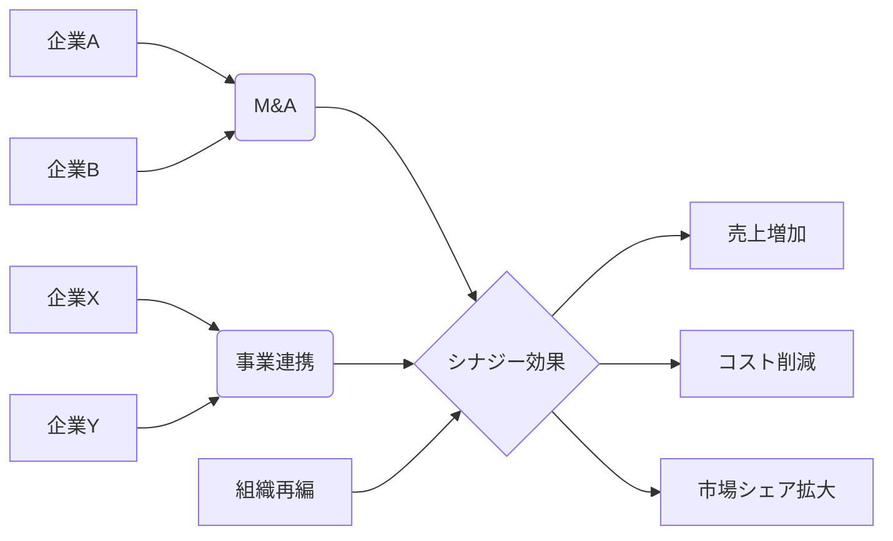

# シナジー効果 - 概要

## 1. 用語と概要

シナジー効果とは、複数の要素が単独で作用する場合よりも、統合的に作用することで、全体としてより大きな効果を生み出す現象のことです。企業経営においては、事業部間の連携強化、M&Aによる相乗効果、企業と顧客間の協働による価値創造など、様々な場面で活用される重要な概念です。単なる足し算ではなく、掛け算以上の効果が期待できる点が特徴です。  この効果は、個々の要素の能力を超えた新しい価値を生み出し、競争優位性を確立する上で重要な役割を果たします。企業戦略において、シナジー効果を最大限に引き出すための計画と実行が求められます。その効果は、売上増加、コスト削減、市場シェア拡大など、多岐に渡ります。  効果的なシナジー効果の創出には、各要素間の連携強化、情報共有の促進、共通目標の設定などが重要になります。

## 2. 背景と目的

シナジー効果という概念が注目されるようになった背景には、グローバル化の進展や市場競争の激化があります。企業は、単独では対応できない複雑な課題に直面し、複数の要素を統合的に活用することで、効率性と競争力を高めようとしています。  例えば、異なる専門知識や技術を持つ企業が合併することで、新しい製品やサービスを生み出したり、既存事業の効率化を図ったりすることが可能になります。また、企業と顧客が連携することで、顧客ニーズに合わせた製品開発やサービス提供を実現し、顧客満足度を高めることも期待できます。

シナジー効果の目的は、単なる規模拡大ではなく、全体としての価値を最大化することです。個々の要素の能力を単純に合計するのではなく、要素間の相互作用によって生まれる付加価値を追求することで、持続的な成長を実現しようとするものです。この目的達成のために、企業は戦略的なパートナーシップの構築、組織構造の最適化、人事制度の改革など、様々な取り組みを行っています。

## 3. 活用方法（図解・表を含めて）

シナジー効果の活用方法は多岐に渡りますが、代表的な例として、M&A、事業連携、組織再編などが挙げられます。

**図1：シナジー効果の活用例**

**表1：シナジー効果を生むための要素**

| 要素 | 説明 | 例 |
|---|---|---|
| 共通の目標 | 各部門・企業が共有する目標 | 新製品開発、市場シェア拡大 |
| 情報共有 | 情報のオープンな共有体制 | 定期的な会議、情報システムの導入 |
| 協調体制 | 部署・企業間の協力体制 | 担当者間の密な連携、クロスファンクショナルチームの編成 |
| 互換性 | システムや製品の互換性 | データベースの統合、共通プラットフォームの利用 |
| 専門性の融合 | 異なる専門性を組み合わせる | マーケティングとエンジニアリングの連携 |

## 4. メリット・デメリット

**メリット:**

* 売上増加：新製品開発や市場拡大による売上増加
* コスト削減：業務効率化、重複投資の削減によるコスト削減
* 競争優位性：独自の強みを生み出し、競合他社との差別化
* イノベーション促進：異なる視点や専門性の融合による新たな発想の創出
* 顧客満足度向上：顧客ニーズに合わせた製品・サービス提供

**デメリット:**

* 統合コスト：システム統合、人事調整などに伴うコスト
* 文化摩擦：異なる企業文化の融合における摩擦
* 情報漏洩リスク：情報共有による情報漏洩リスク
* 失敗リスク：シナジー効果が期待通りに得られないリスク
* 意思決定の遅延：複数の関係者の合意形成に時間がかかる

## 5. 他手法との違い

シナジー効果は、単なる規模の拡大や単純な足し算とは異なります。他手法との違いは、要素間の相互作用によって生まれる「掛け算効果」にあります。例えば、規模拡大は単に企業規模を大きくすることですが、シナジー効果は、規模拡大に加えて、要素間の連携により新たな価値創造を目指します。

## 6. 企業導入事例（仮想でもよいが現実味のあるもの）

架空の事例として、食品メーカーA社と飲料メーカーB社のM&Aを考えてみます。A社は高い技術力を持つ食品開発部門を持ち、B社は強力な販売網とブランド力を持っています。両社が合併することで、A社の開発した健康志向の新商品をB社の販売網を通じて効率的に市場に投入することが可能になり、売上の大幅な増加とブランド力の強化が期待できます。これは、単独では実現できなかったシナジー効果によるものです。

## 7. よくある誤解

* **シナジー効果は必ず得られる:** シナジー効果は必ずしも期待通りに得られるとは限りません。綿密な計画と実行、関係者の協力が不可欠です。
* **規模が大きければ効果が高い:** 規模の大小に関わらず、効果的な連携が重要です。小さな企業でも、適切な連携によって大きなシナジー効果を生み出すことができます。
* **すぐに効果が出る:** シナジー効果の発現には時間がかかる場合もあります。

## 8. 成功のコツ

* **明確な目標設定:** シナジー効果を期待する目標を明確に設定すること。
* **綿密な計画:** 統合プロセス、リスク管理、効果測定などを含めた綿密な計画を立てること。
* **関係者の協調:** 各部門・企業の担当者間の緊密な連携と協力体制を構築すること。
* **柔軟な対応:** 状況に合わせて計画を修正し、柔軟に対応すること。
* **継続的な改善:** 定期的に効果を測定し、改善を継続すること。

## 9. 今後の展望

今後、AIやIoT技術の進展により、企業間のデータ連携が容易になり、より複雑なシナジー効果の創出が可能になると考えられます。  また、サステナビリティへの意識の高まりから、環境問題への対応を共通の目標とすることで、新たなシナジー効果が生まれる可能性があります。企業は、これらの技術革新や社会トレンドを踏まえ、新たなシナジー効果の創出に挑戦していくことが求められます。

## 10. 関連リンク

* [経済産業省：企業連携](仮のURL)
* [M&Aに関する専門サイト](仮のURL)

