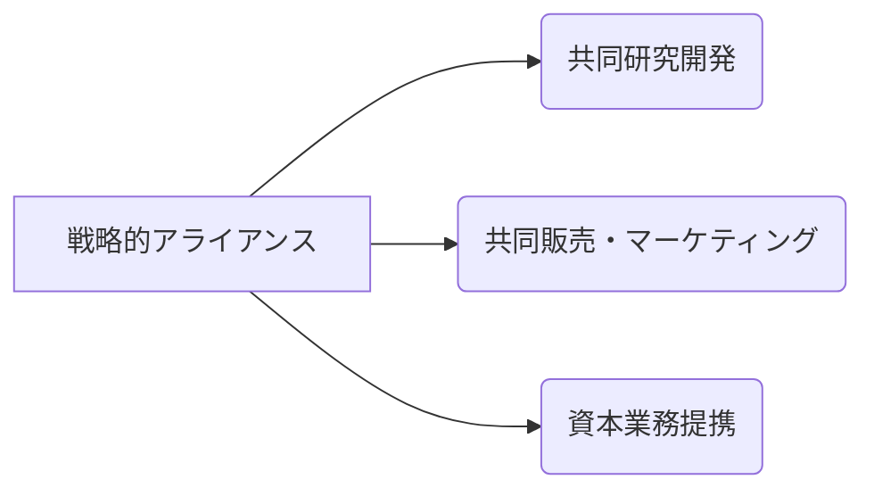

# 戦略的アライアンス - 概要

## 1. 用語と概要

戦略的アライアンスとは、企業が互いの強みを活かし、共同で新たな市場を開拓したり、競争優位性を高めたりするために、長期的な関係を築くことを指します。合併や買収とは異なり、企業は独立性を維持したまま協力関係を構築します。  このアライアンスは、単なる取引関係を超え、技術開発、製品開発、販売、マーケティングなど、ビジネスの様々な分野で協働することを目的としています。  戦略的アライアンスの成功は、パートナー企業間の信頼関係、共通の目標、明確な役割分担、そして継続的なコミュニケーションに大きく依存します。  不適切なパートナーシップ選択や、契約内容の曖昧さは、アライアンス失敗につながる大きな要因となります。

## 2. 背景と目的

グローバル化の進展や技術革新の加速に伴い、単独企業では対応できない複雑な課題や機会が増えています。  市場参入障壁の高まりや、急速な技術変化への適応も、企業にとって大きなプレッシャーとなっています。  こうした背景から、自社だけでは達成できない目標を達成するために、企業同士が協力し、リソースを共有する戦略的アライアンスの重要性が高まっています。  その目的は、大きく分けて以下の3点に集約されます。

* **市場シェアの拡大**: 新しい市場への参入や既存市場でのシェア拡大を図る。
* **技術開発の加速**: 共同で研究開発を行い、革新的な製品やサービスを生み出す。
* **コスト削減**: リソースの共有や効率化によってコストを削減する。

戦略的アライアンスは、これらの目的を達成するための強力な手段として、多くの企業によって活用されています。

## 3. 活用方法（図解・表を含めて）

戦略的アライアンスの活用方法は、企業の戦略や状況によって多様化します。  代表的な例として、以下の3種類のアライアンスが挙げられます。

| アライアンスの種類 | 説明 | 例 |
|---|---|---|
| **共同研究開発アライアンス** | 技術開発や製品開発において共同で取り組むアライアンス | 半導体メーカーが共同で次世代チップを開発 |
| **共同販売・マーケティングアライアンス** | 互いの販売網や顧客基盤を活用して製品やサービスを販売するアライアンス | 通信会社が共同で通信サービスを提供 |
| **資本業務提携アライアンス** | 資本参加を行うことで、より緊密な関係を構築するアラインス | 企業Aが企業Bの株式を取得し、共同事業を行う |

**図：戦略的アライアンスの類型**

アライアンスの形態は、株式保有比率や契約内容によって大きく異なります。  初期段階では、比較的リスクの低い共同研究開発から始める企業も多く見られます。

## 4. メリット・デメリット

**メリット:**

* **リスクの分散**: 複数の企業でリスクを共有できるため、単独で進めるよりもリスクが軽減される。
* **コスト削減**: リソースや設備を共有することで、コストを削減できる。
* **市場参入障壁の克服**: 既存企業との提携によって、新規市場への参入を容易にする。
* **技術・ノウハウの獲得**: パートナー企業から技術やノウハウを学ぶことができる。
* **競争優位の確立**: 互いの強みを組み合わせることで、競争優位性を築くことができる。

**デメリット:**

* **パートナー企業との意思疎通の難しさ**: 異なる企業文化や経営理念を持つ企業同士が協力するため、意思疎通が難しい場合がある。
* **情報漏洩のリスク**: 重要な情報の漏洩を防ぐための適切な対策が必要となる。
* **利益配分の問題**: 利益配分に関する明確な合意がなければ、紛争が発生する可能性がある。
* **依存関係の発生**: パートナー企業への依存度が高まると、独立性が失われる可能性がある。
* **契約違反のリスク**: 契約内容に不備があると、紛争が発生する可能性がある。

## 5. 他手法との違い

戦略的アライアンスは、合併・買収、ジョイントベンチャー、ライセンス契約など、他の事業連携手法と比較して、以下の点が異なります。

* **合併・買収**: 一方の企業が他方の企業を完全に吸収するのに対し、戦略的アライアンスでは、企業は独立性を維持する。
* **ジョイントベンチャー**: 新しい会社を設立するのに対し、戦略的アライアンスでは、既存の企業が協力関係を築く。
* **ライセンス契約**: 特定の技術やブランドの使用権を許諾するのに対し、戦略的アライアンスは、より広範囲な協力関係を築く。

## 6. 企業導入事例（仮想でもよいが現実味のあるもの）

架空の事例：

**株式会社A社（自動車メーカー）と株式会社B社（IT企業）の戦略的アライアンス**

A社は、自動運転技術の開発に遅れをとっており、B社のAI技術の導入を検討。B社は、自動車業界への進出を模索している。両社は共同で自動運転システムの開発を行い、A社はB社のAI技術を搭載した車両を販売、B社は自動車業界への参入を果たすという戦略的アライアンスを締結しました。  このアライアンスにより、A社は自動運転技術の開発を加速させ、市場競争力を高め、B社は新しい顧客基盤と収益源を獲得しました。

## 7. よくある誤解

* **アライアンスは万能ではない**:  全ての課題を解決できると考えるのは誤りです。明確な目標設定と綿密な計画が必要です。
* **短期的な利益追求**: 長期的な視点に立って戦略を練る必要があります。短期的な利益に囚われると失敗する可能性が高いです。
* **パートナー選びの甘さ**: 互いの企業文化や経営理念を理解した上で、慎重にパートナー企業を選定する必要があります。

## 8. 成功のコツ

* **明確な目標設定**: アライアンスの目的を明確に設定し、全ての関係者が共有する。
* **互恵的な関係構築**: パートナー企業にとってメリットのある関係を構築する。
* **効果的なコミュニケーション**: 定期的な会議や情報共有を行い、円滑なコミュニケーションを維持する。
* **リスク管理**: 潜在的なリスクを特定し、適切な対策を講じる。
* **柔軟な対応**: 市場環境の変化に対応できるよう、柔軟な対応をする。

## 9. 今後の展望

技術革新の加速やグローバル化の進展に伴い、戦略的アライアンスの重要性はますます高まると予想されます。  特に、AI、IoT、ブロックチェーンなどの新技術を活用したアライアンスは、新たなビジネスモデルの創出に繋がる可能性があります。  今後、企業は、これらの技術を駆使した戦略的アライアンスによって、競争力を強化し、持続的な成長を実現していくことが求められます。

## 10. 関連リンク

* [経済産業省：企業連携に関する情報](仮のURL)
* [中小企業庁：中小企業のための事業連携支援](仮のURL)

**(注：上記のURLは架空のものであり、実際には存在しません。)**
