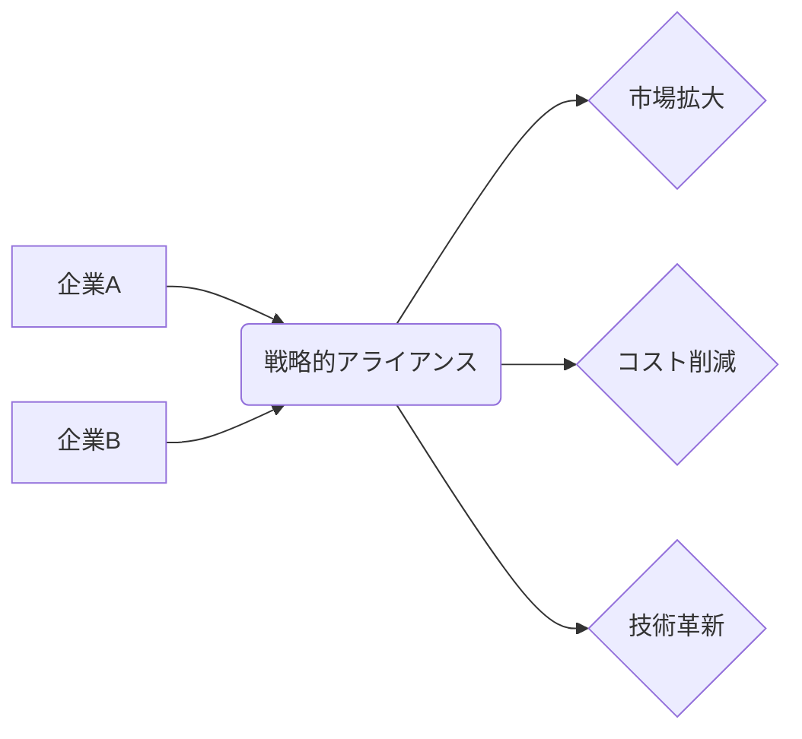

# 戦略的アライアンス - 概要

## 1. 用語と概要

戦略的アライアンスとは、企業が自社の競争優位性を強化し、新たな市場機会を開拓するために、他の企業と長期的な協業関係を構築することです。単なる一時的な取引関係ではなく、互いの資源や能力を共有し、共同で目標達成を目指す戦略的なパートナーシップです。  合弁企業設立、資本業務提携、技術提携など、様々な形態が存在し、それぞれの企業の状況や目標に合わせて最適な形態が選択されます。  競争が激化する現代において、単独では実現困難な目標を達成するために、戦略的アライアンスはますます重要な経営戦略となっています。

## 2. 背景と目的

グローバル化や技術革新の加速により、企業を取り巻く環境はますます複雑化・変化し続けています。単独企業では、高度な技術開発、広範な市場アクセス、多様な人材確保といった課題に直面することが多くなっています。そこで、自社が持つ強みを活かしつつ、足りない部分を補完するために、戦略的アライアンスが注目されています。その目的は、大きく分けて以下の3点に集約されます。

* **市場シェアの拡大**: 新規市場への参入や既存市場でのシェア拡大を図る。
* **コスト削減**: 共同開発や共同生産によるコスト削減効果を得る。
* **技術革新**: 相互の技術やノウハウを共有することで、イノベーションを加速させる。

## 3. 活用方法（できれば図解・表を含めて）

戦略的アライアンスの形態は様々です。代表的なものを表にまとめます。

| アライアンス形態 | 説明 | 具体的な例 | リスク |
|---|---|---|---|
| **合弁事業** | 複数企業が出資して新会社を設立 | 自動車メーカー同士による新車の開発・生産 | 意思決定の遅れ、パートナー企業との摩擦 |
| **資本業務提携** | 資本参加を通じて業務提携を行う | IT企業によるスタートアップへの投資 | 経営権の争い、パートナー企業の経営状態の悪化 |
| **技術提携** | 技術やノウハウを相互に提供する | 半導体メーカー間の技術共有 | 技術流出のリスク、知的財産権の紛争 |
| **販売提携** | 互いの製品やサービスを販売チャネルを通じて販売する | 通信会社と家電メーカーの販売提携 | 販売戦略の不一致、顧客対応の問題 |

**図解：戦略的アライアンスのメリット**

## 4. メリット・デメリット

**メリット:**

* **リスク分散**: 単独で取り組むよりもリスクを分散できる。
* **資源・能力の共有**: 相互の資源や能力を効果的に活用できる。
* **迅速な市場参入**: 新市場への参入を迅速に行える。
* **競争優位性の強化**: 競争力を高め、市場での地位を確立できる。

**デメリット:**

* **パートナー選びの難しさ**: 適切なパートナーを見つけることが重要。
* **意思決定の遅れ**: 複数企業の合意形成が必要となるため、意思決定が遅れる可能性がある。
* **情報漏洩のリスク**: パートナー企業との間で情報漏洩のリスクが存在する。
* **文化の違い**: 企業文化の違いによる摩擦が発生する可能性がある。

## 5. 他手法との違い

戦略的アライアンスは、M&A（合併・買収）や独占禁止法上の問題点などを考慮すると、競争企業との連携を目的とする場合は、より柔軟でリスクの少ない選択肢となります。M&Aは、企業の完全な統合を意味するのに対し、戦略的アライアンスは、企業が独立性を維持したまま協力関係を構築します。

## 6. 企業導入事例（仮想でもよいが現実味のあるもの）

架空の例として、日本の自動車メーカー「A社」と、バッテリー技術に強いスタートアップ企業「B社」の戦略的アライアンスを考えてみましょう。A社は、電気自動車市場への参入を急いでいますが、バッテリー技術の開発に遅れを取っています。一方、B社は革新的なバッテリー技術を持つものの、量産体制が整っていません。両社は資本業務提携を行い、A社がB社に出資する一方、B社はA社にバッテリー技術を提供し、共同で電気自動車の開発・生産を行うことで、互いの弱点を補完し、市場での競争力を高めます。

## 7. よくある誤解

* **「簡単に成功する」という誤解**: 戦略的アライアンスは、綿密な計画と継続的な努力が必要な長期的な取り組みです。
* **「全ての課題を解決できる」という誤解**: 戦略的アライアンスは万能ではありません。うまくいかないケースもあります。
* **「パートナーシップは永遠に続く」という誤解**: 市場環境の変化などによって、アライアンスを解消する必要がある場合もあります。

## 8. 成功のコツ

* **適切なパートナー選び**: 相互の目標や価値観が合致するパートナーを選ぶことが重要です。
* **明確な契約**: アライアンスの内容を明確に定めた契約を締結する必要があります。
* **継続的なコミュニケーション**: パートナー企業との継続的なコミュニケーションを維持することが重要です。
* **柔軟な対応**: 市場環境の変化に対応できるよう、柔軟な対応が必要です。

## 9. 今後の展望

技術革新の加速やグローバル化の進展に伴い、戦略的アライアンスはますます重要性を増していくと考えられます。特に、AI、IoT、ESGなどの分野では、複数の企業が連携することで、より大きな成果を生み出す可能性があります。  今後、より複雑で多様なアライアンス形態が登場し、企業戦略の中核を担う存在になることが予想されます。

## 10. 関連リンク

* [経済産業省：戦略的アライアンスに関する情報](仮のリンク)
* [日本政策金融公庫：戦略的アライアンスに関する情報](仮のリンク)

(上記リンクは架空のリンクです。)
