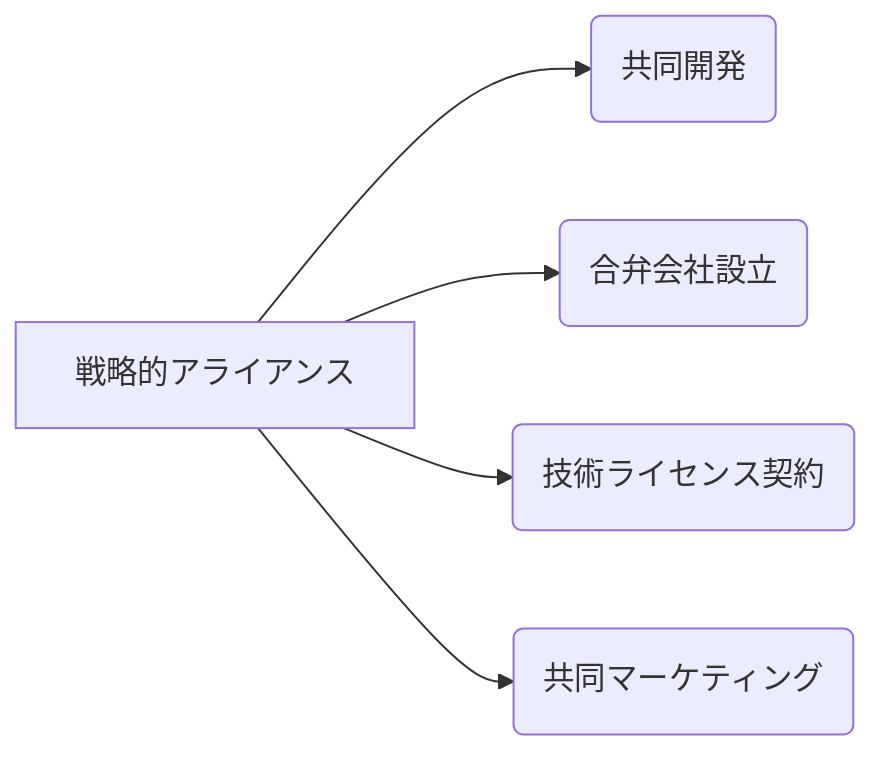

# 戦略的アライアンス - 概要

## 1. 用語と概要

戦略的アライアンスとは、企業が互いの強みを活かし、共通の目標達成に向けて協業する戦略的な提携関係のことです。単なる一時的な取引や業務委託とは異なり、より長期的な視点で、資本関係を持つ場合と持たない場合があります。競争優位性を高め、市場シェア拡大、新技術開発、リスク軽減などを目指して結ばれることが多く、合弁会社設立、共同開発、技術ライセンス供与など、様々な形態をとります。それぞれの企業が独立性を保ちつつ、互いに補完し合う関係を構築することが重要です。規模の経済効果や専門性の高いリソースを共有することで、単独では実現できない成果を創出することを目指します。

## 2. 背景と目的

グローバル化の進展や技術革新の加速により、企業を取り巻く競争環境は激しさを増しています。単独企業では対応が困難な課題も多く、技術開発、市場開拓、コスト削減といった面で、戦略的アライアンスが有効な手段として注目されています。目的としては、大きく分けて以下の３つが挙げられます。

1. **市場拡大・シェア獲得**: 新規市場への参入や既存市場におけるシェア拡大を、パートナー企業の販売網やブランド力などを活用して実現します。
2. **技術開発・イノベーション**: 相互に保有する技術やノウハウを共有することで、より高度な技術開発や製品開発を効率的に進めることが可能です。
3. **コスト削減・効率化**: 資源や設備の共有、業務プロセス最適化などを通して、コスト削減や業務効率の向上を図ることができます。

## 3. 活用方法（図解・表を含めて）

戦略的アライアンスの形態は多岐に渡ります。以下の表に主な形態と特徴をまとめます。

| アライアンス形態 | 説明 | メリット | デメリット |
|---|---|---|---|
| 共同開発 | 二社以上が共同で製品開発を行う | リスク分担、開発期間短縮 | 情報共有リスク、意思決定の複雑化 |
| 合弁会社設立 | 新しい会社を共同で設立 | 資本・資源の統合、リスク分担 | 経営権争い、意思決定の遅延 |
| 技術ライセンス契約 | 特定の技術の使用権を許諾する | 技術導入コストの削減 | 技術漏洩リスク、競争力の低下（場合によっては） |
| 共同マーケティング | 共同でマーケティング活動を行う | 広告費削減、顧客基盤拡大 | 互いのブランドイメージの整合性確保の必要性 |

**図：戦略的アライアンスの形態**

## 4. メリット・デメリット

**メリット:**

* **リスク分散:** 複数の企業がリスクを共有することで、単独で取り組むよりもリスクを軽減できます。
* **資源・能力の補完:** 相互に不足している資源や能力を補完し、シナジー効果を生み出せます。
* **市場拡大:** パートナー企業の販売網や顧客基盤を活用することで、市場を拡大できます。
* **技術革新:** 共同で研究開発を行うことで、技術革新を加速できます。
* **コスト削減:** 資源や設備の共有、業務プロセスの最適化によってコストを削減できます。

**デメリット:**

* **意思決定の遅延:** 複数の企業が合意形成を行う必要があるため、意思決定に時間がかかります。
* **情報漏洩リスク:** パートナー企業への情報共有によって、技術やノウハウが漏洩するリスクがあります。
* **パートナー企業との関係調整:** パートナー企業との関係調整に多くの時間と労力を要します。
* **企業文化の違い:** 企業文化の違いによって、協業が困難になる場合があります。
* **利益配分問題:** 利益配分に関して、パートナー企業間で紛争が生じる可能性があります。

## 5. 他手法との違い

戦略的アライアンスは、M&A（合併・買収）やフランチャイズと比較すると、企業の独立性を維持しつつ協業できる点が大きく異なります。M&Aは企業を完全に合併・買収しますが、アライアンスは独立性を保ちつつ協業します。フランチャイズは、ブランドやノウハウを提供するフランチャイザーと、それを活用するフランチャイジーの関係ですが、アライアンスはより対等な関係となることが多いです。

## 6. 企業導入事例（仮想でもよいが現実味のあるもの）

架空の事例として、EVバッテリー開発企業「バッテリーテック社」と自動車メーカー「グリーンモビリティ社」の協業を挙げます。バッテリーテック社は高度なバッテリー技術を有するものの、販売網を持たない一方、グリーンモビリティ社はEV市場への参入を急いでいるものの、バッテリー技術開発に遅れを取っていました。両社は共同開発による戦略的アライアンスを結び、グリーンモビリティ社はバッテリーテック社の技術を活用したEVを開発・販売し、バッテリーテック社は販売網と市場へのアクセスを得ることで、双方に大きなメリットをもたらしました。

## 7. よくある誤解

* **必ず成功するわけではない:** 戦略的アライアンスは、綿密な計画とパートナー企業との良好な関係構築が不可欠です。準備不足やパートナー選びの失敗は、失敗に繋がりかねません。
* **対等な関係であるとは限らない:** 規模や技術力に大きな差がある場合、一方の企業が主導権を握る関係となることもあります。
* **簡単なものではない:** 契約締結だけでなく、継続的なコミュニケーションと調整が必要です。

## 8. 成功のコツ

* **明確な目標設定:** アライアンスの目的と成果を明確に設定し、パートナー企業と共有することが重要です。
* **適切なパートナー選び:** 相互補完的な関係にある企業を選び、信頼関係を構築することが重要です。
* **効果的なコミュニケーション:** 定期的な情報共有と密なコミュニケーションを心がける必要があります。
* **リスク管理:** 契約内容を明確化し、リスクを事前に洗い出す必要があります。
* **柔軟な対応:** 市場環境の変化や予期せぬ事態にも対応できるよう、柔軟な対応が求められます。

## 9. 今後の展望

技術革新の加速やサプライチェーンの複雑化に伴い、戦略的アライアンスの重要性はますます高まると予想されます。AIやIoTなどの技術を活用した新たなアライアンス形態や、グローバルな視点での協業が今後さらに発展していくと考えられます。

## 10. 関連リンク

* [経済産業省：戦略的アライアンスに関する情報](仮のリンク)
* [日本経済団体連合会：企業連携に関する情報](仮のリンク)

