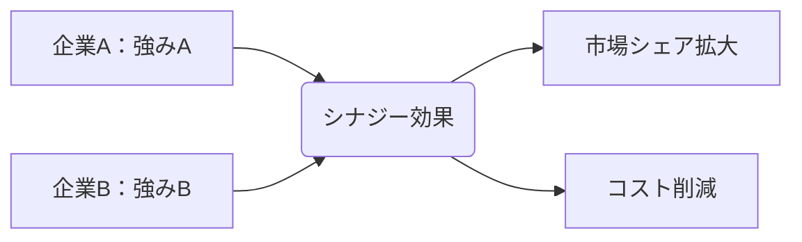

# シナジー効果 - 概要

## 1. 用語と概要

シナジー効果とは、複数の要素を組み合わせることで、それぞれの要素単独では達成できないような、相乗的な効果を生み出すことを指します。  1+1＞2の関係を表し、企業買収や事業提携、部署間の連携など、様々な場面で活用される重要な概念です。単なる足し算ではなく、掛け算的な効果を生み出し、企業価値の向上や競争優位性の獲得に繋がることを期待して戦略的に用いられます。  効果の大きさは、組み合わせる要素間の適合性や連携の密接さに大きく依存します。  そのため、シナジー効果を最大限に発揮するためには、綿密な計画と実行、そして継続的なモニタリングが不可欠です。

## 2. 背景と目的

シナジー効果の概念は、古くから存在しましたが、近代的なビジネスにおいては、グローバル化や市場競争の激化を背景に、その重要性が増しています。 企業は、単独では実現困難な目標達成のために、他社との提携や合併、新たな事業分野への進出といった戦略を展開しています。シナジー効果を狙うことで、コスト削減、効率向上、市場シェア拡大、新たな収益源の創出など、様々なビジネス上の目的を達成しようとしています。 特に、成長戦略においては、既存事業との組み合わせによるシナジー効果の創出が、持続的な成長を実現する鍵となることが多いです。

## 3. 活用方法（できれば図解・表を含めて）

シナジー効果は、様々なビジネスシーンで活用できます。代表的な例として、以下の３つが挙げられます。

**1. 企業買収・合併:**  異なる専門性を持つ企業が合併することで、技術やノウハウ、顧客基盤を統合し、新たな事業展開や市場開拓が可能になります。

**2. 事業提携:**  それぞれの強みを活かし、共同で製品開発や販売を行うことで、効率的な事業運営や市場シェアの拡大を目指せます。

**3. 部署間連携:**  異なる部署間の連携強化によって、情報共有や業務プロセス改善を行い、生産性向上や顧客満足度向上を目指します。

| 活用例           | シナジー効果の具体例                                   | 期待される成果                               |
|--------------------|-------------------------------------------------------|-----------------------------------------------|
| 企業買収           | A社の販売網とB社の技術開発能力の融合                   | 新製品の迅速な市場投入、販売網拡大による売上増加 |
| 事業提携           | 食品メーカーとECサイト運営企業による共同販売             | 販路拡大、顧客基盤の拡大                        |
| 部署間連携           | 営業部と開発部の連携による顧客ニーズへの迅速な対応       | 新製品開発の成功率向上、顧客満足度向上           |

 

**図解：事業提携によるシナジー効果**

## 4. メリット・デメリット

**メリット:**

* **競争優位性の獲得:**  他社にはない独自の強みを組み合わせることで、競争優位性を確立できます。
* **収益性の向上:**  コスト削減や効率化により、収益性を向上させることができます。
* **成長の加速:**  新たな市場開拓や事業拡大を促進し、企業成長を加速させることができます。
* **リスク分散:**  複数の事業分野に展開することで、リスクを分散することができます。

**デメリット:**

* **統合コスト:**  企業買収や合併には、高額な統合コストがかかる可能性があります。
* **文化摩擦:**  異なる企業文化の融合は、困難を伴う可能性があります。
* **シナジー効果の未発揮:**  計画通りにシナジー効果が発揮されないリスクがあります。
* **意思決定の遅延:**  複数企業や部署が関わるため、意思決定が遅れる可能性があります。

## 5. 他手法との違い

シナジー効果は、単なる協力関係や分業とは異なります。協力関係は各々の役割を分担する関係ですが、シナジー効果は、それぞれの強みを掛け合わせ、全体として１＋１＞２の効果を生み出すことを目指します。分業は業務を効率化しますが、シナジー効果は、それ以上の付加価値創造を目指します。

## 6. 企業導入事例（仮想でもよいが現実味のあるもの）

架空の例として、食品メーカー「A社」とECプラットフォーム企業「B社」の事例を挙げましょう。「A社」は高品質なオーガニック食品を製造していますが、販売網が限られています。「B社」はECプラットフォームを運営し、顧客基盤と物流網を持っています。両社が事業提携することで、「A社」は「B社」のプラットフォームを活用し、新たな顧客層にリーチできます。「B社」は高品質な商品を取り扱うことで、プラットフォームの競争力を高められます。この提携により、両社は単独では達成できない規模の売上増加と顧客獲得を実現し、シナジー効果を発揮しています。

## 7. よくある誤解

* **必ずしもすべての組み合わせでシナジー効果が生まれるわけではない:** 相性の悪い企業や事業を組み合わせても、効果は期待できません。
* **シナジー効果は自動的に生まれるわけではない:**  計画的な連携と努力が必要不可欠です。
* **シナジー効果は短期的にはコストがかかる場合がある:** 長期的な視点で判断することが重要です。

## 8. 成功のコツ

* **明確な目標設定:**  シナジー効果によって達成したい具体的な目標を明確に設定する必要があります。
* **綿密な計画策定:**  統合プロセスやリスク管理などを含めた綿密な計画が必要です。
* **効果的なコミュニケーション:**  関係各社・部署間の効果的なコミュニケーションが不可欠です。
* **継続的なモニタリング:**  効果を定期的に測定し、必要に応じて修正を行う必要があります。
* **柔軟な対応:**  予期せぬ事態にも柔軟に対応できる体制が必要です。

## 9. 今後の展望

AIやIoT等の技術革新により、企業間連携やデータ活用によるシナジー効果の創出の可能性はさらに広がると考えられます。  特に、データ分析による顧客ニーズの把握や、AIを活用した効率化は、シナジー効果を最大化する上で重要な役割を果たすと期待されています。

## 10. 関連リンク

* [経済産業省：中小企業庁](https://www.chusho.meti.go.jp/) (参考として)

