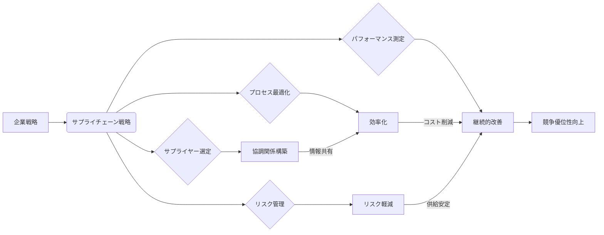

# 戦略的サプライチェーンマネジメント - 概要

## 1. 用語と概要

戦略的サプライチェーンマネジメント (Strategic Supply Chain Management: SSCM) とは、企業の長期的な競争優位性を確立するために、サプライチェーン全体を戦略的に計画・管理するアプローチです。単なる効率性向上にとどまらず、市場の動向、顧客ニーズ、リスク管理などを統合的に考慮し、持続可能な成長を実現することを目指します。従来の、個々の工程最適化に重点を置くオペレーションズマネジメントとは異なり、サプライチェーン全体を俯瞰し、企業戦略と連動した最適化を目指します。  これは、原材料調達から製造、物流、販売、アフターサービスに至るまでの全工程を網羅し、それぞれの段階での連携強化と最適化によって、コスト削減、リードタイム短縮、顧客満足度向上などを実現することを目指します。

## 2. 背景と目的

グローバル化の進展、市場のダイナミズムの増大、そしてサステナビリティへの意識の高まりにより、企業を取り巻く環境はますます複雑化しています。従来の、単一の部門最適化によるサプライチェーン管理では、これらの変化に対応することが困難になっています。そこで、企業全体の戦略目標に合致したサプライチェーンを構築・運用することが重要となり、SSCMの重要性が増しています。SSCMの目的は、企業の競争優位性を高めることです。具体的には、コスト削減、リードタイム短縮、在庫最適化、顧客満足度向上、リスク軽減、そしてサステナビリティの推進などを目指します。これらを実現することで、収益性向上、市場シェア拡大、ブランド価値向上につながります。

## 3. 活用方法（図解・表を含めて）

SSCMの活用方法は、企業の規模や業種、戦略目標によって異なりますが、一般的には以下のステップで進められます。

| ステップ | 内容 | 具体的な活動 |
|---|---|---|
| 1. 戦略の策定 | 企業全体の戦略目標とサプライチェーン戦略との整合性を確保 | SWOT分析、市場調査、競合分析 |
| 2. サプライヤーとの連携強化 | 協力的な関係を構築し、情報共有を促進 | 共同開発、長期契約、サプライヤー評価 |
| 3. プロセスの最適化 | 効率性と柔軟性を両立したプロセス設計 | Lean、Six Sigma、デジタル技術の活用 |
| 4. リスク管理 | サプライチェーンにおけるリスクを特定し、軽減策を講じる | リスクアセスメント、BCP策定、保険 |
| 5. パフォーマンス測定 | KPIを設定し、サプライチェーンのパフォーマンスを監視・評価 | データ分析、レポート作成、改善策の実施 |

## 4. メリット・デメリット

**メリット:**

* コスト削減：効率的なサプライチェーンにより、原材料費、物流費、在庫管理費などを削減できる。
* リードタイム短縮：迅速な情報共有と連携により、製品開発から顧客への配送までの時間を短縮できる。
* 顧客満足度向上：高品質な製品やサービスを迅速に提供することで、顧客満足度を高められる。
* リスク軽減：サプライチェーン全体のリスクを把握し、対応することで、ビジネス中断のリスクを軽減できる。
* 柔軟性の向上：市場の変化に対応できる柔軟なサプライチェーンを構築できる。

**デメリット:**

* 導入コスト：システム導入やコンサルティング費用など、初期投資が必要になる場合がある。
* 複雑性：サプライチェーン全体を管理するため、複雑なシステムやプロセスが必要になる。
* 情報共有の難しさ：サプライヤーなどとの情報共有がスムーズに行われないと、効果が期待できない。
* 関係者間の調整：多くの関係者と連携する必要があるため、調整に時間がかかる場合がある。

## 5. 他手法との違い

SSCMは、従来の在庫管理や物流管理といった個別の機能最適化とは異なり、サプライチェーン全体を統合的に捉え、企業戦略と連携した最適化を目指します。例えば、従来のJIT(ジャストインタイム)方式は、在庫削減に焦点を当てますが、SSCMは、在庫削減だけでなく、サプライヤーとの協調関係構築、リスク管理なども考慮します。また、SCM(サプライチェーンマネジメント)全体を包含する概念であり、SCMの手法を包括的に戦略的に適用することで、より高次元の効果が期待できます。

## 6. 企業導入事例（仮想でもよいが現実味のあるもの）

架空の自動車メーカー「グローバルカーズ社」は、SSCMを導入することで、部品調達から販売までのリードタイムを20％削減し、生産コストを15％削減することに成功しました。これは、サプライヤーとの連携強化、デジタル技術の活用、そしてリスク管理体制の強化によって実現されました。具体的には、サプライヤーとの情報共有プラットフォームを構築し、リアルタイムで在庫状況や生産状況を把握できるようにしました。また、AIを活用した需要予測システムを導入し、在庫最適化を実現しました。さらに、自然災害などのリスクを想定したBCP（事業継続計画）を策定し、リスク軽減に努めました。

## 7. よくある誤解

* SSCMは単なるコスト削減のための取り組みであるという誤解：SSCMはコスト削減も重要な目標ですが、それ以上に、企業戦略に合致したサプライチェーン構築を通じて、持続可能な競争優位性を構築することが目的です。
* SSCMはITシステムの導入だけで実現できるという誤解：ITシステムは重要なツールですが、SSCMは人材育成、組織体制、プロセス改革など、多様な要素が有機的に連携することで初めて効果を発揮します。
* SSCMは導入すればすぐに効果が出るという誤解：SSCMは長期的な取り組みであり、効果を実感するには時間と努力が必要です。

## 8. 成功のコツ

SSCMを成功させるためには、以下の点が重要です。

* トップマネジメントのコミットメント：経営層がSSCMを戦略的重要課題として位置付けることが不可欠です。
* 関係者間の連携：サプライヤー、顧客、内部部門など、関係者間の緊密な連携が必要です。
* データドリブンな意思決定：データ分析に基づいた客観的な意思決定を行う必要があります。
* 継続的な改善：定期的な見直しと改善を繰り返すことで、常に最適な状態を維持する必要があります。
* 人材育成：SSCMを推進できる人材を育成する必要があります。

## 9. 今後の展望

今後、SSCMは、デジタル技術の進化、サステナビリティへの意識の高まり、そしてグローバルなサプライチェーンリスクの増大などを受けて、さらに進化していくと予想されます。具体的には、AIやIoT、ブロックチェーンなどの技術を活用した高度なサプライチェーン管理システムの開発、サステナブルなサプライチェーン構築への取り組み、そしてリスク管理の高度化などが重要になってきます。

## 10. 関連リンク

* [Supply Chain Council](https://www.supplychaincouncil.org/) (架空の団体です。)
* [The Global Supply Chain Institute](https://www.gsci.org/) (架空の団体です。)

このブログ記事は架空の情報を一部含んでいます。ご了承ください。
