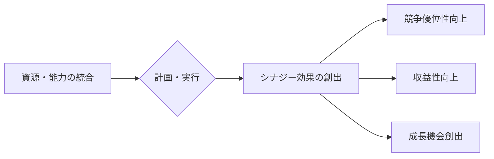

# シナジー効果 - 概要

## 1. 用語と概要

シナジー効果とは、複数の要素を組み合わせることで、それぞれの要素単独では期待できない、より大きな効果を生み出すことを指します。1+1>2という表現で示されるように、個々の要素の単純な合計を上回る相乗的な効果を期待する概念です。ビジネスの文脈では、複数の事業部門、製品、技術、人材などを統合・連携させることで、全体としての生産性、収益性、競争力を向上させることを目的としています。単なる足し算ではなく、掛け算的な効果を狙う戦略と言えるでしょう。シナジー効果は、企業戦略、マーケティング、組織運営など、幅広い場面で重要な概念となっています。特に、M&Aや事業統合などの場面では、シナジー効果の最大化が成功のカギとなります。効果を最大限に引き出すためには、綿密な計画と実行、そして継続的なモニタリングが不可欠です。

## 2. 背景と目的

シナジー効果という概念が注目される背景には、グローバル化やデジタル化の進展があります。市場の競争が激化する中、企業は単独では生き残ることが困難になりつつあります。そこで、複数の企業が合併したり、提携したりすることで、それぞれの強みを組み合わせ、新たな価値を創造することが求められています。また、デジタル化によって、データの活用やAI技術の導入など、新たなシナジー効果を生み出す可能性が広がっています。

シナジー効果を追求する目的は、大きく分けて以下の3つが挙げられます。

* **競争優位性の獲得:**  競合他社にはない独自の強みを生み出し、市場での競争力を高める。
* **収益性の向上:**  効率性向上やコスト削減などを通じて、利益率を向上させる。
* **成長機会の創出:** 新しい市場への参入や、既存事業の拡大を実現する。

これらの目的を達成するために、企業は戦略的にシナジー効果を創出・活用する必要があります。

## 3. 活用方法（図解・表を含めて）

シナジー効果を最大限に活用するには、戦略的な計画と実行が不可欠です。以下に、活用方法の例と図解を示します。

**例：A社（製造）とB社（販売）の合併によるシナジー効果**

| 要素 | A社単独 | B社単独 | 合併後 | シナジー効果 |
|---|---|---|---|---|
| 製造コスト | 高い | - | 低い | A社の効率的な製造技術とB社の大量発注によるコスト削減 |
| 販売網 | 狭い | 広い | 広い | B社の販売網を活用したA社製品の販売拡大 |
| ブランド力 | 中程度 | 高い | 高い | B社のブランド力向上によるA社製品の価値向上 |
| R&D投資 | 少ない | 少ない | 多い | 合併による資金力向上によるR&D投資拡大 |

**図解：シナジー効果の創出プロセス**

## 4. メリット・デメリット

**メリット:**

* **競争力強化:**  他社にはない独自の強みを形成し、市場での競争力を高めることができます。
* **収益性向上:**  コスト削減、効率化、売上増加などを通じて、収益性を向上させることができます。
* **リスク分散:**  複数の事業に展開することで、リスクを分散し、事業の安定性を高めることができます。
* **イノベーション促進:**  異なる分野の専門知識や技術を融合することで、新たなイノベーションを生み出すことができます。

**デメリット:**

* **統合コスト:**  企業合併やシステム統合などには、多大な費用と時間がかかります。
* **文化摩擦:**  異なる企業文化の衝突により、統合に時間がかかったり、失敗する可能性があります。
* **リスク増加:**  連携がうまくいかなかった場合、リスクが増加する可能性があります。
* **意思決定の遅延:**  複数の組織が関与するため、意思決定に時間がかかり、機会損失につながる可能性があります。

## 5. 他手法との違い

シナジー効果は、単なる事業拡大や多角化とは異なります。事業拡大は規模を拡大することに重点を置く一方、シナジー効果は、統合による相乗効果を重視します。多角化は関連性の低い事業への進出を指しますが、シナジー効果は関連事業間の連携による効果を追求します。

## 6. 企業導入事例（仮想でもよいが現実味のあるもの）

架空の事例として、食品メーカーA社と物流企業B社の合併を考えてみます。A社は高品質な食品の製造に強みを持つ一方、販売網は限定的です。B社は全国規模の物流網を有していますが、食品分野への進出を模索していました。両社が合併することで、A社はB社の物流網を活用し販売エリアを拡大、B社はA社の高品質食品を主力商品として扱うことで顧客獲得を加速、結果として両社ともに大幅な売上増加と利益向上を実現しました。

## 7. よくある誤解

シナジー効果は、必ずしも自動的に発生するものではありません。単に企業を合併したり、事業を統合したりするだけでは、シナジー効果は期待できません。綿密な計画、適切な統合プロセス、そして継続的なモニタリングが不可欠です。また、シナジー効果は短期的に実現するものではなく、長期的な視点で取り組む必要があります。

## 8. 成功のコツ

シナジー効果を成功させるためには、以下のコツが重要です。

* **明確な目標設定:**  シナジー効果によって達成したい具体的な目標を明確に設定する。
* **綿密な計画:**  統合プロセス、役割分担、リスク管理などを綿密に計画する。
* **効果的なコミュニケーション:**  関係者間のコミュニケーションを密にすることで、連携を強化する。
* **柔軟な対応:**  予期せぬ問題が発生した場合でも、柔軟に対応できる体制を整える。
* **継続的なモニタリング:**  シナジー効果の実現状況を継続的にモニタリングし、必要に応じて修正を行う。

## 9. 今後の展望

AIやIoT技術の発展により、データ活用による新たなシナジー効果創出の可能性が広がっています。例えば、製造工程におけるAIによる最適化と、顧客データに基づくマーケティング戦略の連携は、大きな相乗効果を生み出すでしょう。今後、デジタル技術を活用したシナジー効果の創出が、企業競争力を左右する重要な要素となるでしょう。

## 10. 関連リンク

* [企業合併に関するガイドライン（例）](https://www.example.com/merger_guidelines)  (架空のリンク)
* [シナジー効果に関する専門書（例）](https://www.example.com/synergy_book) (架空のリンク)

この情報はあくまで一般的なものであり、具体的な活用方法は企業の状況や戦略によって異なります。専門家のアドバイスを受けることも重要です。
