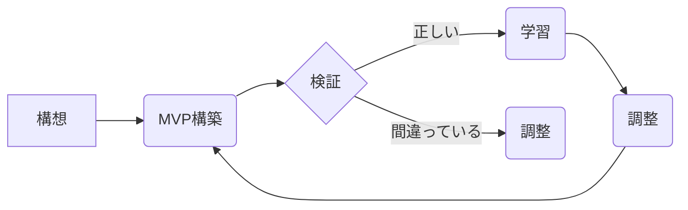

# リーンスタートアップ - 概要

## 1. 用語と概要

リーンスタートアップとは、Eric Riesによって提唱された、ビジネスモデルの検証と改善を迅速に行い、市場ニーズに最適化された製品やサービスを開発するためのアプローチです。最小限の資源で、反復的な開発・テスト・学習サイクルを通じて、無駄を省き、迅速に製品・サービスを市場に投入することを目指します。  従来のウォーターフォール型開発のように、大規模な計画と開発を経てから市場投入するのではなく、早期に顧客フィードバックを取り入れながら、製品・サービスを進化させていきます。  中心となる概念は、「仮説検証」であり、最小限の実験（MVP: Minimum Viable Product）を通じて、顧客のニーズを検証し、迅速に軌道修正を行います。

## 2. 背景と目的

リーンスタートアップが登場した背景には、市場の急速な変化と、従来の開発手法の非効率性が挙げられます。ウォーターフォール型開発では、長期間にわたる開発期間と多額の投資が必要であり、市場の変化に対応できず、開発が完了した時点でニーズが失われているというリスクがありました。  リーンスタートアップの目的は、このリスクを最小限に抑え、市場ニーズに合致した製品やサービスを効率的に開発することです。  不確実性の高い市場環境において、迅速な意思決定と柔軟な対応が求められるようになったため、リーンスタートアップのアプローチは多くの企業に支持されています。  資源の無駄を削減し、市場投入までの時間を短縮することで、競争優位性を確保することも目的の一つです。

## 3. 活用方法（図解・表を含めて）

リーンスタートアップは、以下のサイクルを繰り返すことで実践されます。

| フェーズ       | 内容                                                                     |
|-------------|--------------------------------------------------------------------------|
| **1. 構想**   | アイデアの創出、市場調査、仮説の設定                                                     |
| **2. MVP構築** | 最小限の機能を持つ製品（MVP）の開発                                                   |
| **3. 検証**   | MVPを顧客に提供し、フィードバックを得る                                                |
| **4. 学習**   | フィードバックを分析し、仮説を検証する。仮説が正しければ次のステップへ、間違っていれば修正を行う。|
| **5. 調整**   | 製品・サービスを改善し、次のMVPを開発する                                                |

図のように、反復的なサイクルを回し、継続的に改善していくことが重要です。

## 4. メリット・デメリット

**メリット:**

* **迅速な市場投入:** MVPによって早期に市場投入が可能になり、競争優位性を獲得できる。
* **リスク軽減:** 早期にフィードバックを得ることで、失敗リスクを最小限に抑えられる。
* **コスト削減:** 不必要な機能開発を避け、資源を効率的に活用できる。
* **顧客中心主義:** 顧客のニーズを重視した開発が行える。

**デメリット:**

* **初期段階での顧客獲得が難しい:** MVPは機能が限定されているため、顧客の理解を得にくい可能性がある。
* **反復作業による負担:** 継続的な改善が必要なため、チームに負担がかかる可能性がある。
* **明確なゴール設定が難しい:** 常に変化していく市場に対応するため、ゴール設定が難しくなる場合がある。
* **測定指標の選定が重要:** 適切な指標を選定しないと、効果的な改善ができない。

## 5. 他手法との違い

従来のウォーターフォール型開発と比較すると、リーンスタートアップは、顧客フィードバックを重視し、反復的な開発を行う点が大きく異なります。ウォーターフォール型開発は、事前に詳細な計画を立て、段階的に開発を進めるため、市場の変化に柔軟に対応できません。一方、リーンスタートアップは、変化に迅速に対応し、市場ニーズに最適化された製品・サービスを提供することを目指しています。アジャイル開発と類似点も多いですが、リーンスタートアップはビジネスモデルの検証に重点を置いており、アジャイル開発のように単なる開発プロセス改善にとどまらない点が異なります。

## 6. 企業導入事例（仮想でもよいが現実味のあるもの）

架空のスタートアップ企業「SmartFarm」は、IoT技術を活用した農業支援システムを開発しています。従来のウォーターフォール型開発では、膨大な開発費用と時間が必要だったため、リーンスタートアップを採用しました。まず、基本的なセンサー機能とデータ表示機能のみを持つMVPを開発し、農家へ提供。フィードバックに基づき、必要な機能を追加・修正しながら、システムを改良していきました。その結果、短期間で市場に投入し、農家からの高い評価を得て、急速な成長を遂げました。

## 7. よくある誤解

* **MVPは最低限の機能しか持たない製品である:** MVPは「最小限の**価値**を持つ製品」であり、最低限の機能とは限りません。顧客にとって価値のある機能を最小限に絞り込むことが重要です。
* **リーンスタートアップは小さな企業だけのための方法である:** 大企業もリーンスタートアップの考え方を活用することで、大規模プロジェクトのリスクを軽減し、効率性を向上させることができます。
* **リーンスタートアップは計画を立てないことである:** 計画は必要ですが、詳細な計画を立てずに、仮説検証を繰り返しながら、柔軟に計画を修正していくことが重要です。

## 8. 成功のコツ

* **顧客との密なコミュニケーション:** 顧客のニーズを深く理解するために、継続的なコミュニケーションが不可欠です。
* **データに基づいた意思決定:** 定量的なデータに基づいて、仮説を検証し、改善策を決定する。
* **チームの協調性:** 異なるスキルを持つメンバーが協力し、迅速に意思決定を行うことが重要です。
* **失敗を恐れず、学ぶ姿勢を持つ:** 失敗から学び、改善を繰り返すことで、成功に近づきます。

## 9. 今後の展望

AIや機械学習技術の発展により、リーンスタートアップの手法も進化していくと考えられます。  データ分析技術の向上により、より精度の高い仮説検証が可能になり、さらに効率的な製品開発が可能となるでしょう。  また、自動化技術の活用により、開発プロセス全体の効率化も期待できます。  グローバル化の進展に伴い、多様な市場ニーズに対応するための柔軟性もますます重要となるため、リーンスタートアップの重要性は今後ますます高まると予想されます。

## 10. 関連リンク

* [The Lean Startup by Eric Ries](https://www.amazon.com/Lean-Startup-Entrepreneurs-Continuous-Innovation/dp/0307887898)  (書籍)
* [Lean Startup Co.](https://theleanstartup.com/) (Eric Riesの公式ウェブサイト)

