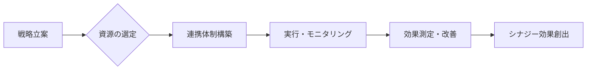

# シナジー効果 - 概要

## 1. 用語と概要

シナジー効果とは、複数の要素を組み合わせることで、それぞれの要素単独の効果を単純に足し合わせた以上の効果を生み出すことを指します。1+1>2という表現で示されることが多く、企業活動においては、異なる部署や事業部門、企業同士の連携によって生まれる相乗効果を指すことが多いです。  この効果は、個々の要素が持つ潜在能力を最大限に引き出し、新たな価値創造や効率向上に繋がります。単なる足し算ではなく、掛け算、あるいは指数関数的な成長をもたらす可能性を秘めており、現代の複雑なビジネス環境において、競争優位性を築く上で非常に重要な概念となっています。  効果の大きさは、要素間の親和性、連携の緻密さ、そして全体の戦略的な方向性によって大きく左右されます。

## 2. 背景と目的

シナジー効果が注目される背景には、グローバル化の進展と市場競争の激化があります。企業は単独では対応できない複雑な課題に直面しており、複数のリソースを効果的に統合・活用することで、効率性向上、リスク軽減、新規市場開拓などを目指す必要があります。  そのため、部門横断的なプロジェクトや企業間連携といった、シナジー効果を追求する取り組みが盛んになっています。目的は、単なるコスト削減や効率化にとどまらず、イノベーション創出、競争優位性の確立、持続可能な成長の達成といった、より戦略的な目標達成にあります。

## 3. 活用方法（図解・表を含めて）

シナジー効果を最大限に活用するには、戦略的な計画と実行が必要です。以下に、具体的な活用方法を示します。

**図1：シナジー効果創出のプロセス**

**表1：シナジー効果を生むための要素**

| 要素             | 説明                                                                     | 例                                       |
|-----------------|-------------------------------------------------------------------------|-------------------------------------------|
| 共通の目標設定   | 関係者全員が共有できる明確な目標を設定する                              | 新製品開発、市場シェア拡大、コスト削減など |
| 情報共有          | 関係者間で情報をスムーズに共有する                                         | 定期的な会議、情報共有システムの活用など     |
| 互換性のある資源 | 相互に補完し合う資源（技術、人材、資金など）を組み合わせる                | 特許技術と製造能力、マーケティングノウハウと販売網など |
| 柔軟な組織体制   | 部署間の壁をなくし、柔軟に連携できる組織体制を構築する                    | マトリックス組織、プロジェクトチームなど       |
| 継続的な改善     | 効果測定を行い、常に改善を繰り返す                                        | 定期的なレビュー、フィードバックシステムの導入など |

## 4. メリット・デメリット

**メリット:**

* **収益増加:** 新規事業の創出や既存事業の活性化による収益増加が期待できる。
* **コスト削減:** 資源の共有や効率化によるコスト削減効果が得られる。
* **リスク軽減:** 多様なリソースの活用により、リスク分散が可能となる。
* **競争優位性:** 独自のシナジー効果により、競合他社との差別化を図ることができる。
* **イノベーション創出:** 異なる視点やアイデアの融合により、革新的な製品・サービスが生み出される。

**デメリット:**

* **連携の複雑化:** 部署間の調整やコミュニケーションコストが増加する可能性がある。
* **意思決定の遅延:** 多数の関係者による合意形成に時間がかかる可能性がある。
* **リスク増大:** 関係者間の不協和音や情報共有不足によるリスク増大の可能性がある。
* **効果測定の困難さ:** シナジー効果の測定が難しく、効果を実感しにくい場合もある。
* **失敗リスク:** 計画不足や連携不足により、期待した効果が得られない可能性がある。

## 5. 他手法との違い

シナジー効果は、単なる統合や合併とは異なります。統合や合併は、企業規模の拡大や市場シェアの獲得を主な目的とする一方、シナジー効果は、統合された要素間の相互作用による相乗効果の創出を重視します。  また、単純な協力関係とは異なり、より緊密な連携と情報共有、そして戦略的な目標設定に基づいて、相乗効果を最大限に引き出すことを目指します。

## 6. 企業導入事例（仮想でもよいが現実味のあるもの）

架空の事例として、食品メーカー「A社」と飲料メーカー「B社」の協業を考えます。A社は、高品質な野菜を使った加工食品を製造しており、B社は、健康志向の飲料を製造しています。両社は、それぞれの強みを生かし、共同で「野菜を使った健康飲料」を開発・販売することにしました。A社の野菜加工技術とB社の飲料開発・販売ノウハウを組み合わせることで、従来にはない新しい商品が誕生し、両社の収益増加に繋がりました。これは、それぞれの企業単独では実現できなかった成果であり、明確なシナジー効果と言えるでしょう。

## 7. よくある誤解

* **シナジー効果は必ず生まれるという誤解:** シナジー効果は、計画的な取り組みと関係者間の緊密な連携なしには生まれません。
* **シナジー効果は数値で簡単に測定できるという誤解:** 効果の測定は複雑で、定量的な指標だけでは評価できない場合があります。
* **シナジー効果は短期的に実現できるという誤解:** シナジー効果の発現には、時間と努力が必要な場合が多いです。

## 8. 成功のコツ

* **明確な目標設定:** 関係者全員が共有できる明確な目標を設定する。
* **緊密な連携:** 部署間、企業間で緊密な連携を図る。
* **情報共有の徹底:** 関係者間で情報をスムーズに共有する。
* **柔軟な対応:** 状況に応じて柔軟に対応できる体制を構築する。
* **継続的な改善:** 効果測定を行い、常に改善を繰り返す。

## 9. 今後の展望

AIやIoT技術の進展により、データに基づいたシナジー効果の測定・予測が可能になりつつあります。 今後は、これらの技術を活用することで、より効率的かつ効果的なシナジー効果の創出が期待されます。また、サステナビリティへの関心の高まりから、環境配慮型シナジー効果の追求も重要になってくるでしょう。

## 10. 関連リンク

* [Wikipedia: シナジー効果](https://ja.wikipedia.org/wiki/%E3%82%B7%E3%83%8A%E3%82%B8%E3%83%BC%E5%8A%B9%E6%9E%9C) (例として)

