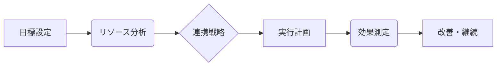

# シナジー効果 - 概要

## 1. 用語と概要

シナジー効果とは、複数の要素を組み合わせることで、個々の要素の単純な合計を上回る効果を生み出すことを指します。1+1＞2という表現がよく用いられます。ビジネスの文脈では、企業合併、業務提携、部署間の連携など、複数の組織や個人が協力することで、単独では達成できない成果や価値を生み出すことを意味します。  単なる足し算を超えた、相乗的な効果こそがシナジー効果の本質であり、その効果は、個々の要素の特性や組み合わせ方によって大きく変動します。  効果を最大限に引き出すためには、各要素間の適切な連携と、全体最適化のための戦略的な計画が不可欠です。  漠然とした期待ではなく、具体的な数値目標を設定し、効果測定を行うことで、真のシナジー効果を把握し、持続的に活用していくことが重要です。

## 2. 背景と目的

シナジー効果が注目される背景には、グローバル化や市場競争の激化があります。企業は単独では対応困難な課題に直面しており、他社との連携や部門間の協調によるシナジー効果の追求が、成長戦略の重要な柱となっています。  目的は、個々の組織や個人が抱えるリソースや能力の限界を超え、より大きな成果を創出することです。  これは、市場シェアの拡大、コスト削減、新規事業の創出、顧客満足度の向上など、多様なビジネス目標の達成に繋がります。  例えば、異なる専門分野を持つ企業が合併することで、それぞれの強みを活かし、競合他社にはない独自の製品やサービスを生み出すことができます。  また、部門間で情報共有や協力体制を強化することで、業務効率の向上や開発期間の短縮を実現できる可能性があります。

## 3. 活用方法（図解・表を含めて）

シナジー効果を最大限に活用するためには、戦略的な計画と実行が不可欠です。

**図1：シナジー効果を生み出すためのプロセス**

**表1：シナジー効果の種類と例**

| シナジー効果の種類 | 説明 | 例 |
|---|---|---|
| 技術的シナジー | 技術やノウハウの組み合わせによる効果 | 半導体メーカーとソフトウェアメーカーの合併による高性能チップの開発 |
| 市場的シナジー | 顧客基盤や販売チャネルの共有による効果 | 通信会社と金融機関の提携による顧客への新たなサービス提供 |
| 管理的シナジー | 管理システムや組織構造の最適化による効果 | 企業合併による重複部門の統合とコスト削減 |

## 4. メリット・デメリット

**メリット:**

* **競争優位性の向上:** 独自の製品・サービス開発、市場シェア拡大
* **コスト削減:** 規模の経済効果、重複排除
* **リスク分散:** 多角化による事業リスクの軽減
* **イノベーション促進:** 新しいアイデアや技術の融合
* **収益増加:** 売上高向上、利益率向上

**デメリット:**

* **文化衝突:** 企業文化や経営理念の相違による摩擦
* **統合コスト:** システム統合、人事異動などにかかる費用
* **意思決定の遅れ:** 多様な意見の調整に時間を要する可能性
* **情報漏洩リスク:** 情報共有によるリスク増加
* **相乗効果が出ないリスク:** 期待通りの効果が得られない可能性

## 5. 他手法との違い

シナジー効果は、単なる協力や連携とは異なります。  単純な協力は、それぞれの組織が独立して作業を行い、結果を足し合わせるのに対し、シナジー効果は、相互作用によって全体として新しい価値を生み出します。  例えば、複数の企業が共同で製品開発を行う場合、単にそれぞれの技術を組み合わせるだけではシナジー効果とは言えず、それぞれの技術を融合し、新しい機能や価値を生み出すことで初めてシナジー効果が実現します。

## 6. 企業導入事例（仮想でもよいが現実味のあるもの）

架空の事例として、食品メーカーA社と飲料メーカーB社の合併を考えてみましょう。A社は高品質な野菜を生産する技術を持ち、B社は効率的な流通網とブランド力を持っています。合併により、A社の野菜を使用した健康志向の飲料を共同開発し、B社の流通網を通じて販売することで、双方にとって大きな収益増を実現しました。  A社の生産技術とB社のブランド力、流通網という異なる強みが融合し、1+1＞2の効果を生み出しています。

## 7. よくある誤解

* **必ず成功するわけではない:** シナジー効果は、計画と実行が適切に行われないと、期待通りの成果が得られない可能性があります。
* **短期的効果に期待しすぎない:** シナジー効果は、多くの場合、時間をかけて徐々に発現していくものです。
* **全てを統合する必要はない:** 部分的な連携でもシナジー効果は得られます。

## 8. 成功のコツ

* **明確な目標設定:** 具体的な数値目標を設定し、効果測定を行う。
* **適切なパートナー選び:** 相互補完的な関係にある組織を選択する。
* **効果的なコミュニケーション:** 情報共有と連携を密にする。
* **柔軟な対応:** 変化に柔軟に対応できる体制を作る。
* **継続的な改善:** 定期的に効果を検証し、改善策を講じる。

## 9. 今後の展望

AIやIoT技術の発展により、データ分析に基づいたより精緻なシナジー効果の予測・実現が可能になるでしょう。  複数の企業や組織がデータ連携を行い、新たな価値創造に繋がる可能性があります。  また、サステナビリティへの意識の高まりから、環境問題への対応においてもシナジー効果が重要になってくるでしょう。

## 10. 関連リンク

* [経済産業省：企業連携](仮のURL)
* [中小企業庁：事業承継](仮のURL)

**(注記:  リンク先は仮のURLです。実際のリンクは適切なものを挿入してください。)**
