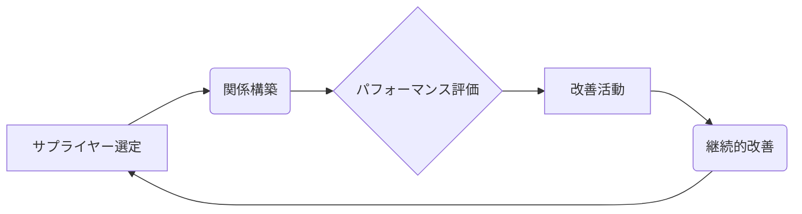

# 戦略的サプライヤー管理 - 概要

## 1. 用語と概要

戦略的サプライヤー管理（Strategic Supplier Management、SSM）とは、企業の事業戦略達成に貢献するよう、サプライヤーとの長期的な関係構築と最適化を図る管理手法です。単なるコスト削減だけでなく、サプライヤーのパフォーマンス向上、イノベーション創出、リスク管理の強化といった多角的な視点から、サプライチェーン全体を最適化することを目指します。従来の購買活動とは異なり、サプライヤーを単なる部品供給元ではなく、事業パートナーとして捉え、相互信頼に基づいた協調関係を築くことが重要となります。SSMは、企業の競争優位性を高める上で不可欠な要素となっており、近年、ますます注目を集めています。

## 2. 背景と目的

グローバル化の進展やサプライチェーンの複雑化に伴い、企業は原材料調達や製造委託において、様々なリスクに直面しています。品質問題、納期遅延、価格変動、地政学的リスクなどは、企業業績に大きな影響を与えます。このような状況下で、企業は単なるコスト最小化ではなく、サプライヤーとの強固な関係構築を通じて、これらのリスクを軽減し、サプライチェーンのレジリエンス（回復力）を高める必要性が高まっています。SSMの目的は、これらの課題に対応し、以下の目標を達成することにあります。

* **コスト削減:** 効率的な調達プロセスとサプライヤーのパフォーマンス向上を通じてコスト削減を実現する。
* **品質向上:** 高品質な製品・サービスの安定供給を実現する。
* **リスク軽減:** サプライチェーンにおける様々なリスクを特定・評価・軽減する。
* **イノベーション創出:** サプライヤーとの協業を通じて、新たな技術や製品開発を促進する。
* **サプライチェーンのレジリエンス向上:** 予期せぬ事態が発生した場合でも、事業継続性を確保できる柔軟なサプライチェーンを構築する。

## 3. 活用方法（図解・表を含めて）

SSMの活用方法は、企業規模や業種によって異なりますが、一般的には以下のステップを踏みます。

| ステップ | 内容 | 備考 |
|---|---|---|
| 1. サプライヤー選定 | 重要度・リスク分析に基づき、戦略的なサプライヤーを選定する。 | ポートフォリオ分析手法を活用 |
| 2. 関係構築 | 選定したサプライヤーと長期的な信頼関係を構築する。 | 定期的なコミュニケーション、情報共有 |
| 3. パフォーマンス評価 | KPIを設定し、サプライヤーのパフォーマンスを継続的に評価する。 | 定量的なデータに基づく客観的な評価 |
| 4. 改善活動 | パフォーマンス評価に基づき、サプライヤーと共に改善活動を推進する。 | 問題解決のための協調的な取り組み |
| 5. 継続的改善 | サプライチェーン全体を継続的に見直し、最適化を図る。 | PDCAサイクルの活用 |

図解：SSMのサイクル

## 4. メリット・デメリット

**メリット:**

* コスト削減、品質向上、納期遵守率の向上など、具体的な成果が期待できる。
* サプライチェーンのリスクを軽減し、事業の安定性を高める。
* サプライヤーとの協調関係を通じて、イノベーション創出を促進できる。
* 企業の競争優位性を強化できる。

**デメリット:**

* 関係構築やパフォーマンス評価に時間とコストがかかる。
* サプライヤーとの信頼関係構築には、長期的な視点と継続的な努力が必要。
* 関係構築がうまくいかない場合、かえってリスクを増大させる可能性もある。
* 担当者のスキル・経験が重要となるため、人材育成に投資が必要。

## 5. 他手法との違い

SSMは、従来の購買活動やサプライチェーンマネジメントと比較して、サプライヤーとの関係構築に重点を置いています。従来の購買活動は、価格交渉やコスト削減に重点を置くことが多く、サプライヤーとの長期的な関係構築にはあまり関心がありませんでした。一方、SSMは、サプライヤーを戦略的パートナーとして捉え、相互信頼に基づいた協調関係を構築することで、サプライチェーン全体の最適化を目指します。

## 6. 企業導入事例（仮想でもよいが現実味のあるもの）

自動車部品メーカーA社は、SSMを導入することで、主要サプライヤーとの連携を強化し、部品供給の安定化と品質向上を実現しました。具体的には、サプライヤーとの定期的な会議を実施し、技術情報の共有や問題解決に共同で取り組むことで、不良率を10%削減、納期遅延率を5%削減しました。また、サプライヤーとの共同開発を通じて、新たな軽量化技術を開発し、製品の競争力を向上させました。

## 7. よくある誤解

* **コスト削減だけが目的ではない:** SSMは、コスト削減だけでなく、品質向上、リスク軽減、イノベーション創出なども目的とする包括的な手法です。
* **サプライヤーへの一方的な要求ではない:** サプライヤーとの相互信頼に基づいたパートナーシップが重要です。
* **短期的な成果を求めるべきではない:** SSMは長期的な視点で取り組む必要があるため、短期的な成果にこだわると失敗する可能性があります。

## 8. 成功のコツ

* **トップマネジメントのコミットメント:** SSMは、企業全体の戦略として位置付けることが重要です。
* **明確な目標設定:** 目標を明確に設定し、KPIを設定することで、進捗状況を把握しやすくなります。
* **関係構築のためのコミュニケーション:** サプライヤーとの定期的なコミュニケーションを通じて、信頼関係を構築することが重要です。
* **適切な人材育成:** SSMを推進するためには、適切なスキルと経験を持つ人材育成が必要です。

## 9. 今後の展望

デジタル技術の進化により、AIやIoTを活用したサプライチェーンの可視化や最適化が進み、SSMはさらに高度化していくと考えられます。ブロックチェーン技術によるサプライチェーンの透明性向上も期待されます。また、サステナビリティへの関心の高まりから、環境配慮や社会貢献を重視したサプライヤーとの連携が重要となるでしょう。

## 10. 関連リンク

* [サプライチェーンマネジメント協会](仮のリンク)
* [日本購買学会](仮のリンク)

(注：リンクは仮のものであり、実際のURLは存在しません。)
