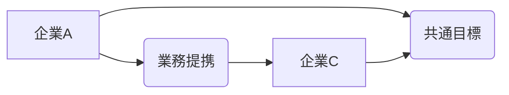

# 戦略的アライアンス - 概要

## 1. 用語と概要

戦略的アライアンスとは、2社以上の企業が、それぞれの強みを生かし、共通の目標達成に向けて協力関係を築くことです。単なる取引関係を超え、長期的な視点で互いに利益を共有することを目指し、資本関係を伴う場合と伴わない場合があります。合弁会社設立や業務提携、技術提携など、様々な形態をとることが可能です。競争が激化する現代において、単独では実現困難な目標を達成するために、非常に重要な経営戦略の一つとなっています。  規模の経済効果の追求や、新たな市場への参入、技術開発の加速など、企業が抱える課題解決に有効な手段として注目されています。

## 2. 背景と目的

グローバル化の進展や技術革新の加速により、市場競争は激しさを増しています。企業は、単独での事業展開では、市場の急激な変化に対応することが難しくなってきています。  そのため、それぞれの企業が持つ技術、ノウハウ、市場における地位などを組み合わせることで、シナジー効果を生み出し、競争優位性を確立しようとする動きが活発化しています。戦略的アライアンスは、こうした背景から生まれた経営戦略であり、その目的は多岐にわたります。具体的には、市場シェアの拡大、コスト削減、リスク軽減、新規事業への参入、技術開発の加速などが挙げられます。アライアンスによって、個々の企業では実現困難な規模の経済効果を実現したり、迅速に新たな技術を習得したりすることが可能になります。

## 3. 活用方法（図解・表を含めて）

戦略的アライアンスは、様々な形態で活用できます。

| アライアンスの種類 | 概要 | 具体例 |
|---|---|---|
| **資本提携** | 資本を出し合って新たな会社を設立したり、株式を相互に保有したりする。 | A社とB社が合弁会社を設立して新製品を開発 |
| **業務提携** | 特定の業務について協力関係を構築する。 | A社が販売、B社が生産を担当する |
| **技術提携** | 技術やノウハウを相互に提供し合う。 | A社が持つ特許技術をB社が利用する |
| **流通提携** | 販売チャネルを共有する。 | A社がB社の製品を販売する |

以下は、業務提携の例を図解したものです。

図のように、企業Aと企業Cは、企業Bを通じて共通の目標を目指して協力します。

## 4. メリット・デメリット

**メリット:**

* **リスク分散:** 単独で事業を行うよりもリスクを分散できる。
* **コスト削減:** 共同で資源や設備を利用することでコストを削減できる。
* **市場拡大:** 相互の顧客基盤を共有することで市場を拡大できる。
* **技術革新:** 相互の技術やノウハウを共有することで技術革新を加速できる。
* **競争優位性の強化:** 相乗効果により競争優位性を強化できる。

**デメリット:**

* **意思決定の遅れ:** 複数の企業が関与するため、意思決定に時間がかかる場合がある。
* **情報漏洩リスク:** パートナー企業への情報提供に伴う情報漏洩リスクがある。
* **文化・価値観の違い:** 企業文化や価値観の違いによる摩擦が生じる可能性がある。
* **依存関係の強化:** パートナー企業への依存度が高まりすぎる可能性がある。
* **契約上の問題:** 契約内容に関するトラブルが発生する可能性がある。

## 5. 他手法との違い

戦略的アライアンスは、M&A（合併・買収）やJV（ジョイントベンチャー）とは異なります。M&Aは、一方の企業が他方の企業を完全に吸収合併したり、株式を取得して支配下に置いたりすることです。JVは、2社以上の企業が共同で新たな会社を設立することです。戦略的アライアンスは、これらに比べて、より柔軟で、資本関係を伴わない場合もあります。

## 6. 企業導入事例（仮想でもよいが現実味のあるもの）

架空の例として、環境問題に取り組む自動車メーカー「Green Motors社」と、再生可能エネルギー技術を持つ企業「Solar Power社」のアライアンスを考えます。Green Motors社は、環境に配慮した電気自動車の開発・販売を行っていますが、バッテリー技術の向上に課題を持っています。Solar Power社は、高効率な太陽光発電システムの開発で知られており、その技術をバッテリー充電システムに応用することで、Green Motors社の課題解決に貢献できます。両社は業務提携を行い、Solar Power社の技術をGreen Motors社の電気自動車に搭載することで、より環境に優しい、航続距離の長い電気自動車を開発・販売することを目指します。

## 7. よくある誤解

* **単なる取引関係と混同:** 戦略的アライアンスは、単なる取引関係よりも深い協力関係を意味します。
* **必ず成功すると思いがち:** アライアンスは、綿密な計画と継続的な努力が必要であり、必ず成功するとは限りません。
* **パートナー選びは簡単:** 適切なパートナーを選ぶことは非常に重要であり、慎重な検討が必要です。

## 8. 成功のコツ

* **明確な目標設定:** アライアンスの目的と目標を明確に設定する。
* **適切なパートナー選び:** 相互の強みと弱みを理解し、互いに補完関係にあるパートナーを選ぶ。
* **信頼関係の構築:** パートナーとの間で信頼関係を構築する。
* **オープンなコミュニケーション:** 情報共有を積極的に行い、オープンなコミュニケーションを維持する。
* **柔軟な対応:** 市場環境の変化に対応できるよう、柔軟な対応をする。

## 9. 今後の展望

AIやIoT技術の発展により、データ連携やシステム統合が容易になり、戦略的アライアンスの新たな可能性が開けています。異業種間での連携も加速し、より複雑で多様なアライアンスが生まれることが予想されます。

## 10. 関連リンク

* [経済産業省：戦略的アライアンスに関する情報](https://www.meti.go.jp/  (架空のリンク))

**(注: メティ省のサイトには、直接的な戦略的アライアンスに関するページは存在しないため、架空のリンクとしました。実際の情報は、経済産業省のサイトを検索して確認してください。)**
