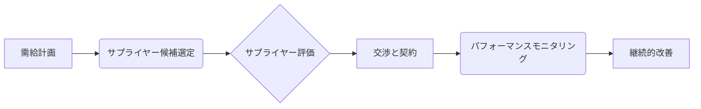

# 戦略的サプライヤー選定 - 概要

## 1. 用語と概要

戦略的サプライヤー選定とは、企業の事業戦略達成に不可欠なサプライヤーを、長期的な視点で選定・育成するプロセスです。単なる価格競争だけでなく、品質、技術力、信頼性、リスク管理、持続可能性など、多角的な視点から評価し、最適なパートナーシップを構築することを目指します。単なる購買活動ではなく、企業競争優位性を築くための重要な経営戦略の一環として位置づけられます。単なるコスト削減だけでなく、イノベーション創出やサプライチェーンの強靭化にも貢献する重要な要素となります。  選定プロセスには、市場調査、サプライヤー評価、交渉、契約締結などが含まれ、関係者間の継続的なコミュニケーションと信頼関係の構築が不可欠です。

## 2. 背景と目的

グローバル化、サプライチェーンの複雑化、技術革新の加速など、現代のビジネス環境はますます不確実性を増しています。企業は、これらの変化に柔軟に対応し、競争力を維持するために、信頼できるサプライヤーとの強固な関係構築が不可欠となっています。戦略的サプライヤー選定の目的は、以下の通りです。

* **安定的な調達体制の確立**: 品質・数量・納期を安定的に確保し、事業継続リスクを低減します。
* **コスト削減**:  効率的な調達プロセスを通じて、コスト削減を実現します。
* **品質向上**: 高品質な製品・サービスを提供できるサプライヤーを選定することで、製品・サービスの品質向上に繋げます。
* **イノベーション促進**: 技術力が高いサプライヤーとの連携により、新たな製品開発や技術革新を促進します。
* **リスク管理**:  サプライヤーのリスクを事前に把握・管理し、事業リスクを最小限に抑えます。
* **サプライチェーンの最適化**: サプライチェーン全体のパフォーマンスを向上させ、効率性を高めます。
* **持続可能性の確保**: 環境配慮や社会的責任を重視するサプライヤーを選定することで、企業の持続可能性に貢献します。

## 3. 活用方法（図解・表を含めて）

戦略的サプライヤー選定は、以下のステップで進められます。

| ステップ | 内容 | 考慮事項 |
|---|---|---|
| 1. 需給計画 | 必要な資材・サービスの量、品質、納期を明確化 | 需要予測の精度、在庫管理 |
| 2. サプライヤー候補選定 | 市場調査を行い、潜在的なサプライヤーをリストアップ | 技術力、生産能力、財務状況、地理的な位置 |
| 3. サプライヤー評価 | 評価基準を設定し、候補サプライヤーを評価 | 品質、コスト、納期、信頼性、リスク、持続可能性 |
| 4. 交渉と契約 | 選定したサプライヤーと交渉を行い、契約を締結 | 価格、契約期間、品質保証、責任分担 |
| 5. パフォーマンスモニタリング | 定期的にサプライヤーのパフォーマンスをモニタリングし、必要に応じて改善策を講じる | KPI設定、データ収集、分析 |

## 4. メリット・デメリット

**メリット:**

* 安定的な調達体制の確立による事業リスクの軽減
* 高品質な製品・サービスの確保による顧客満足度の向上
* コスト削減による収益性向上
* イノベーション促進による競争優位性の強化
* サプライチェーン全体の効率化

**デメリット:**

* 選定プロセスに時間とコストがかかる
* 依存関係が高まるリスク
* サプライヤーとの関係構築に労力が必要
* 選定ミスによるリスク

## 5. 他手法との違い

一般的な購買活動とは異なり、戦略的サプライヤー選定は長期的な視点で、単なる価格競争ではなく、多様な要素を総合的に評価します。  単なる取引先ではなく、パートナーとして関係を構築することを目指す点が大きく異なります。

## 6. 企業導入事例（仮想でもよいが現実味のあるもの）

架空の自動車メーカー「グリーンモーターズ社」は、次世代EV向けバッテリーの調達において戦略的サプライヤー選定を実施しました。複数のバッテリーメーカーを評価し、技術力、生産能力、環境への配慮などを重視。最終的に、持続可能な生産体制と革新的なバッテリー技術を持つ「エナジーテック社」を選定し、長期的なパートナーシップを構築しました。これにより、高性能かつ環境に優しいEVの開発・生産を実現し、市場競争力を強化することができました。

## 7. よくある誤解

* **価格だけで判断する**: 価格も重要な要素ですが、品質、信頼性、技術力など、他の要素も考慮する必要があります。
* **短期的な視点での選定**: 長期的な視点で、持続可能な関係構築を重視する必要があります。
* **単独での選定**: 関係各部署との連携が不可欠です。

## 8. 成功のコツ

* 明確な選定基準の設定
* 関係者間の良好なコミュニケーション
* 定期的なパフォーマンス評価とフィードバック
* 柔軟性と適応性
* 信頼関係の構築

## 9. 今後の展望

AIやビッグデータ分析技術を活用した、より効率的で精緻なサプライヤー選定プロセスが期待されます。  サプライチェーンのレジリエンス強化、サステナビリティへの対応など、新たな課題への対応も求められます。

## 10. 関連リンク

* [サプライチェーンマネジメント協会](仮のリンク)
* [購買プロセスの最適化に関する記事](仮のリンク)

