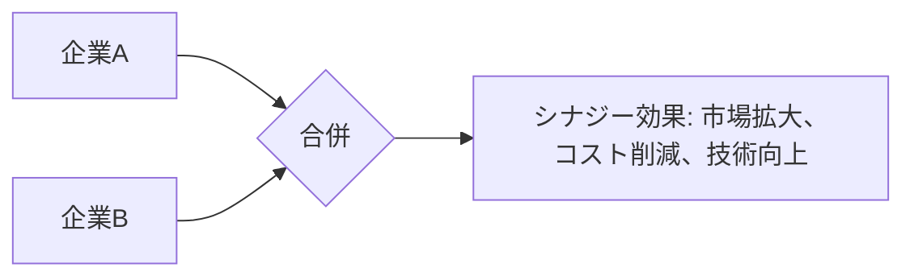

# シナジー効果 - 概要

## 1. 用語と概要

シナジー効果とは、複数の要素を組み合わせることで、それぞれの要素単独の効果の合計よりも大きな効果を生み出す現象のことです。  ビジネスにおいては、企業合併、業務提携、部門間の連携など、異なる要素を統合することで、相乗効果によって新たな価値を創造することを指します。単なる足し算ではなく、掛け算、場合によっては指数関数的な効果を狙う概念です。  効果の発現には、要素間の適切な組み合わせと、効果的な統合プロセスが不可欠となります。  シナジー効果を最大限に引き出すためには、綿密な計画と実行力、そして各要素の特性を深く理解することが重要です。  効果の測定は、統合前後のパフォーマンス比較や、新規事業の収益性分析などを通して行われます。

## 2. 背景と目的

シナジー効果が重視される背景には、グローバル化の進展、市場競争の激化、技術革新の加速などがあります。企業は単独では対応できない課題に直面しており、他社との連携や内部組織の最適化を通じて、より大きな競争力を獲得しようとします。  目的は、企業価値の向上、収益性の改善、市場シェアの拡大、競争優位の確立など多岐に渡ります。  特に、既存事業の限界に直面している企業や、新たな市場への参入を図る企業にとって、シナジー効果の追求は不可欠な戦略となります。  資源の有効活用、リスクの分散、専門知識の共有なども、シナジー効果を目指す重要な目的です。

## 3. 活用方法（図解・表を含めて）

シナジー効果は、様々な場面で活用できます。以下に、代表的な活用例と図解を示します。

**例1：企業合併によるシナジー効果**

| 要素             | 企業A                               | 企業B                               | 合併後のシナジー効果                               |
|-----------------|------------------------------------|------------------------------------|----------------------------------------------------|
| ブランド力       | 中程度                              | 高い                                 | ブランド力の向上による市場シェア拡大                  |
| 技術力           | 高い                                 | 中程度                              | 技術力の相乗効果による製品開発力の向上              |
| 営業網           | 国内中心                            | 海外中心                              | 国内外の広範な営業網による販売拡大                   |
| 顧客基盤         | 若年層                              | 高年齢層                              | 幅広い顧客層への対応による売上増加                   |
| コスト削減効果   | 規模の経済効果によるコスト削減         | 業務プロセス改善によるコスト削減       | 統合による重複業務の削減、効率化による大幅なコスト削減 |

**図解：企業合併によるシナジー効果**

**例2：業務提携によるシナジー効果**

例えば、物流会社とECサイトの業務提携では、物流会社の配送網とECサイトの顧客基盤を組み合わせることで、両社の売上向上を実現できます。

## 4. メリット・デメリット

**メリット:**

* 収益性向上：コスト削減、売上増加などによる収益性の劇的な向上。
* 競争力強化：市場シェア拡大、競争優位性の確立による競争力向上。
* 新規事業創出：異なる分野の技術やノウハウを組み合わせた新たな事業の創出。
* リスク軽減：事業リスクの分散、多角化による経営の安定化。
* 効率性向上：業務プロセス改善、資源の有効活用による効率性の向上。

**デメリット:**

* 統合コスト：企業合併や業務提携に伴う統合コストの発生。
* 文化衝突：企業文化の違いによる摩擦、統合の遅延。
* 予期せぬリスク：統合後の不測の事態、市場の変化への対応。
* 情報漏洩：機密情報の漏洩リスク。
* 従業員の抵抗：組織変更、人員削減などによる従業員の抵抗。

## 5. 他手法との違い

シナジー効果は、単なる協力関係や業務委託とは異なります。協力関係は各社が独立して活動する一方、シナジー効果は、相互に深く連携し、一体となって活動することで、全体として新たな価値を生み出します。業務委託は、特定の業務を外部に委託するもので、統合による相乗効果は期待できません。

## 6. 企業導入事例（仮想でもよいが現実味のあるもの）

架空の事例として、食品メーカーA社と飲料メーカーB社の合併を考えてみましょう。A社は高いブランド力と既存の流通網を持ち、B社は独自の技術で開発された健康志向の飲料を製造しています。合併によって、A社の流通網を活用しB社の飲料を全国展開することで、両社の売上を大幅に向上させるシナジー効果が期待できます。さらに、A社の食品開発技術とB社の飲料技術を融合することで、新たな健康食品の開発も可能になります。

## 7. よくある誤解

* **単なる合計効果と混同:** シナジー効果は、各要素の単純な合計を超える効果を指します。単なる足し算ではなく、掛け算的な効果であることを理解する必要があります。
* **必ず成功するわけではない:** シナジー効果は、綿密な計画と実行、適切な統合プロセスがなければ、期待通りに発現しません。失敗するケースも存在します。
* **短期的効果のみを期待する:** シナジー効果は、長期的な視点で捉える必要があります。短期的な成果に捉われず、長期的な企業価値向上を目指すべきです。

## 8. 成功のコツ

* **明確な目標設定:** 具体的な目標を設定し、シナジー効果を定量的に測定できるようにする。
* **綿密な計画立案:** 統合プロセス、リスク管理、リソース配分などを綿密に計画する。
* **効果的なコミュニケーション:** 関係者間の円滑なコミュニケーションを確保する。
* **柔軟な対応:** 予期せぬ事態に対処できるよう、柔軟な対応体制を整える。
* **継続的な改善:** 常に効果を検証し、改善を続けることで、シナジー効果を最大化する。

## 9. 今後の展望

AIやIoT技術の発展により、より複雑なシナジー効果が生まれる可能性があります。データ分析技術を活用した最適化や、新たなビジネスモデルの創出が期待されます。

## 10. 関連リンク

* [経済産業省：企業連携](仮のリンク)
* [中小企業庁：事業承継](仮のリンク)

