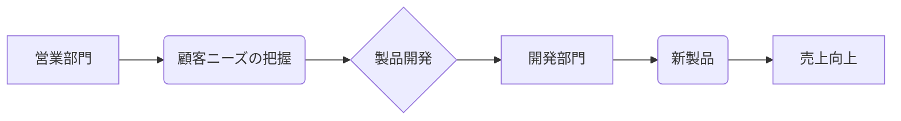

# シナジー効果 - 概要

## 1. 用語と概要

シナジー効果とは、複数の要素を組み合わせることで、個々の要素を単独で活用した場合よりも大きな効果を生み出す現象のことです。1+1＞2という表現で示されるように、全体としての成果が部分の単純な合計を上回ることを意味します。ビジネスにおいては、企業合併、部門連携、異業種コラボレーションなど、様々な場面でシナジー効果の創出が目指されています。  単なる相乗効果ではなく、相互作用によって生まれる新たな価値創造がその本質であり、その効果は予測不能な部分も包含します。そのため、綿密な計画と柔軟な対応が不可欠です。シナジー効果は、企業の競争優位性を確立し、持続的な成長を促す重要な要素と言えるでしょう。

## 2. 背景と目的

シナジー効果が注目される背景には、グローバル化の進展や市場競争の激化があります。単独では生き残りが困難な状況下において、企業は他社との連携や事業の多角化を通じて、新たな価値を創造し、競争力を高める必要性を感じています。  目的は、企業価値の向上、収益の最大化、市場シェアの拡大など多岐に渡ります。  具体的には、コスト削減、効率化、イノベーション創出、リスク分散などを目指すことで、企業の持続的な成長を実現しようとしています。  そのため、シナジー効果の創出は、現代ビジネスにおける重要な経営戦略の一つとなっています。

## 3. 活用方法（できれば図解・表を含めて）

シナジー効果は、様々な場面で活用できます。以下にいくつかの例を示します。

**例1：企業合併**

| 企業A | 企業B | 合併後のシナジー効果 |
|---|---|---|
| 販売網が充実 | 技術力が高い | 広い市場への製品供給、新製品開発の加速 |
| ブランド力が高い | コスト削減に成功 | ブランド力の向上、利益率の改善 |
| 財務基盤が安定 | 人材が豊富 | 安定した経営基盤、高い生産性 |

**例2：部門連携**

例えば、営業部門と開発部門が連携することで、顧客ニーズを的確に捉えた製品開発が可能となり、売上向上に繋がります。

**例3：異業種連携**

例えば、金融機関と不動産会社が連携することで、住宅ローンの提供を円滑に進め、双方にとっての顧客獲得に繋がります。

## 4. メリット・デメリット

**メリット:**

* **収益性の向上:** コスト削減や売上増加により、収益性が向上します。
* **競争力の強化:** 新たな製品・サービスの開発や市場開拓により、競争力が強化されます。
* **リスクの軽減:** 事業の多角化や連携により、リスクを分散することができます。
* **イノベーションの促進:** 異なる視点やアイデアの融合により、イノベーションが促進されます。

**デメリット:**

* **統合コスト:** 企業合併などでは、統合にかかるコストが大きくなる可能性があります。
* **文化摩擦:** 異なる企業文化の衝突により、連携がうまくいかない可能性があります。
* **意思決定の遅延:** 多数の関係者による意思決定が必要となるため、意思決定が遅れる可能性があります。
* **情報共有の難しさ:** 情報共有が不十分な場合、シナジー効果が発揮されない可能性があります。

## 5. 他手法との違い

シナジー効果は、単なる相乗効果とは異なります。相乗効果は、要素を足し合わせただけの効果ですが、シナジー効果は、要素間の相互作用によって生まれる新たな価値創造を含みます。  また、単なるコスト削減や効率化とは異なり、イノベーションや新たな市場創出といった、より大きな成果を目指します。

## 6. 企業導入事例（仮想でもよいが現実味のあるもの）

株式会社A社（食品メーカー）と株式会社B社（物流会社）が連携し、A社の農場から工場、そして消費者に至るまでのサプライチェーン全体を最適化しました。B社は、A社の農作物の収穫から配送までを一括で管理し、効率的な物流システムを構築。これにより、A社はコスト削減、鮮度維持、迅速な配送を実現し、B社は新たな顧客を獲得しました。双方で利益を共有するシステムを構築することで、高いシナジー効果を生み出しています。

## 7. よくある誤解

* **シナジー効果は必ず生まれるという誤解:** シナジー効果は、計画的に取り組み、関係各所の協力が不可欠です。無計画な連携では、効果が期待できないどころか、かえって損失を招く可能性もあります。
* **シナジー効果は簡単に実現できるという誤解:** シナジー効果の実現には、綿密な計画、関係者間の良好なコミュニケーション、柔軟な対応などが必要であり、容易ではありません。

## 8. 成功のコツ

* **明確な目標設定:** シナジー効果を生み出すための明確な目標を設定することが重要です。
* **綿密な計画:** 関係各所との綿密な計画と役割分担が不可欠です。
* **効果的なコミュニケーション:** 関係者間の効果的なコミュニケーションを確保することが重要です。
* **柔軟な対応:** 状況の変化に対応できる柔軟性が必要です。
* **継続的なモニタリングと評価:** 定期的に効果をモニタリングし、必要に応じて修正を加える必要があります。

## 9. 今後の展望

AIやIoT技術の発展により、データ分析に基づいたシナジー効果の創出が可能になってきています。 今後は、これらの技術を活用することで、より効率的かつ精度の高いシナジー効果の創出が期待されます。また、サステナビリティを考慮したシナジー効果の創出も重要な課題となっており、環境問題への配慮や社会的責任を果たすような連携が求められています。

## 10. 関連リンク

* [経済産業省：企業連携](仮のURL)
* [中小企業庁：異業種連携](仮のURL)

