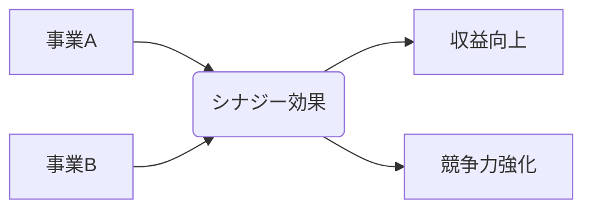

# シナジー効果 - 概要

## 1. 用語と概要

シナジー効果とは、複数の要素を組み合わせることで、それぞれの要素単体では得られない、相乗的な効果を生み出すことを指します。  1+1>2という関係性をビジネスの文脈で表現したものです。  単なる足し算ではなく、掛け算、場合によっては指数関数的な効果が期待できるため、企業戦略において重要な概念となっています。  特に、異なる事業分野や部門、企業同士の連携によって生まれるシナジー効果は、企業の成長や競争優位性を確立する上で非常に大きな役割を果たします。  本稿では、シナジー効果の背景、活用方法、メリット・デメリット、そして成功への道筋について詳しく解説します。

## 2. 背景と目的

シナジー効果が注目される背景には、グローバル化の進展と市場競争の激化があります。  単独では生き残りが困難な状況下で、企業は自社の強みを最大化し、弱みを補完するために、他社との連携や事業領域の拡大を模索するようになりました。  シナジー効果を追求する目的は、大きく分けて以下の3つがあります。

1. **収益性の向上:**  コスト削減、売上増加、利益率向上など、直接的な経済効果の追求。
2. **競争優位性の強化:**  他社には真似できない独自の強みを生み出し、市場での優位性を確立。
3. **リスク管理の改善:**  事業ポートフォリオの多様化によるリスク分散効果。

これらの目的を達成するために、企業は綿密な計画に基づいた戦略的なシナジー効果の創出を目指しています。

## 3. 活用方法（図解・表を含めて）

シナジー効果は、様々な場面で活用できます。代表的な例として、以下の3つのシナジー効果のタイプを挙げ、図解で示します。

| シナジー効果の種類 | 説明 | 例 |
|---|---|---|
| **事業間シナジー** | 異なる事業分野間の連携による効果 | 食品メーカーが飲料事業に進出し、既存の流通網を活用して販売コストを削減 |
| **部門間シナジー** | 異なる部門間の連携による効果 | 営業部と開発部が連携して、顧客ニーズに合わせた新製品開発を行う |
| **企業間シナジー** | 異なる企業間の連携による効果 |  A社が持つ技術とB社が持つ販売網を組み合わせ、新たな市場を開拓 |

上記の図は、事業Aと事業Bが連携することでシナジー効果が生まれ、収益向上や競争力強化につながる様子を表しています。

## 4. メリット・デメリット

**メリット:**

* **収益の増大:** コスト削減、売上増加、利益率向上など、直接的な経済効果が期待できる。
* **市場シェアの拡大:** 新規市場への参入や既存市場でのシェア拡大が可能になる。
* **競争優位性の向上:** 他社には真似できない独自の強みを生み出し、競争優位性を確立できる。
* **リスクの低減:** 事業ポートフォリオの多様化により、リスクを分散できる。
* **イノベーション創出:** 異なる視点やアイデアの融合により、革新的な製品やサービスを生み出せる。

**デメリット:**

* **連携コスト:** 部門間、企業間での情報共有や調整にコストがかかる。
* **意思決定の遅延:** 複数の関係者間の合意形成に時間がかかり、意思決定が遅れる可能性がある。
* **文化の衝突:** 異なる企業文化の融合に困難が生じる可能性がある。
* **情報漏洩リスク:** 情報共有に伴い、機密情報の漏洩リスクが高まる可能性がある。
* **パートナー選びの失敗:** 相性の悪いパートナーと連携すると、かえって損失を招く可能性がある。

## 5. 他手法との違い

シナジー効果は、単なる合併や買収とは異なります。合併や買収は企業規模の拡大や市場支配力の強化が主な目的ですが、シナジー効果は、連携によって生まれる相乗効果を重視します。  また、単なる協業とも異なり、より深く、持続的な関係性を前提としています。

## 6. 企業導入事例（仮想でもよいが現実味のあるもの）

架空の事例として、食品メーカー「A社」と飲料メーカー「B社」の連携を考えます。A社は高い品質の食材調達力と加工技術を持ち、B社は広範な販売網とブランド力を有しています。両社が連携し、A社の食材を使った新たな健康飲料を共同開発・販売することで、A社は販売チャネルを拡大し、B社は高付加価値な商品を提供できるようになります。これは、事業間シナジーの好例です。

## 7. よくある誤解

* **必ず成功するわけではない:** シナジー効果は、適切な計画と実行がなければ、期待通りの成果が得られない。
* **単なる足し算ではない:**  1+1>2の効果を期待するが、単なる足し算ではシナジー効果とは言えない。
* **短期間で実現できるわけではない:**  効果の発現には、時間と努力が必要。

## 8. 成功のコツ

* **明確な目標設定:**  シナジー効果によって達成したい具体的な目標を明確にする。
* **適切なパートナー選び:**  互いに補完し合える関係にあるパートナーを選ぶ。
* **密なコミュニケーション:**  関係者間の密なコミュニケーションを図る。
* **柔軟な対応:**  状況変化に応じて、柔軟に対応できる体制を整える。
* **継続的な評価と改善:**  効果を継続的に評価し、必要に応じて改善していく。

## 9. 今後の展望

今後、デジタル技術の進化により、データ連携やAI活用によるシナジー効果創出が加速すると予想されます。  特に、異なる業界間のデータ連携による新たなビジネスモデルの創出が期待されます。

## 10. 関連リンク

* [経済産業省：中小企業における事業承継](仮のURL)
* [日本生産性本部：生産性向上](仮のURL)

**(注記：関連リンクは架空のURLです。)**
