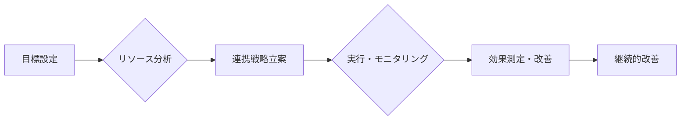

# シナジー効果 - 概要

## 1. 用語と概要

シナジー効果とは、複数の要素を組み合わせることで、それぞれの要素単独の効果を単純に合計した以上の効果を生み出す現象のことです。  企業経営においては、複数の事業部門や部署、あるいは企業同士の連携によって、全体としてより大きな利益や価値を生み出すことを指します。 単純な足し算を超えた「１＋１＞２」の効果を生み出すことが期待されます。  これは、個々の要素の強みを最大限に活かし、弱点を補完することで実現します。  単なる相乗効果と表現されることもありますが、より積極的で、革新的な効果を期待するニュアンスが込められています。  効果の大きさは、連携する要素間の適合性や連携方法に大きく依存します。

## 2. 背景と目的

シナジー効果の概念は、企業が成長・発展していく上で非常に重要な役割を果たします。  グローバル化や市場の複雑化が進む現代において、単独で事業を展開するだけでは競争力を維持することが難しくなってきています。  そこで、複数の資源や能力を統合し、効率性と生産性を向上させるシナジー効果の追求が、企業にとって不可欠な戦略となっています。  目的は、既存リソースの最適化、新規事業の創出、市場競争優位性の確立、収益最大化など多岐に渡ります。  特に、M&A（合併・買収）やアライアンス（提携）などの戦略的提携においては、シナジー効果の実現が成功の鍵となります。

## 3. 活用方法（図解・表を含めて）

シナジー効果を最大限に活用するためには、綿密な計画と実行が必要です。  以下の図は、シナジー効果を生み出すための一般的なプロセスを示しています。

| 段階        | 内容                                                              | 具体例                                                       |
|--------------|-------------------------------------------------------------------|------------------------------------------------------------|
| 目標設定      | シナジー効果によって達成したい具体的な目標を設定する。             | 売上高増加10%、市場シェア拡大5%、コスト削減20%など                 |
| リソース分析 | 各部門・部署の強み、弱み、保有リソースを分析する。                | 技術力、ブランド力、販売網、人材、資金など                         |
| 連携戦略立案 | 複数の要素を効果的に組み合わせるための戦略を立案する。             | 部署間の情報共有、共同プロジェクト、共同開発、外部企業との提携など |
| 実行・モニタリング | 立案した戦略を実行し、その進捗状況を継続的にモニタリングする。 | 定期的な会議、進捗報告、課題の共有など                         |
| 効果測定・改善 | 実行結果を評価し、改善策を講じる。                               | KPIの測定、分析、改善計画の作成など                             |
| 継続的改善  | 継続的に改善を繰り返すことでシナジー効果を最大化させる。            | 定期的な見直し、新たな連携方法の探索など                         |

## 4. メリット・デメリット

**メリット:**

* **競争優位性の強化:** 競合他社にはない独自の強みを構築できる。
* **収益性の向上:** 効率的な事業運営により、利益率の向上に繋がる。
* **リスク分散:**  複数の事業に展開することで、リスクを分散できる。
* **イノベーションの促進:**  異なる分野の知見が融合することで、新たなアイデアが生まれる。

**デメリット:**

* **連携コスト:** 部署間や企業間の連携には、時間とコストがかかる。
* **調整コスト:** 複数の関係者を調整する必要があるため、意思決定に時間がかかる可能性がある。
* **情報共有の難しさ:**  関係者間での情報共有がスムーズにいかない可能性がある。
* **文化の違い:** 企業文化の違いにより、連携がうまくいかない可能性がある。

## 5. 他手法との違い

シナジー効果は、単なる協力関係や業務提携とは異なります。  協力関係は各々が独立して活動する中で、互いに助け合う関係性を指すのに対し、シナジー効果は、連携によって1+1>2の効果を追求することを目指します。  また、業務提携は、特定のプロジェクトや業務における連携を指すことが多いですが、シナジー効果は、より広範な範囲での連携を想定している点が異なります。

## 6. 企業導入事例（仮想でもよいが現実味のあるもの）

株式会社A社は、製造部門と販売部門の連携強化によってシナジー効果を実現しました。  従来は、製造部門が製品を開発・製造し、販売部門が販売するという独立した体制でしたが、両部門の担当者が定期的に会議を行い、市場ニーズを踏まえた製品開発や販売戦略を共同で立案するようになりました。  その結果、顧客ニーズに合致した製品開発が進み、販売数量が大幅に増加しました。  さらに、製造工程の見直しを通じてコスト削減にも成功し、利益率の向上に繋がりました。

## 7. よくある誤解

* **必ずしも全ての連携がシナジー効果を生むわけではない:**  連携する要素間の適合性や連携方法が適切でなければ、シナジー効果は期待できません。
* **シナジー効果は魔法ではない:**  計画性と努力なしに、自然発生的に生まれるものではありません。

## 8. 成功のコツ

* **明確な目標設定:**  具体的な目標を設定することで、連携の目的を明確にし、効果的な戦略を立案できます。
* **関係者間のコミュニケーション:**  関係者間で情報を共有し、相互理解を深めることが重要です。
* **柔軟な対応:**  状況に応じて柔軟に対応することで、課題を克服し、シナジー効果を最大化できます。
* **継続的な改善:**  継続的に効果を測定し、改善策を講じることで、シナジー効果を維持・向上させることができます。

## 9. 今後の展望

AIやIoTなどの技術革新により、企業間連携の可能性はさらに広がると予想されます。  これらの技術を活用することで、より高度なシナジー効果を実現できる可能性があります。  例えば、AIを活用した需要予測により、製品開発や生産計画を最適化したり、IoTを活用したデータ共有により、リアルタイムでの連携を強化することができます。

## 10. 関連リンク

* [経済産業省：中小企業庁](https://www.chusho.meti.go.jp/)  (参考：中小企業の連携事例について情報が掲載されている場合があります。)

