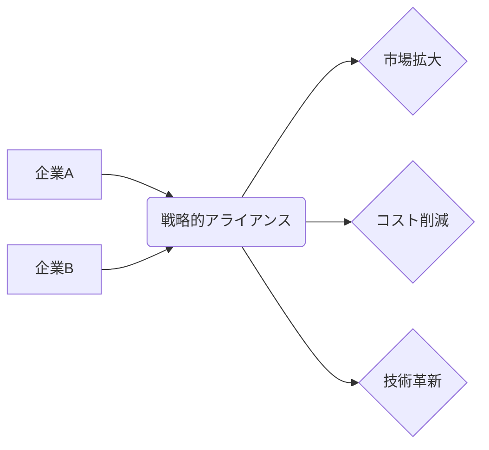

# 戦略的アライアンス - 概要

## 1. 用語と概要

戦略的アライアンスとは、企業が互いの強みを活かし、共同で新たなビジネスチャンスを創出するために結ぶ長期的な提携関係のことです。合弁会社設立、資本提携、技術提携、販売提携など、様々な形態をとることができ、単なる取引関係を超えた、より深い連携が特徴です。競争が激化する現代において、企業単独では達成できない目標を、アライアンスを通じて実現しようとする戦略的な取り組みと言えます。企業規模や業種を問わず、幅広い業界で活用されており、グローバル化やデジタル化の進展に伴い、その重要性が増しています。単なる一時的な協力関係ではなく、明確な戦略目標を共有し、持続的な関係構築を目指した取り組みが成功の鍵となります。

## 2. 背景と目的

近年、市場のグローバル化、技術革新の加速、顧客ニーズの多様化など、企業を取り巻く環境はますます複雑化しています。従来のような単独での事業展開では、競争に勝ち抜くことが困難になってきています。そこで、複数の企業がそれぞれの強みやリソースを共有することで、より効率的かつ効果的に事業を推進しようとする動きが活発化しています。戦略的アライアンスの目的は、大きく分けて以下の3つに分類できます。

* **市場拡大:** 新規市場への参入、既存市場におけるシェア拡大、新たな顧客基盤の獲得
* **コスト削減:** 研究開発費、製造コスト、販売コストなどの削減
* **技術革新:** 新技術の開発・導入、競争力の強化

これらの目的を達成することで、企業は持続的な成長を実現し、株主価値の向上を目指します。

## 3. 活用方法（図解・表を含めて）

戦略的アライアンスは、様々な形態で構築されます。代表的な例を以下に示します。

| アライアンス形態 | 説明 | 例 |
|---|---|---|
| 資本提携 | 出資を通じて関係を構築 | 企業Aが出資し、企業Bの株式の一部を取得 |
| 技術提携 | 技術やノウハウを共有 | 企業Aが持つ特許技術を企業Bが使用 |
| 販売提携 | 互いの製品・サービスを販売 | 企業Aが企業Bの製品を販売チャネルを通じて販売 |
| 合弁会社設立 | 新たな会社を共同で設立 | 企業Aと企業Bが共同で新会社を設立し、新たな事業を展開 |

**(図解)**

この図は、企業Aと企業Bが戦略的アライアンスを結び、市場拡大、コスト削減、技術革新といった成果を上げる様子を表しています。

## 4. メリット・デメリット

**メリット:**

* **リスク分散:**  単独で事業展開するよりもリスクを分散できる。
* **コスト削減:**  共同で資源を共有することで、コストを削減できる。
* **市場拡大:**  パートナー企業のネットワークを活用することで、市場を拡大できる。
* **技術革新:**  互いの技術やノウハウを共有することで、技術革新を加速できる。
* **競争優位性の強化:**  競合他社に対する競争優位性を強化できる。

**デメリット:**

* **情報漏洩リスク:** パートナー企業への情報漏洩のリスクがある。
* **意思決定の遅延:**  共同で意思決定を行うため、意思決定が遅延する可能性がある。
* **パートナー企業との摩擦:**  パートナー企業との間で摩擦が生じる可能性がある。
* **企業文化の相違:**  企業文化の相違により、連携がうまくいかない可能性がある。
* **依存関係の発生:**  一方的な依存関係が発生する可能性がある。

## 5. 他手法との違い

戦略的アライアンスは、M&A（合併・買収）やフランチャイズとは明確に異なります。M&Aは企業を合併もしくは買収することで、完全に統合しますが、アライアンスはあくまで独立性を保ったまま協力関係を築きます。フランチャイズは、ブランドやビジネスモデルの利用権を許諾する一方的な関係ですが、アライアンスは相互に利益を追求する対等な関係であることが一般的です。

## 6. 企業導入事例（仮想でもよいが現実味のあるもの）

**例：スマート農業におけるアライアンス**

架空の農業用ドローン開発企業「AgriDrone社」と、農業IoTプラットフォームを提供する「FarmTech社」が戦略的アライアンスを締結しました。AgriDrone社はドローン技術、FarmTech社はデータ分析技術に強みを持っています。両社は共同で、ドローンによる農作物モニタリングとデータに基づいた精密農業システムを開発・販売し、市場シェア拡大を目指しています。FarmTech社のプラットフォームにAgriDrone社のドローンデータが統合されることで、より高精度な農業経営が可能となり、顧客への価値提供を向上させました。

## 7. よくある誤解

* **単なる取引関係と混同:**  戦略的アライアンスは、単なる取引関係とは異なり、長期的な視点で互いに協力し、価値を創造することを目的としています。
* **企業買収と同じ:**  アライアンスは企業を完全に統合するM&Aとは異なり、各社は独立性を維持します。
* **容易に成功する:**  アライアンスは、パートナー企業との信頼関係構築、明確な目標設定、リスク管理など、綿密な計画と実行が必要です。

## 8. 成功のコツ

* **明確な目標設定:**  アライアンスの目的と目標を明確に定義する。
* **パートナー企業の選定:**  互いに補完的な関係にあるパートナー企業を選択する。
* **契約の明確化:**  契約内容を明確に定め、リスクを最小限にする。
* **コミュニケーションの円滑化:**  パートナー企業との間で、密なコミュニケーションを図る。
* **柔軟な対応:**  変化する市場環境に柔軟に対応する。

## 9. 今後の展望

技術革新の加速やグローバル化の進展に伴い、戦略的アライアンスの重要性はますます高まると予想されます。特に、AI、IoT、ブロックチェーンなどの新技術を活用したアライアンスが注目を集め、新たなビジネスモデルや価値創造が期待されます。さらに、サステナビリティへの関心の高まりから、環境問題への取り組みを共有するアライアンスも増加すると考えられます。

## 10. 関連リンク

* [経済産業省：企業連携](仮のURL)
* [JETRO：海外企業との連携](仮のURL)

**(注記：上記関連リンクは架空のURLです。実際の情報は、経済産業省やJETROなどのウェブサイトをご確認ください。)**
