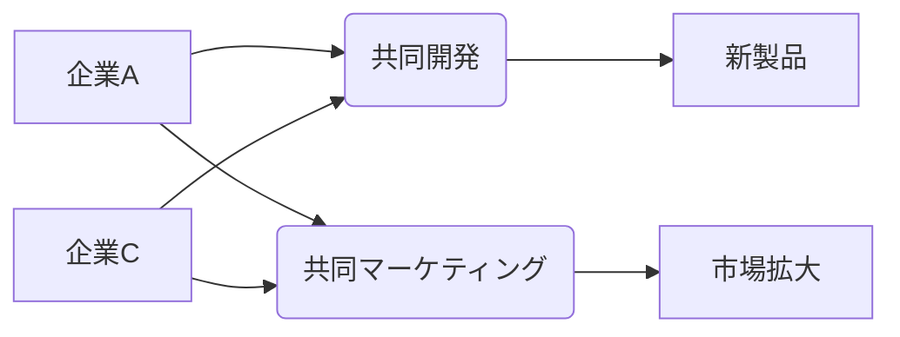

# 戦略的アライアンス - 概要

## 1. 用語と概要

戦略的アライアンスとは、2社以上の企業が、それぞれの強みや資源を共有し、共通の目標を達成するために結ぶ長期的な協力関係です。単なる取引関係を超え、互いに深く連携することで、競争優位性を築き、市場シェア拡大、新規事業開発などを目指します。合併や買収とは異なり、各社は独立性を維持したまま、協調関係を構築します。この関係は、共同開発、共同マーケティング、相互出資、技術ライセンスなど、様々な形態を取ることが可能です。戦略的アライアンスを成功させるためには、明確な目標設定、互恵的な関係構築、そして継続的なコミュニケーションが不可欠です。

## 2. 背景と目的

グローバル化が加速する現代において、単独企業が全ての資源を保有し、全ての市場をカバーすることは困難になっています。技術革新のスピードも速く、常に新しい技術や知識を吸収し続ける必要があります。そこで、それぞれの専門性や資源を補完しあい、リスクを分散することで、より効率的かつ効果的に事業を推進できる戦略的アライアンスが注目されています。目的としては、市場拡大、新規事業創出、コスト削減、技術獲得、リスク軽減など多岐に渡ります。例えば、特定分野の専門知識を持つ企業とのアライアンスにより、自社では開発が困難な技術を迅速に獲得したり、新たな市場への参入障壁を低くすることが可能です。

## 3. 活用方法（図解・表を含めて）

戦略的アライアンスは様々な形態を取ります。

| アライアンスの種類 | 説明 | 例 |
|---|---|---|
| 共同開発 | 新製品・新サービスの共同開発 | 自動車メーカーと部品メーカーの共同開発 |
| 共同マーケティング | 共同でマーケティング活動を行う | 通信会社と家電メーカーの共同キャンペーン |
| 交差出資 | 相互に出資を行う | 金融機関同士の相互出資 |
| 技術ライセンス | 技術の利用許諾を与える | 特許技術のライセンス供与 |
| 資本業務提携 | 資本と業務の両面で提携を行う | 小売業と物流会社の提携 |

**図解：戦略的アライアンスの例**

この図は、企業Aと企業Cが共同開発と共同マーケティングを通じて新製品を開発し、市場拡大を目指す戦略的アライアンスを示しています。

## 4. メリット・デメリット

**メリット:**

* **リスク分散:** 複数の企業でリスクを共有できるため、失敗のリスクを軽減できます。
* **資源共有:** 各社の強みや資源を共有することで、効率的な事業運営が可能になります。
* **市場拡大:** 新たな市場への参入や既存市場のシェア拡大が期待できます。
* **技術革新:** 新しい技術やノウハウを迅速に獲得できます。
* **競争優位性の向上:** 競合他社に対する競争優位性を築き上げることができます。

**デメリット:**

* **意思決定の遅延:** 複数の企業が関与するため、意思決定に時間がかかる場合があります。
* **情報漏洩のリスク:** 重要な情報の漏洩リスクがあります。
* **パートナー企業との摩擦:** パートナー企業との間で意見の相違や摩擦が生じる可能性があります。
* **依存関係の発生:** パートナー企業への依存度が高まり、自社の独立性を損なう可能性があります。
* **契約上のトラブル:** 契約内容に関するトラブルが発生する可能性があります。

## 5. 他手法との違い

戦略的アライアンスは、合併、買収、合弁会社とは明確に異なります。

* **合併:** 2社以上の企業が合併し、1つの企業となる。
* **買収:** ある企業が別の企業の株式を取得し、支配権を獲得する。
* **合弁会社:** 複数の企業が共同で新たな会社を設立する。

戦略的アライアンスは、これらの手法と異なり、各企業が独立性を維持したまま協力関係を築く点が大きな特徴です。

## 6. 企業導入事例（仮想でもよいが現実味のあるもの）

架空の事例として、次のようなケースを考えます。

**企業A：**  大手食品メーカー。既存の流通網とブランド力は強いが、健康志向の商品の開発ノウハウが不足している。
**企業B：**  オーガニック食材の生産・販売を行う中小企業。健康志向の商品の開発力が高いが、流通網が弱い。

企業Aと企業Bは戦略的アライアンスを結び、企業Bが健康志向の商品の開発を行い、企業Aが自社の流通網を活用して販売を行うことで、双方にメリットのある関係を構築しました。

## 7. よくある誤解

* **単なる取引関係と混同:** 戦略的アライアンスは、一時的な取引関係とは異なり、長期的な協力関係です。
* **合併・買収と混同:** 各社が独立性を維持したまま協力関係を築く点が、合併・買収とは大きく異なります。
* **容易に成功すると思いがち:** 互いの信頼関係構築や継続的なコミュニケーションなど、成功には多くの努力が必要です。

## 8. 成功のコツ

* **明確な目標設定:** アライアンスの目的と目標を明確に設定し、共有することが重要です。
* **互恵的な関係構築:** 各社が互いにメリットを得られるような関係を構築することが必要です。
* **継続的なコミュニケーション:** 定期的な会議や情報共有など、継続的なコミュニケーションを維持することが重要です。
* **信頼関係の構築:** 相互の信頼関係を築き、リスクを共有できる関係を構築することが不可欠です。
* **柔軟な対応:** 環境の変化に応じて、柔軟に対応できる体制を構築することが重要です。

## 9. 今後の展望

AIやIoT技術の発展により、企業間のデータ連携が容易になることで、戦略的アライアンスの可能性はさらに広がると考えられます。また、サプライチェーンの最適化や、持続可能な開発目標（SDGs）達成に向けた協働も、重要な役割を果たしていくでしょう。

## 10. 関連リンク

* [経済産業省：戦略的アライアンスに関する情報](仮のURL)
* [中小企業庁：戦略的アライアンスに関する情報](仮のURL)

**(注：上記のURLは仮のものであり、実際のリンクではありません。)**
